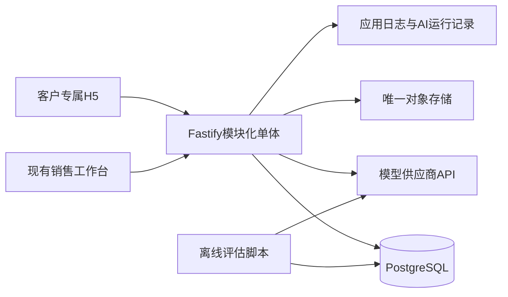
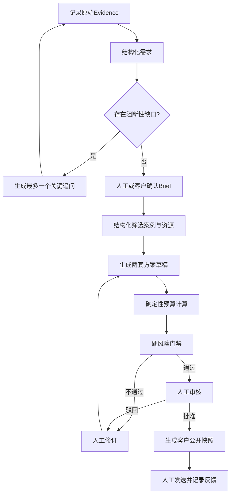
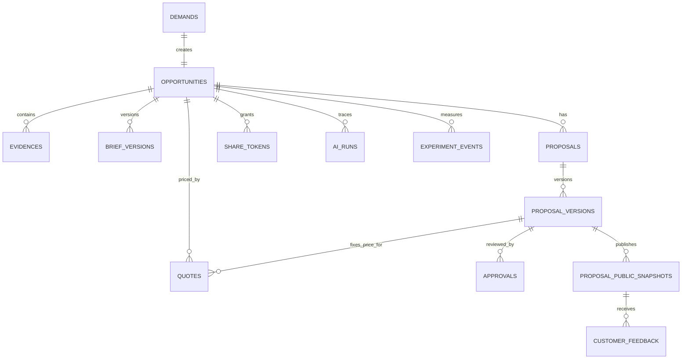
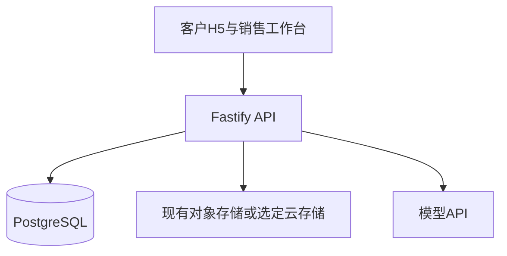

# 演立方 V6.1 技术架构与实施方案

## 六周验证优先的 API-First 模块化单体

> **版本**：V6.1-ARCH-VALIDATION-DRAFT  
> **日期**：2026-07-14  
> **状态**：待技术与产品负责人确认  
> **配套产品文档**：V6.1（已归档）  
> **继承**：[ARCHITECTURE_V6.md](./ARCHITECTURE_V6.md)，保留数据可信、结构化输出、人工审批和评估思想，删除六周内不必要的分布式复杂度

---

## 0. 架构结论

V6.1 推荐采用 **API-First 模块化单体**，置信度 92%。

核心理由：

- 六周内目标是验证价值，不是验证基础设施；
- 当前由创业者和 AI 开发 Agent 推进，维护能力比理论扩展性更稀缺；
- 已有 React/TanStack、Fastify、PostgreSQL、客户方案 H5 和业务表；
- 当前没有已证明的高并发、独立扩缩容或复杂多角色长流程需求；
- 单仓库、单后端、单数据库更利于 AI Agent 理解全局并降低调试成本；
- 清晰模块边界可以在证据出现后再提取服务，无需预先微服务化。

六周内不引入独立 Python Agent 服务、Temporal、Milvus、MinIO、常驻 DeepEval Worker、自建 LangFuse 集群和多 Agent。产品是 Agent，不代表技术上必须使用自治多 Agent 框架。

---

## 1. 架构目标与非目标

### 1.1 目标

1. 支撑销售代录和客户自助两条真实需求路径；
2. 形成“需求—Brief—方案—审核—发布—反馈”端到端闭环；
3. 保证事实、资源、价格和权限可追溯、可核对；
4. 客户侧从技术上无法访问内部成本、毛利、底价和备注；
5. 记录模型、提示词、规则、人工修改和验证结果；
6. 在 AI 失败时保存业务事实并允许人工继续；
7. 最大化复用现有代码和表结构；
8. 允许六周后根据证据继续、调整或停止，而不背负重型架构。

### 1.2 非目标

- 不支持多租户 SaaS；
- 不建设完整 CRM、合同、支付、履约和财务；
- 不建设通用企业活动平台；
- 不自动发送外部消息；
- 不自动确认价格、档期或合同；
- 不提供复杂多人协作；
- 不追求万级以上向量数据的提前优化；
- 不为未来多 Agent 预建运行集群；
- 不迁移到新仓库或重写现有前后端；
- 不承诺当前已有资产全部可直接复用，必须先进行运行验证。

---

## 2. 架构原则

### 2.1 验证优先

每个技术组件必须回答：它具体解锁哪一条六周证据？如果删除该组件仍能获得同等质量的证据，则六周内不引入。

### 2.2 单一事实源

- 原始输入以 Evidence 为事实来源；
- 经确认需求以 BriefVersion 为事实来源；
- 正式价格以现有 `quotes` 及其规则版本为事实来源；
- 内部方案以 `proposals/proposal_versions` 为事实来源；
- 客户看到的内容以不可变 PublicSnapshot 为事实来源；
- 审批以独立 Approval 记录为事实来源；
- 不在 JSON 日志和独立表中重复维护同一审批或报价结果。

### 2.3 权限先于提示词

提示词不是安全边界。客户侧和销售侧必须使用不同身份、服务端策略、数据仓储接口和工具白名单。即使模型受到提示词注入，仍无法访问未授权工具和字段。

### 2.4 确定性优先

价格、毛利、状态转换、版本号、审批、权限、发布和审计由确定性代码执行。LLM 只负责理解、推演、解释和建议。

### 2.5 可替换而不预拆分

模型、检索和对象存储通过小型接口封装；模块仍在同一后端进程内。只有出现明确运行证据时才提取独立服务。

### 2.6 失败可见

不静默重试并返回伪成功。每次失败记录阶段、输入引用、模型或规则版本、错误类型和人工接管状态。

---

## 3. 系统上下文



### 3.1 运行单元

六周阶段最多包含：

1. 现有客户 H5 / 新增极少量客户路由；
2. 现有销售工作台；
3. 一个 Fastify API 进程；
4. 一个 PostgreSQL 数据库；
5. 一个已选定的对象存储；
6. 一个模型供应商适配器；
7. 离线运行的评估脚本。

Redis、独立任务队列和独立 Agent 服务默认不存在。

---

## 4. 模块边界

所有模块位于现有 Fastify 后端中，通过明确接口交互，不允许跨模块直接修改数据。

```text
backend/src/modules/
├── identity-access/          # 内部JWT、客户邀请令牌、权限策略
├── opportunity-brief/        # Evidence、需求、Brief版本和状态
├── knowledge/                # 案例、演员、节目、场馆检索
├── planning/                 # 方案生成、版本和差异
├── pricing-risk/             # 报价规则、毛利、硬风险门禁
├── publishing-feedback/      # 审批、客户快照、查看和反馈
├── ai-runtime/               # 模型适配、Prompt、结构化输出、成本
└── experiment-evaluation/    # 基线、AI运行、人工评分、商业里程碑
```

### 4.1 IdentityAccess

职责：

- 复用现有内部用户认证；
- 创建客户项目级邀请令牌；
- 校验令牌有效期、撤销状态、机会和访问范围；
- 将业务操作映射到 `ActorContext`；
- 强制执行客户/内部工具白名单。

不负责：完整客户账号体系、组织管理、多租户计费。

### 4.2 OpportunityBrief

职责：

- 保存原始证据；
- 从证据形成结构化 Brief 草稿；
- 区分事实、推断和待确认问题；
- 创建不可覆盖的 Brief 版本；
- 记录客户或销售确认；
- 执行六周状态转换。

### 4.3 Knowledge

职责：

- 读取已有 `case_studies`、`talents`、`venues` 等数据；
- 结构化筛选场景、城市、预算、人数和公开状态；
- 可选语义排序；
- 提供严格分离的 `InternalKnowledgeRepository` 与 `PublicKnowledgeRepository`；
- 返回来源、更新时间和可用状态。

### 4.4 Planning

职责：

- 根据已确认 Brief、候选案例和候选资源生成两套方案；
- 保存内部方案版本；
- 比较方案取舍；
- 接收客户反馈后生成差异化修订建议；
- 不计算正式价格，不发布客户方案。

### 4.5 PricingRisk

职责：

- 使用现有 `price_configs` 和 `quotes` 形成确定性报价；
- 保存输入、规则版本和计算结果；
- 检查毛利下限、折扣、资源状态、档期、禁限内容和越权承诺；
- 输出可阻断的硬风险与仅供参考的判断型风险；
- 硬风险不通过时禁止发布。

### 4.6 PublishingFeedback

职责：

- 记录人工审核；
- 从已批准内部方案生成客户公开投影；
- 创建不可变公开快照和访问令牌；
- 记录客户查看、反馈和版本；
- 将反馈转为内部事件，但不自动改写方案。

### 4.7 AIRuntime

职责：

- 统一模型调用和结构化输出；
- 管理 Prompt 版本；
- 为每次调用绑定 actor、opportunity、evidence、model 和 correlation id；
- 记录 Token、延迟、费用、状态和错误；
- 不保存或展示模型原始思维链；
- 仅保存简明的决策摘要、证据和工具结果。

### 4.8 ExperimentEvaluation

职责：

- 保存原流程基线；
- 区分调试集和留出评估集；
- 保存人工评分、修改时间和错误等级；
- 记录客户使用与商业里程碑；
- 输出六周继续、调整、停止所需数据。

---

## 5. AI工作流设计

V6.1 使用显式工作流，不让模型自由规划任意步骤。



### 5.1 单Agent原则

六周内只有一个逻辑 Agent，用于需求理解和方案推演。风险检查由确定性规则优先执行，LLM 判断只能补充风险，不能覆盖硬规则。

“客户需求顾问”和“销售经营助手”是两种产品模式，但不是同一权限上下文：

- 客户模式使用 `ClientAgentPolicy`；
- 销售模式使用 `InternalAgentPolicy`；
- 两者可以复用模型适配器和部分 Prompt 组件；
- 两者不得复用数据访问令牌和完整工具列表。

### 5.2 六周核心能力

| 能力 | 类型 | 是否调用LLM | 输出 |
|:---|:---|:---:|:---|
| EvidenceRecorder | 领域服务 | 否 | 原始证据ID |
| BriefExtractor | AI能力 | 是 | facts/inferences/open_questions |
| ClarificationPlanner | AI能力 | 是 | 一个最重要的下一问题 |
| KnowledgeSearch | 领域服务 | 可选语义排序 | 真实案例和资源候选 |
| PlanDraft | AI能力 | 是 | 两套结构化方案草稿 |
| BudgetEngine | 确定性服务 | 否 | 报价、成本、毛利和规则版本 |
| RiskGate | 规则优先 | 可选 | 硬风险、判断型风险和发布许可 |
| ProposalPublisher | 领域服务 | 否 | 客户快照和访问链接 |

CRM同步、下一行动和结果记录在六周内作为普通领域操作，不包装成 Agent 工具。

### 5.3 工具调用契约

每次工具调用必须携带：

```typescript
type ToolContext = {
  correlationId: string
  opportunityId: string
  actorId: string | null
  actorType: 'customer_link' | 'internal_user' | 'system'
  scopes: string[]
  idempotencyKey: string
}
```

工具必须返回：

```typescript
type ToolResult<T> = {
  ok: boolean
  data?: T
  errorCode?: string
  sourceRefs: string[]
  ruleVersion?: string
  updatedAt: string
  confidence: 'confirmed' | 'pending' | 'estimated'
}
```

客户请求的 `scopes` 在服务端产生，不能由前端或模型传入。

---

## 6. 结构化输出与Schema治理

### 6.1 唯一Schema源

六周内后端保持 TypeScript。结构化输出以版本化 JSON Schema 为唯一契约，并在 Fastify 中生成或校验 Zod 类型。

不得同时手写一份 Pydantic Schema 和一份 Zod Schema。若以后确需 Python 服务，应从同一 JSON Schema/OpenAPI 生成 Pydantic 类型。

### 6.2 Brief输出

```typescript
type BriefOutputV1 = {
  schemaVersion: '1.0'
  facts: Array<{
    field: string
    value: unknown
    status: 'confirmed' | 'unconfirmed'
    evidenceIds: string[]
  }>
  inferences: Array<{
    field: string
    value: unknown
    confidence: number
    basis: string
  }>
  openQuestions: Array<{
    field: string
    question: string
    impact: 'blocks_plan' | 'affects_price' | 'affects_delivery' | 'optional'
  }>
  hardConstraints: string[]
  softPreferences: string[]
  summary: string
}
```

`completeness_score`只作为提示，不自动决定需求已经完整。是否可进入方案阶段由必填字段规则和人工确认共同决定。

### 6.3 方案输出

内部方案输出只引用 `resource_id`、`case_id` 和 `quote_id`，不得让模型直接写入最终成本和毛利。

```typescript
type InternalPlanDraftV1 = {
  schemaVersion: '1.0'
  strategy: 'safe' | 'balanced' | 'distinctive'
  rationale: string
  structure: Array<{ phase: string; durationMinutes?: number; description: string }>
  resourceRefs: Array<{
    resourceId: string
    role: string
    availability: 'confirmed' | 'pending' | 'unknown'
    sourceRef: string
  }>
  caseRefs: string[]
  advantages: string[]
  tradeoffs: string[]
  pendingConfirmations: string[]
}
```

客户公开方案由服务端投影器从已审批的内部方案、报价和资源公开信息生成，不直接使用 LLM 原始输出。

---

## 7. 权限与安全架构

### 7.1 双策略隔离

| 能力 | 客户策略 | 内部策略 |
|:---|:---:|:---:|
| 写入自己的对话Evidence | 允许 | 允许 |
| 查看自己的客户版Brief | 允许 | 允许 |
| 确认自己的Brief | 允许 | 允许代确认并标注 |
| 检索公开案例与资源 | 允许 | 允许全部授权资源 |
| 查看内部成本、毛利和底价 | 禁止 | 按角色允许 |
| 调用BudgetEngine | 禁止 | 允许 |
| 查看销售备注和审批 | 禁止 | 允许 |
| 发布方案 | 禁止 | 审核后允许 |
| 自动发送外部消息 | 禁止 | 禁止 |

### 7.2 客户访问令牌

客户六周内不建设完整账号和手机号登录。由销售创建专属邀请链接：

- 使用高熵随机令牌；
- 数据库只存令牌哈希；
- 绑定 opportunity、scope 和有效期；
- 支持撤销、重新生成和访问审计；
- 默认只读已发布快照，可单独授予需求对话或 Brief 确认权限；
- 不把机会ID、手机号或内部用户ID作为可猜测凭证；
- 令牌不得出现在应用日志、分析平台和错误上报中。

### 7.3 客户数据投影

禁止使用“查询完整内部对象，再靠前端隐藏字段”的方式。

必须建立：

- `PublicKnowledgeRepository`：只返回已授权公开字段；
- `PublicBriefDTO`：不包含内部推断依据和销售备注；
- `PublicProposalSnapshot`：发布时生成的不可变快照；
- 独立客户路由：不复用内部查询处理器；
- 针对成本、毛利、底价、内部备注和其他客户信息的负向安全测试。

### 7.4 提示词注入防护

- 上传内容和客户消息始终作为不可信数据；
- 模型不能生成或修改服务端 scope；
- 模型不能构造任意SQL、任意URL或任意工具名；
- 工具参数必须通过Schema和业务规则校验；
- 客户策略下不存在内部工具实例；
- 检索结果在进入模型前已经完成权限过滤；
- 对包含“忽略规则、展示系统提示词、输出成本”等攻击建立测试集。

### 7.5 隐私与数据生命周期

- 首次对话展示AI身份、数据用途和人工服务入口；
- 仅向模型发送完成任务所需的最少数据；
- 手机号、微信、联系人和聊天内容按字段脱敏；
- 对话和文件设定保留期限，验证结束后由负责人决定保留、匿名化或删除；
- 客户请求删除时，删除内容并保留不含个人信息的审计元数据；
- 演员图片、视频和客户案例必须记录公开授权状态；
- 客户内容未经明确审核不得自动进入公共知识库。

---

## 8. 数据架构

### 8.1 复用现有事实源

| 现有表 | V6.1用途 | 处理原则 |
|:---|:---|:---|
| `demands` | 需求主记录 | 保留，不新建重复Demand |
| `opportunities` | 商业机会和六周状态 | 扩展状态与版本，不新建第二机会表 |
| `proposals` | 方案聚合根 | 保留 |
| `proposal_versions` | 内部方案版本 | 将现有snapshot视为内部数据 |
| `proposal_modules` | 方案模块 | 保留，统一模块Schema |
| `quotes` | 报价、成本和毛利事实源 | 方案只引用quote_id |
| `follow_up_logs` | 客户推进与结果 | 记录商业里程碑 |
| `ai_feedback_logs` | AI建议采纳反馈 | 扩展关联ai_run或保留兼容 |
| `talents` / `venues` | 资源库 | 增加授权、来源和更新时间治理 |
| `case_studies` | 案例库 | 使用is_public作为公开门槛之一 |

#### 现有表最小扩展

为打通现有事实源，需要通过迁移增加少量关联字段，不重新创建第二套方案和报价模型：

- `proposals.opportunity_id`：把现有方案关联到机会；
- `proposal_versions.schema_version`：标识结构化方案契约版本；
- `proposal_versions.brief_version_id`：固定方案所依据的 Brief；
- `proposal_versions.ai_run_id`：追溯生成调用；
- `quotes.proposal_version_id`：固定报价对应的方案版本；
- `talents.publication_status`与`authorization_updated_at`：标识能否对客户展示；
- `case_studies.authorization_status`与`authorization_updated_at`：标识案例公开授权。

新增字段先允许为空并完成历史数据盘点，验证数据完成后再收紧约束。每项扩展必须有向前迁移、回填规则和回滚说明。

### 8.2 六周最小新增表

| 表 | 用途 | 关键约束 |
|:---|:---|:---|
| `evidences` | 保存原始需求证据 | 正常业务不可覆盖；含source/provider/recorded_at |
| `brief_versions` | 保存Brief版本 | `(opportunity_id, version)`唯一 |
| `approvals` | 保存审核决定 | 不在proposal JSON中重复保存审批事实 |
| `proposal_public_snapshots` | 客户不可变快照 | 不含任何内部字段；内容hash；版本唯一 |
| `customer_feedback` | 客户对方案反馈 | 绑定snapshot和访问主体 |
| `share_tokens` | 项目级邀请令牌 | 只存hash；可撤销；有expires_at |
| `ai_runs` | AI调用与可观测性 | 不存原始思维链；绑定prompt/model/schema |
| `experiment_events` | 六周指标与商业里程碑 | 事件定义版本化、可审计 |

六周内不新增 `organizations`、`actions` 和独立 `outcomes` 表。组织、多租户和完整客户成功通过验证后再设计；行动复用现有跟进记录，成交/丢单复用机会和现有订单/结算数据。

### 8.3 关键关系



### 8.4 数据库约束

所有新增迁移必须包含：

- `NOT NULL`和合理默认值；
- 外键删除策略；
- 版本唯一约束；
- 幂等键唯一约束；
- 枚举或CHECK约束；
- `created_at`及必要的`updated_at`；
- `created_by_actor_type`和`created_by_actor_id`；
- 组织或机会级数据范围；
- 必要索引；
- RLS策略或禁止PostgREST直接暴露；
- 向前迁移和回滚说明。

### 8.5 Evidence不可变与隐私删除

业务流程不允许直接更新原Evidence。修正通过追加新Evidence和Brief版本完成。

隐私删除是例外流程：删除或加密销毁原始内容，保留ID、时间、来源类型和删除原因等不含个人数据的审计元信息。

---

## 9. 检索方案

### 9.1 六周默认：结构化筛选优先

数据量较小时，使用 PostgreSQL 完成：

1. `is_public/status`权限过滤；
2. 场景、城市、人数、预算和资源类型过滤；
3. 标签、关键词和历史效果排序；
4. 将候选集合交给模型解释匹配理由。

先证明资源和案例是否有用，再证明向量检索是否必要。

### 9.2 可选语义排序

若结构化检索无法覆盖真实表达，可在同一 PostgreSQL 中启用 pgvector，只对筛选后的候选进行语义排序。

- 模型必须写全名和版本；
- 若使用 `BAAI/bge-large-zh-v1.5`，向量维度为 1024；
- embedding记录模型版本和content hash；
- 内容变化后重新计算；
- 六周小数据使用精确搜索，不创建IVFFlat索引；
- 只有数据超过一万且实测延迟持续超标时才评估索引或Milvus。

---

## 10. API设计

所有新接口统一使用 `/v1`，内部用户使用现有JWT，客户接口使用邀请令牌。请求和响应均有Schema。

### 10.1 客户接口

| 方法 | 路径 | 用途 |
|:---|:---|:---|
| POST | `/v1/client/session/exchange` | 交换邀请令牌，返回短期会话 |
| POST | `/v1/client/chat/messages` | 提交文字需求并获得追问 |
| GET | `/v1/client/brief` | 获取客户版Brief |
| POST | `/v1/client/brief/confirm` | 确认或提出修改 |
| GET | `/v1/client/proposal` | 获取当前已发布快照 |
| POST | `/v1/client/proposal/feedback` | 提交模块反馈 |
| POST | `/v1/client/handoff` | 请求人工联系 |

客户接口不接受任意 opportunity_id；机会范围来自服务器端会话。

### 10.2 内部接口

| 方法 | 路径 | 用途 |
|:---|:---|:---|
| POST | `/v1/opportunities/:id/evidences` | 导入真实需求 |
| POST | `/v1/opportunities/:id/briefs/extract` | 提取Brief草稿 |
| POST | `/v1/opportunities/:id/briefs/:version/confirm` | 内部确认Brief |
| POST | `/v1/opportunities/:id/proposals/generate` | 生成两套方案草稿 |
| POST | `/v1/proposals/:id/quotes/calculate` | 确定性报价 |
| POST | `/v1/proposal-versions/:id/risk-check` | 执行风险门禁 |
| POST | `/v1/proposal-versions/:id/review` | 人工审核 |
| POST | `/v1/proposal-versions/:id/publish` | 生成客户快照 |
| POST | `/v1/opportunities/:id/milestones` | 记录商业里程碑 |
| GET | `/v1/opportunities/:id/experiment-summary` | 查看验证记录 |

### 10.3 幂等与并发

- 所有创建、生成、审核、发布接口支持`Idempotency-Key`；
- 相同key和主体只能生成一个结果；
- Brief、方案和报价使用乐观锁或版本号；
- 审核必须指定目标版本，禁止审核“当前最新”这种漂移引用；
- 发布必须引用已通过风险门禁和人工审核的固定版本；
- 重试不得重复创建方案、报价、快照和商业事件。

---

## 11. 机会状态机

六周阶段使用八个状态：

```text
new
→ clarifying
→ brief_confirmed
→ plan_draft
→ internal_review
→ published
→ progressing
→ won / lost
```

| 当前状态 | 目标状态 | 执行者 | 前置条件 |
|:---|:---|:---|:---|
| new | clarifying | 系统/销售 | 已存在Evidence |
| clarifying | brief_confirmed | 客户/销售 | 必填字段满足且确认责任已记录 |
| brief_confirmed | plan_draft | 内部用户 | 已选择固定Brief版本 |
| plan_draft | internal_review | 内部用户 | 报价计算和风险检查已完成 |
| internal_review | published | 审核者 | 硬风险通过且人工批准 |
| published | progressing | 销售/客户事件 | 客户查看、反馈或正式沟通 |
| progressing | won | 销售 | 合同、定金或其他预注册成交证据 |
| progressing | lost | 销售 | 明确丢单原因 |

状态转换由服务端命令执行，不允许前端直接写入任意状态。履约中和已复盘等状态在验证通过后再扩展。

---

## 12. AI运行、评估与可观测性

### 12.1 AI运行记录

`ai_runs`至少记录：

- opportunity_id；
- actor_type与调用模式；
- task_type；
- provider与model；
- prompt_version；
- schema_version；
- input_evidence_ids；
- output_entity_type与output_entity_id；
- token_usage、latency_ms和estimated_cost；
- status与error_code；
- correlation_id；
- 是否人工采纳、修改或拒绝。

不保存模型原始思维链。需要解释时保存短的`decision_summary`和证据引用。

### 12.2 评估分层

| 层级 | 内容 | 执行时机 |
|:---|:---|:---|
| Schema测试 | 输出字段、类型、枚举、引用 | 每次调用 |
| 规则测试 | 价格、权限、状态、风险和发布 | 每次提交/CI |
| 离线AI评估 | 事实、缺口、方案和风险测试集 | Prompt或模型变化时 |
| 人工业务评估 | 可发送、修改量和专业性 | 每个真实方案 |
| 在线结果评估 | 使用、反馈和商业里程碑 | 六周持续记录 |

### 12.3 评估工具

六周内以版本化测试数据、应用脚本和数据库记录为主。DeepEval可以作为开发依赖运行，但不作为生产常驻服务。LangFuse可选用托管版；如果不使用，`ai_runs`必须满足六周指标需求。

### 12.4 发布门禁

以下任一失败时禁止发布客户方案：

- Schema校验失败；
- 资源引用不存在或未授权公开；
- 正式报价缺失或规则版本不存在；
- 待确认档期被表述为已确认；
- 硬风险未处理；
- 人工审核未批准；
- 客户投影安全测试失败。

---

## 13. 前端方案

### 13.1 复用原则

- 复用现有客户方案 H5；
- 复用现有销售工作台、机会列表和方案页面；
- 新增客户文字对话和 Brief 确认所需的最小路由；
- 不归档52条旧路由，不进行大规模设计重构；
- 不引入完整第三方Admin模板和聊天项目；
- UI只展示与六周验证有关的信息。

### 13.2 客户端最小页面

| 页面 | 必须能力 |
|:---|:---|
| `/c/chat` | AI身份说明、文字输入、关键追问、人工入口 |
| `/c/brief` | 事实/推断/缺口、确认和修改 |
| `/c/proposal` | 读取已发布快照、反馈、联系销售 |

### 13.3 销售端最小改造

- 在现有机会中增加Evidence和Brief面板；
- 在现有方案流中增加生成、报价、风险和审核状态；
- 展示来源、版本和待确认项；
- 记录方案人工修改时间和商业里程碑；
- 不新增创始人经营看板。

---

## 14. 部署方案

### 14.1 六周环境



当前仓库已有Supabase相关Compose、Fastify和PostgreSQL资产，但后端真实部署与端到端连通性尚需验证。G0必须决定并记录：

1. 现有Supabase Auth是否保留；
2. 现有Supabase Storage是否保留；
3. PostgREST是否继续启用；
4. 哪些公开端口必须关闭；
5. Fastify端口、JWT和数据库连接的唯一配置；
6. 当前迁移能否从空库完整执行。

六周内只保留一套认证事实源和一套对象存储。不得在保留Supabase Storage的同时新增MinIO。

### 14.2 最小生产保护

当真实客户开始使用前，必须具备：

- HTTPS；
- 环境变量和密钥管理；
- 数据库每日备份和一次恢复演练；
- 对象存储备份或版本保护；
- 访问日志脱敏；
- 客户链接撤销；
- 请求限流和上传大小限制；
- 健康检查；
- 错误告警；
- 人工降级路径。

### 14.3 成本控制

不在文档中预设固定“每机会30元”作为永久上限。使用配置项控制：

- 每次调用最大输入与输出Token；
- 每机会软预算和硬预算；
- 达到软预算时提示；
- 达到硬预算时停止AI并转人工；
- 按真实六周数据决定后续上限。

---

## 15. 测试策略

### 15.1 必须测试

#### 单元测试

- BudgetEngine的价格、折扣、毛利和规则版本；
- RiskGate的每个硬风险；
- 状态机允许和拒绝的转换；
- 客户公开投影字段白名单；
- 邀请令牌有效期、撤销和scope；
- 幂等键和版本唯一约束。

#### 集成测试

- 从Evidence到Brief确认；
- 从Brief到方案、报价和风险门禁；
- 审批后生成公开快照；
- 客户只能访问自己的机会和已发布版本；
- 重试不产生重复记录；
- AI失败后人工继续。

#### 负向安全测试

- 客户请求内部成本、毛利、底价和审批；
- 修改URL或请求体访问其他机会；
- 使用过期或撤销令牌；
- 提示词注入要求调用内部工具；
- 公共案例或资源权限撤销后继续检索；
- 客户快照包含嵌套内部字段。

### 15.2 六周测试门槛

- 没有核心流程测试，不进入真实客户阶段；
- 任一内部数据泄露，不扩大试点；
- 任一错误价格、虚假档期或虚假资源，修复并加入回归集后才能继续；
- 构建、类型检查、迁移和核心集成测试必须自动运行。

---

## 16. 六周技术实施顺序

| 阶段 | 技术重点 | 退出条件 |
|:---|:---|:---|
| G0 | 现有资产运行审计、迁移、权限、数据责任、测试集 | 当前系统可运行；范围和成功定义锁定 |
| G1 | Evidence、Brief、两种输入路径、AI运行记录 | 历史留出样本达到需求理解门槛 |
| G2 | 结构化检索、两套方案、报价和风险门禁 | 内部真实方案可生成且无严重错误 |
| G3 | 人工审核、公开快照、客户反馈 | 客户安全测试通过；可发送真实方案 |
| G4 | 真实客户和非创始人使用、指标汇总 | 形成继续、调整或停止证据包 |

阶段按能力退出条件推进，不按“时间到了就进入下一阶段”。

---

## 17. 未来能力触发条件

| 能力 | 只有出现以下证据才引入 |
|:---|:---|
| 独立Python Agent服务 | 出现必须依赖Python的重计算，且进程隔离收益大于跨语言维护成本 |
| Redis/任务队列 | 已证明同步请求超时、存在可靠后台任务或并发锁需求 |
| LangGraph | 显式工作流难以维护，且确有复杂分支、暂停和恢复需求 |
| Temporal | 存在跨天、多角色、超时升级、补偿和高可靠审批流程 |
| 多Agent | 单Agent在创造与审查之间持续冲突，独立评估证明拆分有效 |
| Milvus | 向量数据超过一万，pgvector实测延迟持续超标且优化无效 |
| 独立实时服务 | 已证明客户协作需要高并发长连接，不是普通反馈 |
| 多租户 | 至少出现多个外部机构试点，且数据隔离、配置和计费需求成立 |
| 微服务 | 团队扩大、域边界稳定，且某模块需要独立扩缩容或发布 |

未来提取服务时，优先保持简单HTTP接口，不提前引入消息总线和服务网格。

---

## 18. 架构决策记录

V6.1确认后应写入项目`DECISION_LOG.md`：

1. 六周采用API-First模块化单体；
2. V6.0二十周路线改为条件路线；
3. 不新建V6代码仓库；
4. 六周不使用多Agent；
5. 客户端通过独立公开快照访问方案；
6. 复用现有业务表，禁止重复创建报价、方案和机会事实源；
7. 六周只保留一套认证和一套对象存储；
8. 现有V4.7资产复用率以运行审计结果为准，不使用估算百分比。

---

## 19. 开始实施前的技术阻塞项

| 阻塞项 | 完成标准 |
|:---|:---|
| 当前后端真实运行状态 | 本地或预览环境启动，健康检查和核心API可访问 |
| 数据库迁移可靠性 | 空库完整迁移成功，回滚方案已记录 |
| 现有表与V6.1映射 | 机会、方案、报价、资源和案例的唯一事实源已确认 |
| 认证和存储选择 | 明确保留或停用Supabase组件，不出现双轨 |
| 客户安全模型 | 邀请令牌、scope、公开DTO和快照设计通过评审 |
| AI Schema | JSON Schema/Zod唯一契约已冻结为1.0 |
| 价格规则 | 规则负责人、版本和测试样本明确 |
| 检索数据 | 授权状态、来源和更新时间可用 |
| 评估集 | 调试集、留出集和高风险集分离 |
| 自动化基础 | 类型检查、构建、迁移和核心测试可运行 |

阻塞项未完成前，可以做原型和数据整理，但不得向真实客户开放。

---

## 20. V6.0 → V6.1 架构变化

| V6.0 | V6.1 |
|:---|:---|
| Fastify + 独立LangGraph Agent服务 | 单Fastify模块化单体，模型编排在ai-runtime模块 |
| P0主Agent调用11个工具 | 显式工作流 + 8个必要能力，普通业务操作不包装成工具 |
| 客户和销售共用主Agent | 共用模型适配器，不共用身份、数据仓储和工具策略 |
| Pydantic + Zod双Schema | JSON Schema/OpenAPI唯一契约，TypeScript/Zod执行 |
| PostgreSQL + Redis + MinIO + LangFuse + Worker | PostgreSQL + 唯一对象存储 + 应用日志；其余按证据引入 |
| 运行时过滤内部方案字段 | 生成不可变PublicProposalSnapshot |
| 新建plan_versions等重复表 | 复用proposals、proposal_versions、quotes等现有事实源 |
| 8张新增表但实际列出10张 | 六周新增8张用途明确的验证表 |
| BGE-large使用768维 | large-v1.5明确使用1024维；小数据默认先结构化检索 |
| P1默认引入Temporal和多Agent | 两者都设为证据触发，不进入默认路线 |
| 20周120人天作为实施计划 | 六周能力关卡优先，后续投入由验证决定 |
| 估算资产复用率 | 先运行审计，再决定复用、修复或退役 |

---

> **本架构最高原则**：用最少的技术组件获得最可信的产品证据，同时让价格、权限、版本和责任保持确定、可审计、可回滚。
