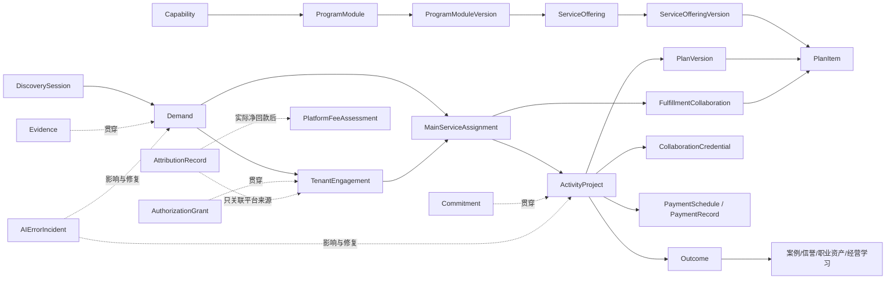

# 演立方 V7.2 PRD

> **文档文件**：`PRD_V7.2.md`

## 可交付供给与单一责任主导的组合履约 AI 经营产品

> **版本**：V7.2
> **日期**：2026-07-17
> **负责人**：李昊
> **继承关系**：V5.0 AI 商演经营 Agent → V6.6 多租户平台、演员生态与信誉推荐 → V6.7 公开发现与 AI 经纪经营 → V6.8 可信经营协作网络 → V6.9 AI 经营产品成熟版 → V7.0 交易协作与商业模式版 → V7.1 可交付供给与组合履约版 → V7.2 多路径经营与复购增强版
> **文档状态**：已确认并正式生效；作为 Phase 1 工程基础准备与后续 MVP 开发的产品事实源。
> **平台主体**：演立方由 Hao Works / 演立方团队独立运营；后仰喜剧是第一家普通 Tenant，不具备平台级特殊权限。

---

## 目录

1. 执行摘要
2. 产品战略定位
3. 核心价值轴与产品原则
4. 产品主体与责任边界
5. 核心用户与价值主张
6. 业务对象与关系
7. 核心经营闭环
8. 公开发现与内容图谱
9. 企业客户活动项目空间
10. Tenant 经营工作台
11. 演员职业资产与 AI 经纪经营
12. 主 Agent 与确定性工具
13. 派单、推荐与服务承接
14. 报价、合同与合作凭证、收付款与履约
15. 证据、承诺、授权与审计
16. 评价、信誉、投诉与申诉
17. 商业模式、订阅、成交服务费与退出
18. 产品信息架构与核心页面
19. 权限、隐私和数据治理
20. 核心状态体系
21. 商演行业知识模型
22. 指标体系
23. 产品验收标准
24. 风险与控制
25. 明确不做
26. V7.1 → V7.2 差异矩阵
27. 正式范围、实施分层与待确认参数

---

## 1. 执行摘要

### 1.1 一句话定义

演立方是面向商演与企业活动的 AI 经营产品：以可信经营协作网络为底座，把演员和机构模糊的“我们什么都能做”，转化为客户看得懂、销售讲得清、项目交付得了的节目和服务产品；主 Agent 按需求成熟度选择最短合适路径，帮助企业更专业地做决定、更确定地完成活动，并在多演员、多节目和必要的多供应商协作中始终面对唯一主服务 Tenant。平台继续通过独立 AI 经纪经营 SaaS 和可归因的平台来源项目成交服务费持续经营，但不强制平台合同或在线支付，不侵占 Tenant 私域客户，也不让收费影响推荐。

### 1.2 演立方解决的核心问题

商演与企业活动具有高度非标、多角色决策、资源状态动态变化和责任链长的特点。行业长期缺少：

- 能识别需求成熟度，并让探索型、明确型、复购型和专业采购型客户走最短合适路径的机制；
- 能让客户真正理解、比较和确认方案的空间；
- 能证明演员、案例、档期和价格状态的证据体系；
- 能让平台、Tenant、客户和演员明确权利与责任的协作系统；
- 能让供给侧在没有平台订单时仍持续获得价值的经营工具；
- 能兼容企业合同、外部合同、框架协议、简化确认、对公转账和分阶段付款的交易协作机制；
- 能证明哪些项目由平台促成、哪些属于 Tenant 自有客户，并据此进行公平、有限、可申诉的收费；
- 能把履约结果沉淀为可携带职业资产和可复用经营资产的基础设施。
- 能在等待期持续协助、在错误后恢复信任并让用户看到长期成长的产品体验。
- 能区分“具备能力”“可以交付一个节目”“可以出售一项服务”和“可以承担完整活动”的供给结构；
- 能让一个主服务 Tenant 在不泄露内部成本的情况下组织多演员、节目和协作方，并把责任落实到每个方案模块。
- 能把企业历史活动、Tenant 客户经营和演员商业成长沉淀为下一次可复用资产，而不扩展成重型 CRM、OA 或企业知识库；
- 能在成交前、履约中、失败后和复购时持续采集有边界的过程信号，让产品从成功与失败样本共同学习。

### 1.3 核心价值链

```text
发现可信内容或调取历史活动
→ 识别咨询探索、明确执行、老客复购或专业采购模式
→ 只补齐影响可行性、报价和责任的必要信息
→ 形成或复用可信 Brief
→ 匹配完整服务产品或组合可交付模块
→ 确认唯一主服务 Tenant 与模块责任
→ 比较并确认可执行方案
→ 明确服务主体、报价、合作凭证和承诺
→ AI 持续陪伴并与人工无损接力
→ 完成收付款、结算与履约协作
→ 形成成果回赠、信誉、职业资产和经营学习
→ 形成复购入口与下一次经营建议
→ 下一次经营更快、更准、更省心
```

### 1.4 核心产品结论

1. 演立方不是演员商城，也不是付费线索市场。
2. 企业客户可以独立浏览演员、案例、指南和脱敏洞察，并把来源偏好带入主 Agent。
3. 企业客户拥有轻量活动项目空间，但演立方不建设企业 OA、ERP、采购或通用项目管理系统。
4. Tenant 是客户服务和商业责任主体；平台负责规则、匹配、证据和生态治理。
5. 演员拥有平台身份和可携带职业资产，与 Tenant 的经营关系可建立、变更和终止。
6. 所有用户始终面对一个主 Agent；专业能力通过确定性工具和内部能力完成。
7. AI 经纪经营助手是独立 SaaS，处理平台内外业务；基础身份、授权、在途项目和合法数据权利不依赖订阅。
8. 机会网络采用免费但经审核的接入资格；平台只对可证明的平台来源项目、按实际净回款收取成交服务费，未成交原则上不收费。
9. Tenant 自有客户、Tenant 专属入口、自有邀约和仅使用 SaaS 管理的平台外业务不收平台成交服务费。
10. 派单采用“客户选择优先、平台确定性辅助路由兜底、单一主承接 Tenant、受控备选、禁止公开抢单”。订阅、费率、预计平台收入和套餐不得影响推荐。
11. 商业确认支持平台电子合同、外部合同、框架协议 + 订单/确认单、简化合作确认，不强制使用平台合同。
12. 平台优先管理交易事实、收付款计划、Evidence 和责任状态；项目款默认由客户直接支付给合同收款主体，小额标准项目可自愿使用合规第三方在线支付，平台当前不托管、代收或自动分账。
13. 主 Agent 在等待期继续提供流程解释、资料准备和决策协助，但不替 Tenant 作出商业承诺。
14. AI 错误必须可发现、可阻断传播、可修正、可重新确认并回流评估，不得只用免责声明代替恢复。
15. 每次项目都向客户、Tenant 和演员返回可感知成果，让长期价值不依赖平台派单数量。
16. 商演行业知识模型统一支撑快照、追问、方案、匹配、预算、风险、商业确认、结算、成长建议与结果学习。
17. 平台匹配的首先是可交付的节目和演出服务产品，而不只是演员和机构。
18. Capability、ProgramModule/Version、ServiceOffering/Version 和 PlanItem 分别表达能力、稳定供给身份与版本、商业产品身份与版本和项目交付快照；内部精确、前台简化。
19. 多演员属于基础能力；跨主体协作采用邀请制，每个正式项目必须由唯一主服务 Tenant 对客统一负责，不建立公开协作市场。
20. 主服务 Tenant 必须同时满足来源归属、长期意愿、轻量适格、当前容量、项目匹配、客户选择和 Tenant 逐单接受。
21. 同一净回款原子只能被一个 active ChargeableValue 叶节点覆盖并形成一次平台来源成交服务费评估；协作应付不产生重复收费。
22. Tenant 和演员可以上传现有资料由 AI 提取草稿，按 readiness 的草稿、可匹配、可报价、可公开逐步完善；readiness、生效、发布和 Evidence 正交，不要求首次填满全部字段。
23. 主 Agent 先识别需求成熟度：咨询探索、明确需求快速执行、老客户复购、专业采购或已有方案；不得强迫所有客户重走完整咨询流程。
24. 每个进入正式商业确认和履约阶段的项目都必须有且只有一个主服务 Tenant；金额只影响合同、审批、付款、Evidence 和风控深度，不决定是否需要主服务 Tenant。
25. 企业历史活动、客户偏好和采购习惯在来源清晰、客户授权和数据隔离前提下形成轻量长期资产，并提供“再办一次类似活动”入口。
26. 主服务 Tenant 可以组织自有、平台内和符合规则的外部资源；AI 推进缺口识别、候选解释和协作准备，最终资源组织权和逐单责任接受权属于商业主体。
27. 平台不靠封锁联系方式、强制站内沟通、强制合同或支付防跳单；依靠有限归因、双边事实、合理封顶费用、原服务方复购优先和持续协作价值。
28. 计费核验只读取本次平台来源项目的最小必要字段，永不因此访问 Tenant 完整客户名单、完整银行流水、总收入、内部底价或无关经营资料。
29. 方案故事板、决策摘要、Tenant 专业方案页和成果故事在现有对象上形成客户视图，不新增平行情绪或游戏化系统。
30. 过程信号和失败样本优先用于经营学习、流程优化和模型评估；未经明确归责不得直接影响公开信誉。

---

## 2. 产品战略定位

### 2.1 产品是

- 商演与企业活动领域的行业专用经营协作网络；
- 以真实证据、业务规则、授权和责任为基础的 AI 协作系统；
- 连接平台、Tenant、企业客户和演员的共同事实层；
- 帮助客户做活动决策、帮助供给侧经营业务的双向产品；
- 支持公开发现、服务承接、交易协作、履约和结果学习的完整闭环。
- 能持续陪伴、从错误中恢复并向用户反馈成长的 AI 经营产品。
- 以 SaaS 经营效率和平台来源增量成交共同形成收入、同时保持推荐中立的行业产品。
- 以可交付节目和服务产品为供给单元、以 PlanItem 为项目责任单元的组合履约系统；
- 在单一主服务 Tenant 责任下支持多演员、多节目和受控跨主体协作的行业产品。

### 2.2 产品不是

- 通用 ChatGPT、文案或 PPT 生成器；
- 默认开放、自由比价下单的演员或活动服务商城；
- 付费即可买订单、买曝光、买排名的线索平台；
- 企业 CRM、OA、ERP、采购系统或完整项目管理平台；
- 无人值守、自动签约和自动处理资金的自治交易系统；
- 银行、支付机构、资金托管方、项目款默认收款方或多方分账主体；
- 通过无限期归因、封锁联系方式或强制站内付款控制客户关系的平台；
- 将后仰喜剧设为平台运营者的内部系统；
- 将演员永久绑定某个供应商的经纪数据库；
- 代替合同主体、司法、仲裁或专业人员作最终法律判断的平台。
- 公开的供应商抢单、协作竞价或自动拼团市场；
- 强迫所有 Tenant 成为总包方、暴露内部采购价或接受平台指定协作方的资源调度系统；
- 因内部对象拆分而对同一客户交易多层收费的抽佣系统。

### 2.3 品牌架构

演立方保持一个产品品牌和一个用户入口。不同角色使用不同工作台：

- 企业客户：活动顾问与活动项目空间；
- Tenant：经营工作台；
- 演员：职业资产与 AI 经纪经营助手；
- 平台：生态治理后台。

“活动顾问”“经营工作台”“AI 经纪经营助手”“机会网络”是产品角色或权益名称，不是四个平行品牌。

### 2.4 长期愿景与对外表达

演立方的长期愿景是：

> 让可信能力代替关系成为商演合作的基础，让每一次履约都成为可复用的行业资产。

企业客户价值主张统一表达为：帮助企业客户更专业地做决定、更确定地完成活动，并在出现变化时始终知道由谁负责、如何处理。产品最终同时满足两个真实购买结果：降低活动出错风险，并让客户能够向领导和协作方清楚说明自己的专业判断。

对外不使用“节目货架化”作为核心定位，也不向普通用户暴露内部对象名。可交付供给的核心表达是：让节目和演出服务可以被理解、被组合、被确认、被交付和被追责。

---

## 3. 核心价值轴与产品原则

### 3.1 核心价值轴

| 用户 | 核心结果 |
|:---|:---|
| 企业客户 | 更快理解自己需要什么、为什么这样选、由谁负责以及下一步做什么 |
| Tenant | 更高效处理自有与平台来源业务，降低遗漏和责任断裂，沉淀经营资产 |
| 演员 | 获得持续经营工具、可信机会解释和可携带职业资产 |
| 平台 | 建立高质量、可治理、可持续收费的供需协作网络 |

企业客户的最终体验目标是“我做出了专业判断、风险已经考虑、有人明确负责、变化发生时有处理路径、活动结束后能展示成果”。Tenant 的最终体验目标是“我的公司显得更专业、方案和报价更容易被理解与内部转发、平台费用对应了明确价值”。

### 3.2 全局产品原则

1. **价值先于承诺**：在要求用户登录、留资、导入经营数据、授权公开或付费前，先提供与投入相匹配的可感知价值。
2. **证据先于评分**：优先展示来源、状态、样本和有效期，不用简单百分比制造确定感。
3. **责任先于自动化**：任何外部承诺先明确责任主体，再决定能否自动执行。
4. **客户选择优先**：推荐用于帮助决策，不代替客户作不可逆选择。
5. **确定性规则优先**：价格、权限、状态、有效期、排序硬条件和审计不由模型自由决定。
6. **数据最小共享**：只向当前任务必要的主体共享必要字段。
7. **行业专用优先**：围绕商演活动真实对象、约束和履约过程建设，不泛化为通用企业软件。
8. **退出不破坏权利**：停止订阅或合作关系终止，不得抹除合法职业资产、历史合同或在途项目权利。
9. **错误必须可恢复**：错误发生后必须识别影响、阻断传播、生成修正版并要求必要主体重新确认。
10. **成长必须可感知**：系统沉淀的数据要以成果摘要、经营总结和职业成长反馈返还给用户。
11. **复杂性渐进呈现**：内部对象保持精确，用户只看到与当前任务相关的简单语言和下一步。
12. **陪伴不越权**：AI 可以解释、准备和提醒，但不得伪造人工进度或替责任主体承诺。
13. **收费必须对应增量价值**：SaaS 为平台内外经营效率收费；成交服务费只为可证明的平台来源项目收费，同一价值不得重复收费。
14. **归因有限且可释放**：平台来源必须有事实、有效期、异议和释放机制，不以浏览、工具使用或历史身份形成无限期归因。
15. **资金事实不等于控制资金**：系统可以管理应收、付款、到账、发票和退款事实，不因此自动取得收款、托管或资金处置权。
16. **商业与推荐隔离**：订阅、费率、预计平台收入、账单状态和商业团队意图不得进入推荐排序。
17. **可交付供给优先**：能力标签只能用于发现，正式方案必须落到有版本、有责任主体和有交付边界的节目或服务产品。
18. **一个整体责任主体**：方案可以多演员、多节目、多供应商，但每个正式项目必须只有一个主服务 Tenant 对客户承担整体商业和履约责任。
19. **意愿、能力、容量、接受分离**：长期设置只决定是否可能收到机会，不能替代客观适格、当前容量和逐单确认。
20. **协作邀请制**：跨主体协作由主服务 Tenant 逐单邀请和确认，平台不能自动成立联盟或强迫接受陌生协作方。
21. **维护渐进化**：AI 可以从现有资料提取草稿，供给主体只需先确认最小字段；未确认内容不得被当成已核验能力。
22. **一次价值一次收费**：同一客户交易价值只能形成一个可追溯计费标识，不因演员、节目、协作方或内部应付拆分而重复收费。
23. **最短合适路径**：先识别需求成熟度，只补充会改变可行性、价格、权利和责任的问题，不让明确客户从零重做咨询。
24. **历史服务于复购**：经授权的历史 Brief、方案、服务方、执行结果和偏好应当减少重复输入，但不得扩大为企业全量知识库或泄露 Tenant 私有数据。
25. **开放资源、责任集中**：主服务 Tenant 可以组织平台内外合格资源，但每个正式项目始终只有一个整体责任主体。
26. **学习不等于惩罚**：过程信号和失败样本先用于经营改进；未考虑通知失败、资料缺失、授权范围和外部原因前，不得用于信誉惩罚。

---

## 4. 产品主体与责任边界

| 主体 | 核心责任 | 不拥有的权利 |
|:---|:---|:---|
| 演立方平台 | Tenant 准入、公开内容治理、平台来源需求、推荐规则、归因规则、平台 SaaS/成交服务费账单、投诉申诉与审计 | 不自动取得 Tenant 客户关系、演员代理权、项目合同权利、项目款收款权或资金处置权 |
| 供应商 Tenant | 经营客户、方案、报价、合作凭证、收付款、履约和合作演员；按规则申报平台来源成交 | 不得查看其他 Tenant 私有数据、无授权经营演员或以自有客户豁免隐瞒平台来源成交 |
| 独立演员 Tenant | 经营本人邀约、报价、合作凭证、收付款和履约；直接承接时承担一次 Tenant 级平台费用 | 不得查看其他 Tenant 客户、价格和结算信息，也不因个人身份被重复收费 |
| 企业客户 | 确认需求、偏好、方案、报价、合作凭证、本方付款事实和评价 | 不得查看内部成本、毛利、底价、演员私有结算和平台私有治理记录，也不能确认收款方已到账 |
| 演员 | 管理本人身份、公开资料、授权、档期、任务、评价和申诉 | 不自动拥有 Tenant 客户关系和 Tenant 私有商业数据 |

项目内的“主服务 Tenant”“协作 Tenant”“独立演员协作方”和“外部协作方”是履约角色，不新增平台用户主体。主体身份和项目责任角色必须分开记录。

### 4.1 四种必须区分的权利

1. **公开展示权**：允许平台在指定渠道、字段和期限展示内容。
2. **Tenant 经营权**：允许某 Tenant 在指定范围内推荐、报价或组织某演员。
3. **法律代理权**：允许代表权利人签约、作出承诺或处理资金。
4. **平台交易归因权**：平台可以在已确认规则内记录和核验平台来源事实，不因此取得客户关系、合同权利或项目资金。

前两种权利不自动产生第三种权利。
平台交易归因权也不自动产生公开展示权、Tenant 经营权、法律代理权、合同权利、收款权或资金处置权。

### 4.2 服务主体

客户侧始终展示：

```text
实际服务方：{Tenant}
技术与协作平台：演立方
主要联系人：{姓名/角色}
当前责任边界：{简明说明}
```

每一个进入正式商业确认和履约阶段的活动项目，都必须有且只有一个明确的主服务 Tenant。其他演员、供应商和协作方作为项目参与者加入；即使存在多方合同或多个合法收款主体，也不得形成多个互不负责的整体责任主体。项目金额只影响合同严谨度、审批权限、付款方式、Evidence 要求和风控深度，不影响是否需要主服务 Tenant。

### 4.3 项目服务角色

| 项目角色 | 责任 | 客户关系与商业边界 |
|:---|:---|:---|
| 主服务 Tenant | 整合方案、统一对客报价/合作确认、组织履约、处理变更与整体结果 | 默认持有项目客户经营关系并承担整体责任 |
| 模块协作 Tenant | 对获确认 PlanItem 承担局部交付责任 | 不自动取得客户关系、完整 Brief 或直接收款权 |
| 独立演员协作方 | 对本人节目、档期、到场、权利和局部交付负责 | 能完成节目不代表能承担完整活动 |
| 外部协作方记录 | 表达平台外团队/设备/场地等局部义务 | 不是新增正式用户角色；访问和确认通过受控邀请或人工 Evidence 完成 |
| 演立方平台 | 提供规则、资格门禁、协作记录、证据和申诉 | 不成为项目总包方，不替主 Tenant 接受协作或承担履约 |

主服务 Tenant 不因承担整体责任而自动对所有局部过错承担唯一责任；局部责任仍需通过 PlanItem、Commitment、Evidence 和 FulfillmentCollaboration 归因。对客户的补救与内部追责是两个不同问题。

---

## 5. 核心用户与价值主张

### 5.1 企业客户

典型角色包括需求发起人、业务协作者、决策人、付款联系人和执行联系人。企业客户可以：

- 匿名浏览和获得初步判断；
- 从演员或案例形成具体偏好；
- 与 Agent 形成可确认 Brief；
- 比较方案方向、取舍和风险；
- 生成领导摘要；
- 请求人工顾问、正式报价和合同；
- 查看等待状态、执行进度和责任人；
- 对项目、Tenant 和具体演员进行有依据的评价。
- 查看经授权的历史活动，并基于历史 Brief、方案、服务方和复盘发起“再办一次类似活动”；
- 对明确采购文件或已有方案走缺口检查、资源核验和商务推进的快速路径；
- 获得适合内部转发的一分钟决策摘要、方案故事板和活动成果故事。

### 5.2 Tenant

典型角色包括管理员、销售、策划、资源统筹、报价审核人、项目负责人、财务和管理者。Tenant 获得：

- 自有与平台来源邀约统一处理，并清楚区分自有客户豁免与平台来源归因；
- Brief、方案、报价、合同/合作确认、收付款与履约闭环；
- 多成员、多演员和分级审批；
- 客户关系与商业数据隔离；
- AI 经纪经营助手；
- 案例、信誉和经营资产沉淀；
- 免费但经资格审核的机会网络接入；
- 只对实际成交并回款的平台来源项目承担可解释、可封顶的服务费。
- 低成本维护节目库和演出服务产品库；
- 明确区分主服务机会与模块协作机会；
- 选择只提供自有节目，或在通过门禁后逐单组织协作方；
- 管理协作邀请、内部报价、内部合作条件、协作应付和模块履约。
- 使用历史客户、同期活动、采购周期和未成交线索的复购经营提醒；
- 复用历史方案和报价，获得本次与上次变化摘要及下一步销售动作建议；
- 生成自有品牌、可转发、有版本、有责任与风险说明的专业方案页面。

### 5.3 演员

演员获得：

- 唯一平台身份；
- 自有资料、作品、案例和职业记录；
- 多 Tenant 合作关系管理；
- 公开授权和撤回；
- 档期、邀约、任务和演出提醒；
- 回复、报价和合同草案；
- 收款提醒、履约证据、评价和申诉；
- 订阅结束后仍可导出的自有职业资产。
- 维护本人可复用节目和可直接出售的服务；
- 明确本人只承担局部节目还是具备整体主服务条件；
- 选择是否加入组合项目，并只查看与本人模块有关的信息和结算。
- 看到企业活动需求正在验证哪些节目和能力、哪些资料缺口影响商业匹配；
- 获得节目产品化、组合协作适配和独立承接准备度建议，以及周期性职业镜像。

### 5.4 平台运营方

平台获得：

- 可治理的 Tenant 和演员网络；
- 可解释的匹配与派单能力；
- 公开内容和需求入口；
- AI 经纪经营 SaaS 经常性收入；
- 平台来源项目成交服务费收入；
- 生态健康、履约质量和公平性数据；
- 与项目交易款相隔离的平台订阅和成交服务费账单体系。

---

## 6. 业务对象与关系

### 6.1 三层核心经营对象

V7.2 继续沿用 V7.1 的三层经营对象，不让单一 `Opportunity` 同时表达客户需求、Tenant 商机和履约项目。

| 对象 | 定义 | 主要归属 |
|:---|:---|:---|
| Demand | 客户表达的活动需求、需求成熟度模式及其授权、来源、来源 Tenant、客户关系归属和匹配范围 | 客户拥有其表达与授权；Tenant 私域来源持续归来源 Tenant；平台仅保存授权范围内事实 |
| TenantEngagement | 某 Tenant 对某 Demand 的服务承接关系与经营过程；`engagement_type=main_service / module_collaboration` 区分整体机会与模块机会 | 对应 Tenant |
| ActivityProject | `MainServiceAssignment` 双方决定均为肯定且全部门禁通过后，原子创建或绑定的正式活动协作空间 | 合同/服务参与方 |

客户界面统一称为“活动项目”，不要求客户理解内部三层对象。选定主服务 Tenant 前，客户看到的活动项目由 `DiscoverySession + Demand` 支撑；选定后无缝升级为 `ActivityProject`，原有内容来源、偏好、Evidence、AuthorizationGrant 和版本引用不得丢失。

### 6.2 核心对象

| 对象 | 关键内容 |
|:---|:---|
| Platform | 运营主体、规则、分类和治理策略 |
| Tenant | 类型、品牌、服务范围、资质和状态 |
| Actor | 平台身份、职业资料和公开授权 |
| ActorTenantRelationship | 合作类型、经营权、有效期和决定权 |
| Capability | 受治理的能力词条、适用范围和 Evidence 引用；不是报价或履约承诺 |
| ProgramModule | 可复用节目或局部服务的稳定身份、所有者和不可变业务编号 |
| ProgramModuleVersion | ProgramModule 的具体版本；保存交付定义、时长、角色、依赖、权利、技术条件、成熟度和生效历史 |
| ServiceOffering | Tenant/独立演员可售服务产品的稳定身份、所有者和不可变业务编号 |
| ServiceOfferingVersion | ServiceOffering 的具体商业版本；保存覆盖范围、组成、责任、价格方式、有效期和生效历史 |
| PublicContentVersion | 内容类型、字段、权利、脱敏、渠道和有效期 |
| DiscoverySession | 匿名发现上下文、来源和选择 |
| ContextPreference | 演员偏好强度或案例借鉴元素 |
| Demand | 需求事实、成熟度模式、历史活动引用、来源类型、来源 Tenant、客户关系归属、客户授权和匹配范围 |
| RoutingDecision | 候选、过滤、排序、客户选择和最终路由 |
| TenantEngagement | Tenant 响应、方案、报价和结果 |
| ActivityProject | 服务主体、成员、商业与履约状态 |
| Evidence | 原始证据、来源、时间、权利和引用位置 |
| BriefVersion | 事实、推断、待确认、约束和确认状态 |
| PlanVersion | 项目方案版本、整体目标、主服务候选、PlanItem 聚合、预算、取舍和风险 |
| PlanItem | 本项目内冻结的节目/角色/服务交付快照、责任主体、资源/档期/报价/替换/履约状态 |
| QuoteVersion | 价格、税费、有效期、包含项和付款条件 |
| CollaborationPreferenceVersion | Tenant 的长期主服务意愿、可接受协作来源和最小商业边界 |
| MainServiceEligibility | 按城市、活动类型、规模、Evidence 和有效期形成的轻量主服务适格评估 |
| CapacityDeclaration | Tenant 当前承接状态、有效期、限制和人工评估要求 |
| MainServiceAssignment | 激活前属于 Demand/主服务型 TenantEngagement 的候选与双决定；激活后绑定 ActivityProject，并保留改派和终止历史 |
| FulfillmentCollaboration | 候选期可行性询价或激活后的履约协作关系，可覆盖一个或多个 PlanItem；两阶段权限不同 |
| ExternalCollaboratorRecord | Tenant 自有的外部协作方最小业务记录；不是平台正式用户角色，未受邀前没有项目访问权 |
| CollaborationQuoteVersion | 协作方向主 Tenant 提供的内部报价版本，与客户 QuoteVersion 隔离 |
| InternalFulfillmentCredential | 主 Tenant 与协作方的内部合作条件和 Evidence，权限域与客户凭证隔离 |
| CollaborationPayable | 主 Tenant 对演员/协作方的内部应付、付款条件和结算状态 |
| CollaborationCredential | 商业确认的统一上位对象，区分平台电子合同、外部合同、框架协议订单和简化合作确认 |
| ContractVersion | 平台电子合同或纳入协作的合同版本、条款、参与方、签署与变更 |
| ExternalContractRecord | 外部或纸质合同原件、签署主体、来源、关键条款提取和人工确认 |
| FrameworkAgreement | 框架协议主体、编号、有效期、适用范围和订单优先级 |
| OrderConfirmation | 框架协议下订单/采购单/确认单及本次金额、范围、付款和验收 |
| PaymentSchedule | 面向某一付款义务的应付、应收、付款、到账、退款、核销和开票计划 |
| PaymentRecord | 单一来源的付款方声明、收款方到账声明、支付机构回调或平台核验及对应 Evidence |
| PaymentReconciliation | 多个独立 PaymentRecord 的金额、主体、付款节点匹配结果与争议状态 |
| InvoiceRecord | 开票主体、受票主体、金额、税务信息、状态和附件 |
| SettlementException | 付款/到账不一致、逾期、退款、坏账、重复或金额争议 |
| ActorSettlement | V7.0 兼容对象；V7.1 新建时统一映射为 CollaborationPayable 的演员类型 |
| ExecutionVersion | 时间线、资源、责任和确认状态 |
| Commitment | 对外承诺、责任人、证据、范围和有效期 |
| AuthorizationGrant | consent/content_right/operating_right/agency/signing/fund_operation 等分类授权 |
| Evaluation | 对项目、Tenant 或演员的评价与归因 |
| ReputationProfile | 证据维度、样本、限制、版本和申诉 |
| Subscription | AI 经纪经营 SaaS 产品、权益、周期、宽限、用量和退出 |
| SaaSSubscriptionBill | AI 经纪经营 SaaS 的订阅账单、发票、付款、退款、贷项和争议 |
| OpportunityNetworkQualification | 机会网络身份、资质、服务范围、响应能力、暂停和恢复 |
| AttributionRecord | 自有/平台来源分类、证据、有效期、异议、复核、复购期和释放 |
| ChargeableValue | 平台来源可计费客户价值的非重叠分配对象；绑定归因范围、净回款原子、计费主体、金额和父子谱系 |
| PlatformFeeAssessment | 可计费净回款、排除项、费率快照、封顶、调整和争议 |
| PlatformServiceFeeBill | 平台成交服务费独立账单、发票、到期、支付和调整 |
| Outcome | 收入、成本、履约、满意度、复购和经验 |
| AIErrorIncident | 错误等级、发现者、影响对象、传播状态、修复版本、责任与评估回流 |
| OutcomeSummary | 面向客户、Tenant 或演员的成果回赠版本、依据、叙事投影、下次建议和可见范围 |
| TemplatePack | 行业示例、适用范围、示例标识、替换状态和禁止发布门禁 |
| CareerAssetExport | PDF 职业档案、信誉证据报告或机器可读自有字段快照 |
| MarketInsightSnapshot | 统计周期、样本门槛、城市品类、聚合指标和适用声明 |
| ShareGrant | 项目只读分享范围、有效期、验证方式、下载权限、水印和撤销状态 |
| HandoffPackage | 人工接力触发、接收人、已授权版本引用、待办、承诺、接收确认和失败回退 |

### 6.3 产品概念地图与用户语言

内部产品对象关系：



`PlanComposition` 不作为独立持久化对象；它只是 PlanVersion 对当前 PlanItem、缺口、顺序和责任的聚合视图。ServiceOfferingVersion 可以引用一个或多个 ProgramModuleVersion，也可以包含策划、统筹、设备等非节目服务定义。PlanVersion 保存所选 ServiceOfferingVersion 的快照；所选产品进入项目时展开为一个或多个**最小可独立归责**的 PlanItem。不存在同时参与客户报价或计费的“包级 PlanItem + 子 PlanItem”：客户可见的产品汇总只是 PlanVersion/QuoteVersion 的展示与价格汇总，不是第二层交付义务。

客户不需要理解这些内部对象名。用户语言统一为：

```text
我的活动 → 当前需求 → 候选服务方 → 活动方案 → 正式报价
→ 合同或合作确认 → 收付款计划 → 项目执行 → 活动成果
```

客户语言只使用“节目内容、服务产品、活动方案、主服务方、协作团队、待确认内容”，不暴露内部对象名。

原则：内部模型必须精确，用户语言必须简单；不得为了数据模型完整而把系统复杂性直接暴露给用户。

### 6.4 供给根对象、版本与项目快照字段契约

稳定根对象只负责长期身份，不承载会随报价、权利、配置或有效期变化的内容：

| 对象 | 必要字段 | 版本规则 |
|:---|:---|:---|
| ProgramModule | `program_module_id`、所有者 Tenant/独立演员 Tenant、不可变业务编号、创建来源、归档标记 | 所有交付变化创建 ProgramModuleVersion；根对象不直接进入报价或履约 |
| ProgramModuleVersion | 名称/类型、标准与可调整时长、角色与人数、固定演员与替换边界、成熟度/定制程度、技术与场地条件、适用活动/受众/城市、准备期、内容/肖像/传播/经营权、Evidence、有效期 | 版本生效后不可原地改写；新版本只影响后续匹配，历史 PlanItem 保留原快照 |
| ServiceOffering | `service_offering_id`、所有者、不可变业务编号、产品家族、归档标记 | 商业包装或责任变化创建 ServiceOfferingVersion |
| ServiceOfferingVersion | 名称/类型/介绍、服务覆盖、标准与可调时长、活动目标/城市/人数/场地/预算/准备期、模块与非节目服务组成、完整/局部覆盖、责任范围、履约/签约模式、依赖/缺口、成熟度、价格方式、有效期 | 引用明确 ProgramModuleVersion；生效、暂停、替代和退役不改写历史项目 |
| PlanItem | 名称/目标/时长/顺序、来源根与版本快照、最小独立责任主体、演员/协作方/资源/日期、报价归集引用、替换规则、客户可见投影、风险/待确认、Commitment/Evidence、并行履约状态 | 只通过 ChangeRequest 产生新项目版本；不得回写供给模板 |

一项完整产品如果由同一责任主体提供不可拆分交付，可以展开为一个 PlanItem；如果存在可独立负责、替换、验收或计价的组成，就必须展开为多个互不重叠的 PlanItem。一个客户 QuoteVersion 行可以汇总多个 PlanItem，但每个 PlanItem 在同一 QuoteVersion 中只能被一个计价汇总覆盖；包级汇总与明细不得同时计入总价或平台计费价值。

---

## 7. 核心经营闭环

### 7.1 需求成熟度分层与最短路径

主 Agent 在展开追问前，先根据用户已提供信息、历史关系和文件判断当前模式；模式可以随着信息变化切换，但必须保留来源和切换原因。

| 模式 | 适用情况 | 主 Agent 的最短路径 |
|:---|:---|:---|
| 咨询探索 | 新客户、复杂活动、不知道需要什么、需要比较方向 | 澄清目标与约束，形成 Brief，生成并比较方案 |
| 明确需求快速执行 | 演员、节目、日期、城市、预算或服务类型已较明确 | 只检查影响可行性、报价和责任的缺口，校验主体、权利、档期和条件后进入询档/报价 |
| 老客户复购 | 周期性活动、相似活动再办、原方案调整 | 调取经授权历史资产，生成“上次摘要 + 本次变化”，优先原主服务 Tenant，不从零追问 |
| 专业采购或已有方案 | 已有采购文件、策划方案、销售方案，只需资源/报价/合规/履约 | 做缺口、资源、文件、风险检查并推进商务履约，不擅自推翻已有方案 |

明确需求快速执行模式的标准路径：

```text
输入明确需求
→ 检查必要缺口
→ 校验服务主体、权利、档期和条件
→ 询档/报价
→ 合作确认
→ 履约
```

老客户复购模式的核心问题是“与上次相比，这次发生了什么变化？”。历史信息只能在有效授权和当前用途内复用；AI 必须区分历史事实、客户本次确认和基于历史生成的建议。

### 7.2 企业客户闭环

```text
浏览演员/案例/指南、上传已有文件或选择历史活动
→ 识别需求成熟度模式
→ 获得适配当前模式的快照、缺口检查或历史变化摘要
→ 形成或复用 Draft Brief
→ 确认共享范围
→ 匹配完整服务产品或形成组合方案
→ 在合格池选择主服务 Tenant并等待其逐单接受
→ 在活动项目空间比较方案模块、责任和资源确定度
→ 请求并接受正式报价
→ 选择适用的合同或合作确认方式
→ 按企业流程完成付款、开票与执行准备
→ 成果故事、评价、复购建议和案例授权
→ 再办一次类似活动
```

### 7.3 Tenant 闭环

```text
接收平台或自有邀约
→ 去重、归属和负责人
→ Brief 与阻塞问题
→ 完整产品覆盖判断或 PlanItem 组合与缺口
→ 逐单接受主服务责任或仅响应模块机会
→ 邀请并确认必要协作方
→ 资源、方案和预算
→ 审批与正式报价
→ 合同/合作凭证和收付款计划
→ 履约、变更和异常
→ 平台来源归因与独立服务费账单（如适用）
→ 评价、案例、经营复盘和复购机会识别
```

### 7.4 演员闭环

```text
维护职业资产和授权
→ 维护或导入本人节目与可售服务
→ 接收平台/Tenant/自有邀约
→ 区分主服务机会与模块协作机会
→ 查看匹配原因、节目责任和所需角色
→ 确认档期与合作条件
→ 审核回复、报价和合作凭证
→ 排练、到场和履约
→ 收款、评价、申诉、职业镜像和商业成长资产沉淀
```

### 7.5 供给建模闭环

```text
上传服务包/案例/海报或创建简版资料
→ AI 提取 Capability、节目和产品草稿
→ 责任人确认最小字段与权利
→ 草稿 / 可匹配 / 可报价 / 可公开逐级成熟
→ 在项目中冻结为 PlanItem
→ 履约 Evidence 和结果回流节目/产品的新版本
```

模板更新不能改写已经确认的 PlanItem；项目事实只能通过 ChangeRequest 和重新确认变更。

### 7.6 组合履约闭环

```text
PlanVersion 出现外部协作缺口
→ 主服务 Tenant 选择或接受建议的协作主体
→ 只共享脱敏模块 Brief
→ 协作方回应、内部报价和档期
→ 确认内部合作条件与必要数据授权
→ PlanItem 资源确认并纳入统一客户报价
→ 模块履约、替换、应付和责任归因
```

平台可以推荐合格协作方，但不能替主 Tenant 接受，也不能因推荐形成平行主服务关系。

---

## 8. 公开发现与内容图谱

### 8.1 内容结构

公开发现采用“导航上下文 + 内容资产 + 供给资产”三层结构：

- 导航上下文：活动场景、目标、受众、预算级别、城市和内容类型；
- 内容资产：已核验案例、脱敏洞察、活动指南和模板；
- 供给资产：演员职业页、经授权节目单元、演出服务产品和可解释服务能力。

场景和目标是导航分类，不全部建设为独立业务对象。

公开内容和指南还应按场景、活动目标、受众和氛围组织“活动灵感”导航，帮助客户形成判断。它只重组已授权内容，不聚合实时需求、不形成需求热力图，也不向 Tenant 暗示订单数量。

### 8.2 演员页

可展示：

- 公开姓名或艺名、头像和简介；
- 风格、能力、城市和适用场景；
- 已授权作品与案例；
- 可解释的履约维度和证据状态；
- 资料更新时间；
- “基于这位演员生成方案”入口。

不可展示：

- Tenant 私有报价、结算和内部评价；
- 未确认的精确档期；
- 演员从客户总预算中获得的比例；
- 无授权联系方式；
- 将历史合作条件表达为当前承诺。

演员选择强度为：参考、优先考虑、仅考虑。选择不等于锁定档期、价格或合作条件。

演员页可以展示经授权的“代表节目”和“可售服务”。必须标注其属于完整服务、独立节目、组合模块还是附加服务，以及对外责任主体。演员拥有节目不代表具备完整项目主服务资格。

### 8.3 节目与演出服务产品页

公开节目页可以展示对外名称、标准/可调整时长、适用活动、核心演员或角色、服务城市、技术条件摘要、定制程度、资料更新时间、权利和 Evidence 状态。

公开服务产品页还必须展示：

- 覆盖类型：完整解决方案、独立节目、组合模块或附加服务；
- 责任范围：整体项目或指定模块；
- 履约方式：完全自有、自有为主允许协作、主要依赖协作；
- 产品成熟度：标准、可配置、半定制或定制解决方案；
- 价格方式：固定价、起步价、区间价或仅人工报价；
- 关键包含项、排除项、组合依赖和单独使用缺口；
- 产品主体、公开授权、有效期和“基于此产品生成方案”入口。

公开页面不得展示内部采购价、协作方底价、毛利、未确认档期或把“完整产品”表达为资源已经锁定。

### 8.4 案例页

案例必须标注：

- 已核验或脱敏状态；
- 项目时间和适用背景；
- 可公开范围和权利状态；
- 预算级别而非原客户精确商业条件；
- 可借鉴元素与不可复制边界；
- 原服务 Tenant；
- “参考此案例生成我的活动方案”入口。

客户选择案例时只记录希望借鉴的活动结构、内容模块、氛围、互动方式或预算逻辑，不复制原客户信息、受限素材、原报价和效果承诺。

### 8.5 匿名可行性快照 2.0

用户无需登录即可先获得与输入相匹配的完整初步价值：

| 区域 | 必须回答 |
|:---|:---|
| 当前理解 | 活动目标、受众、城市、日期、规模、预算和内容偏好中已知什么 |
| 初步包含 | 基于当前判断通常需要覆盖的内容、人员、技术或协作模块 |
| 明确不包含 | 尚未纳入判断、需要另行采购或必须人工确认的项目 |
| 方向建议 | 适合的内容形式、演员类型与活动结构，不锁定具体资源 |
| 预算判断 | 预算级别或宽区间及其适用条件 |
| 价格驱动 | 日期、城市、演员能力、时长、设备、交通、版权、税费等主要变量 |
| 风险说明 | 场地、档期、审批、内容合规、付款与决策周期风险 |
| 待确认项 | 哪些问题会改变方案、价格或履约可行性 |
| 下一步 | 用户可继续补充、保存、请求人工或进入 Tenant 匹配 |

快照同时标注：用户提供信息、行业经验、来源支持、待确认内容、生成时间和判断有效条件。

快照是非绑定判断，不提供单个演员精确报价、确定档期或合同承诺；不得以“解锁完整预算”为名故意隐藏包含项、排除项和关键风险。

### 8.6 30 秒体验 Demo

产品提供明确标注为“示例数据”的交互演示，展示从不同需求成熟度到必要信息检查、方案差异和责任确认。演示结果不得伪装成真实演员、真实档期或正式报价。

---

## 9. 企业客户活动项目空间

活动项目空间是客户做决定和追踪服务的轻量空间，不是企业组织工作台。

### 9.1 核心模块

1. Agent 对话与人工顾问入口；
2. 当前事实、推断、待确认和冲突；
3. 演员偏好与案例借鉴元素；
4. 方案方向比较；
5. 方案模块、顺序、时长、责任主体和资源确定度；
6. 决策记录和领导摘要；
7. 正式报价、合同/合作凭证、收付款计划和发票；
8. 等待状态、下一动作和责任人；
9. 执行确认、变更和已核实异常；
10. 历史活动、“再办一次”、成果故事、评价、复购和案例授权。

### 9.2 方案比较

客户看到的是不同方案方向和真实取舍，不是营销文案差异。每个方向必须说明：

- 适合的目标；
- 活动结构；
- 内容和资源组合；
- 预算级别；
- 优势、牺牲和不适用条件；
- 尚未确认的资源和条件；
- 需要谁在何时确认。

每个客户可见方案模块使用简单语言显示：节目/服务名称、目标、顺序、时长、核心演员/团队、主服务方或协作方、确认/待确认、允许替换与主要风险。客户默认不看到 ProgramModuleVersion、PlanItem、内部报价、内部凭证和协作应付。

#### 完整产品与组合方案

- 有一个有效 ServiceOfferingVersion 完整覆盖需求时，优先作为可解释候选，但仍需校验档期、资源和项目条件；
- 无完整覆盖时，系统把需求拆成 PlanItem，并明确缺口与外部协作依赖；
- 客户选择演员或局部节目时，该资源进入方案约束，不自动把其提供方设为主服务 Tenant；
- 客户始终看到谁承担整体责任，以及哪些核心模块由协作方提供。

#### 方案故事板与决策表达

PlanVersion 提供面向客户的方案故事板视图，以“开场—氛围建立—内容推进—互动高潮—领导或关键环节—收尾”表达活动如何发生。每个节点显示目的、观众体验、节目或服务、责任主体、确定状态和主要风险；它是现有 PlanVersion 的客户投影，不新增底层业务对象。

现有领导摘要增强为决策表达工具，至少支持：一分钟决策摘要、选择当前方案的理由、未选方案的主要原因、预算增减位置、最大风险与控制办法、当前需要领导决定的事项，以及适合转发或导出的只读决策页面。产品不建设完整 PPT 编辑器。

### 9.3 正式等待状态

等待状态必须显示：

- 正在等待什么；
- 当前责任主体；
- 已完成动作；
- 下一次更新时间或服务约定；
- 客户可采取的动作。

不得编造处理进度或虚假预计时间。

#### 等待期 AI 陪伴

当项目从即时 AI 协作进入 Tenant 人工确认、询档、报价、合同或付款等待时，主 Agent 不退出，而是切换为“等待陪伴模式”。

可以提供：

- 解释当前流程和责任边界；
- 汇总已确认事实和仍待处理事项；
- 帮助补充 Brief、材料和会议问题；
- 推荐经授权且与当前问题相关的案例；
- 解释方案、预算和风险取舍；
- 生成领导摘要和下一次沟通准备；
- 提醒授权、报价或资料即将过期；
- 在超过服务约定时提供联系责任人、转人工或投诉入口。

不得：

- 假装 Tenant 已处理或编造人工进度；
- 承诺 Tenant 回复时间、演员档期、价格或合同条件；
- 用通用建议覆盖人工已确认的事实；
- 在用户未授权时扩大资料共享范围。

每次回答明确区分“现在可以帮助你的”“正在由谁确认的”“只有责任主体可以决定的”。

#### 人工接力闭环

以下情况创建版本化 `HandoffPackage`：客户请求人工、项目进入 Tenant 确认、需要询档/报价/合同专业处理、AIErrorIncident 升级人工或等待超过服务约定。

交接包必须包含：

- Demand / TenantEngagement / ActivityProject 与当前状态；
- 客户授权共享范围和接收 Tenant；
- 已确认事实、Evidence 和所引用版本；
- 明确标注的推断、冲突和待确认项；
- 客户偏好、已作决定和不可改变的约束；
- 有效 Commitment、有效期和责任人；
- 待处理事项、期望下一动作和等待开始时间；
- AI 已提供的帮助及禁止代替人工决定的事项。

交接流程：

```text
触发人工接力
→ 校验接收人身份、Tenant 归属和 AuthorizationGrant
→ 生成引用已授权版本的 HandoffPackage
→ 发送给明确责任人
→ 接收人接受 / 请求补充 / 拒绝并说明原因
→ 记录接收时间、决定和下一动作
→ 客户看到真实交接状态，主 Agent 继续等待陪伴
```

在接收人确认前不得显示“人工已接手”。接收超时、拒绝或身份/权限失效时，系统通知客户并提供继续等待、联系其他授权责任人、撤回或按既有派单规则重新授权的选项；不得静默改派。材料发生实质变化时生成新交接版本，旧版本标记被替代但不删除审计历史。

### 9.4 角色投影

同一活动项目空间向不同客户角色提供不同投影：

- 发起人：完整需求和协作；
- 决策人：方案差异、风险和领导摘要；
- 付款联系人：报价、合同、付款和开票；
- 执行联系人：时间、责任、资源和变更。

不建立企业级部门树、审批中心、采购中心或通用工作流平台。

### 9.5 项目分享链接

临时查看需求通过 `ShareGrant` 实现，不新增“访客”正式角色或访客管理体系。

分享者可以配置：

- 只读内容范围；
- 有效期与撤销；
- 密码、短信或企业身份验证；
- 是否允许下载；
- 商业内容水印；
- 是否隐藏客户身份和联系方式；
- 访问记录可见范围。

需要评论、决策、付款或签署的人必须成为正式项目成员并获得相应授权。分享链接不得绕过客户视图、内部价格隔离和最小共享原则。

### 9.6 客户活动成果故事

项目完成后，系统基于 OutcomeSummary 向客户返回活动成果故事：

- 原始目标与最终方案；
- 关键选择及理由；
- 主要变更与责任确认；
- 实际执行和已核实结果；
- 未解决事项；
- 可复用经验；
- 下次活动建议。

成果故事按“原始目标—关键选择—活动如何展开—重要变化—已核实结果—客户反馈—下次建议”组织。事实、客户评价和 AI 建议必须分开；不得编造现场效果、伪造评价或把 AI 判断写成客观事实。对外分享继续遵循内容权利与案例授权。

### 9.7 企业历史活动与复购

企业客户在现有 ActivityProject 范围内获得轻量历史活动列表，而不是新的企业 CRM、OA 或知识库。经客户授权后，可汇总：

- 历史目标、人数、预算、Brief 和方案；
- 原主服务 Tenant、演员、节目和主要协作模块；
- 客户偏好、禁忌和决策特点；
- 采购、合同、付款和开票习惯；
- 已核实执行问题、结果、评价和复盘；
- 下次活动建议。

每项信息必须标明来源，并区分项目事实、客户反馈和 AI 建议。客户和其他 Tenant 不得看到原 Tenant 的内部成本、毛利、底价、采购价或私有经营备注。

历史活动提供“再办一次类似活动”入口：新建 Demand 时引用历史 Brief/Plan/Outcome 的只读快照，由主 Agent 生成变化项并请求客户确认；历史项目本身不得被改写。

---

## 10. Tenant 经营工作台

### 10.1 核心能力

- 今日待办和经营预警；
- 客户、联系人、Demand 和 TenantEngagement；
- Brief、方案、资源、报价和审批；
- 合同与合作凭证、客户应收、演员/协作方应付、开票和核销；
- ActivityProject、变更、异常和复盘；
- 演员合作关系、经营权、档期和私有条款；
- 案例、内容授权、评价和信誉；
- 全渠道邀约和 AI 经纪经营助手；
- 成员、角色、服务范围和规则；
- AI SaaS 订阅权益、机会网络资格、平台来源归因、平台服务费账单、用量、宽限和数据导出。
- 节目库、演出服务产品库、产品版本和渐进完整度；
- 主服务协作偏好、轻量适格结果和当前容量声明；
- 主服务机会与模块协作机会；
- 协作方邀请、内部报价、内部合作条件、协作应付、模块履约和替换。
- 历史客户复购、去年同期活动、采购周期、未成交跟进和长期未互动提醒；
- 历史方案/报价复用、本次与上次变化摘要和下一步销售动作建议；
- 自有品牌专业方案页面与客户成功辅助。

### 10.2 先体验、再替换的初始化

Tenant 首次进入先使用明确标注的行业示例包体验一条完整邀约，看到需求如何被整理、服务范围如何影响匹配、报价草案如何产生以及哪些责任规则仍缺失；随后再逐步替换为真实数据：

1. 品牌与服务范围；
2. 成员和责任角色；
3. 演员合作关系与授权；
4. 案例和内容；
5. 报价、合同与审批规则；
6. 自有邀约导入；
7. 免费机会网络资格、平台来源规则和自有客户豁免。
8. 从已有服务包、案例、海报或历史方案导入节目和产品草稿。

`TemplatePack` 可以包含活动场景、Brief、方案结构、报价规则骨架、风险清单、演员字段、案例发布和审批责任模板。模板必须保留来源、适用条件、示例状态和替换进度。

模板不得直接成为对客报价、当前档期、演员经营权、真实案例、平台信誉或正式合同条件。自填资料标记为“本人/本 Tenant 声明”，只有经过相应证据核验后才可标记为平台已核验。

#### 节目与产品渐进维护

Tenant 可以先创建一个简版服务包；系统在内部生成必要 ProgramModule 与 ProgramModuleVersion 草稿，不要求用户理解对象结构。草稿至少确认名称、主体、类型、标准时长和整体/局部责任；随着 `readiness_level` 从 `draft` 提升为 `matchable / quotable / publishable`，再逐级补充城市、准备期、依赖、权利、技术条件、价格方式和公开授权。资料成熟度不等于版本已经生效或已经公开。

系统必须提供“为什么当前不能匹配/报价/公开”的字段级说明，不得用单一完整度分数制造压力。

### 10.3 Tenant 经营成果总结

每个完成或明确关闭的 TenantEngagement / ActivityProject 生成可审核的经营总结：

- 从需求到结果的关键路径；
- 被客户接受的方案与材料；
- 报价、合同和实际结果差异；
- 承诺、风险和异常如何处理；
- 可沉淀案例、规则和评估样本；
- 复购或后续经营机会；
- Agent 实际减少的整理、交接和提醒工作。

总结不以模型调用次数或对话长度冒充价值。

### 10.4 市场机会洞察

机会网络以聚合、脱敏、有统计周期和样本门槛的 `MarketInsightSnapshot` 展示：

- 城市和活动类型需求趋势；
- 常见预算级别与提前期；
- 内容形式和演员能力需求变化；
- Tenant 当前服务范围覆盖度；
- 因城市、资质、档期、资料或证据不足而无法匹配的机会类型；
- 合格需求密度和数据样本量。

洞察不得展示实时客户身份、未授权需求、竞争 Tenant 商业数据或“升级后可获得多少订单”；历史趋势不构成未来订单承诺。

### 10.5 客户经营与复购辅助

AI 经纪经营助手在现有 Tenant 工作台内承担受控的销售经营、客户成功和复购经营辅助，不新增平行 CRM 产品。它可以：

- 根据历史 ActivityProject、TenantEngagement 和已授权客户习惯生成去年同期活动、采购周期和复购提醒；
- 对未成交、长期未互动或项目刚完成的客户提出跟进与唤醒建议；
- 复用历史 Brief、PlanVersion、QuoteVersion 和结果，生成本次与上次变化摘要；
- 草拟下一步销售动作、沟通材料和项目完成后的复购机会清单。

AI 只能建议、准备和提醒。未经授权不得自动发送高风险营销消息，不得作出折扣、档期、资源、合同、结果或服务范围承诺，也不得把客户沉默自动判断为拒绝或低价值。

### 10.6 Tenant 专业方案页面

Tenant 可以基于现有 PlanVersion、QuoteVersion、服务范围和责任投影生成自有品牌、可转发、有版本、有确认状态、有预算与风险说明且可生成领导摘要的专业方案页面。

页面不得展示内部采购价、协作底价、Tenant 毛利、未确认档期或未经责任主体确认的承诺。分享继续使用 ShareGrant 的范围、有效期、水印、撤销和访问审计。

---

## 11. 演员职业资产与 AI 经纪经营

### 11.1 职业资产分层

| 层级 | 内容 | 合作终止后的处理 |
|:---|:---|:---|
| 平台身份资产 | 唯一身份、经核验履约事实、申诉结果 | 跟随演员保留 |
| 演员自有资产 | 本人资料、作品、授权内容，以及本人提供或依法有权持有的邀约与经营字段 | 在排除或脱敏第三方个人信息、Tenant 私有商业数据和受限素材后可导出；可撤回公开授权 |
| Tenant 私有资产 | 客户关系、底价、结算、内部评价和商业备注 | 留在 Tenant，不随演员转移 |
| 项目共同记录 | 合同、付款、履约、变更和争议证据 | 按参与方权限和法定责任保留 |

### 11.2 AI 经纪经营助手

正式产品名称为“AI 经纪经营助手”。它可以：

- 汇总平台、Tenant、自有和人工导入邀约；
- 识别来源、重复、截止时间和所需角色；
- 检查经营权、档期冲突和资料缺口；
- 生成回复、报价和合同检查草案；
- 提醒排练、演出、交付和回款；
- 解释匹配理由、缺失证据和改善建议；
- 沉淀职业资产和履约结果；
- 提示哪些节目和能力正在形成企业活动需求、哪些资料缺失影响商业匹配；
- 建议哪些节目适合成为独立服务产品、哪些能力适合作为组合履约模块；
- 解释演员当前更适合独立承接还是参与协作，并给出可验证的准备建议。

它默认没有法律代理权、签约权、到账确认权、退款权或收款账户变更权。

演员或独立演员 Tenant 还可以维护本人 ProgramModuleVersion 和 ServiceOfferingVersion，包括时长、适用活动、城市、定制程度、技术条件、提前期、价格方式、签约模式、组合意愿、经营权和履约 Evidence。系统必须明确提示：完成自己的节目不等于承担客户整个项目。

演员加入组合项目时只确认本人 PlanItem、档期、内部合作条件、权利和局部责任。除非其独立演员 Tenant 同时通过主服务门禁且逐单接受，否则不得被设为主服务 Tenant。

基础身份、授权管理、基础档期、在途项目、机会响应、申诉、授权撤回和合法数据导出免费。AI 自动整理、草案生成、批量提醒、经营分析、团队协作和额外用量属于可订阅能力。订阅与机会网络资格、候选排序和平台来源归因相互独立。

### 11.3 演员看到的匹配解释

演员可以看到：

- 为什么适合该角色；
- 活动类型、城市、日期和公开预算级别；
- 需要确认的档期、内容和履约要求；
- 哪些职业资产支持匹配；
- 由哪个 Tenant 或客户角色发起。

演员不能看到客户隐私、Tenant 毛利、其他候选完整资料或算法机密。

### 11.4 机会准备度与成长建议

演员不仅看到“为什么适合”，还可以看到基于证据的机会准备情况：

- 资料或关键标签缺失；
- 档期长期未更新；
- 服务城市和内容范围覆盖不足；
- 作品、案例或授权已过期；
- 某类活动缺少可核实履约证据；
- 报价或合作关系信息未维护；
- 所需资质尚未核验；
- 当前市场需求与能力方向暂不匹配。

建议必须可行动、可解释并标明依据。不得使用公开排名、单一机会分、“补齐即可获得订单”或付费影响机会的暗示；不得泄露未选择该演员的具体客户身份和其他候选信息。

### 11.5 职业资产产品化输出

演员可以生成版本化 `CareerAssetExport`：

1. **PDF 职业档案**：公开身份、能力风格、授权作品、已核验经历、公开案例、服务城市、公开联系路径、更新时间和核验标识。
2. **信誉与履约证据报告**：有效样本、履约维度、已核实事件、申诉与更正状态、统计周期、证据来源类型和平台核验边界。
3. **机器可读自有字段**：本人提供、享有权利或依法应持有的资料快照。

输出前执行权利检查；客户身份、Tenant 私有商业数据、其他参与方个人信息和受限素材必须排除、脱敏或另行授权。信誉报告不是脱离证据的信用证书。

V7.2 继续不包含完整第三方日历双向同步；如提供一次性日历文件，只包含演员本人有权导出的时间占用，不暴露客户和项目秘密。

### 11.6 演员职业镜像与成长回顾

在每次履约后和经批准的周期内，向演员返回本人可见的“职业镜像”：当前风格标签、适配活动类型、已验证能力、服务城市、节目成熟度、最近变化、机会准备情况和下一步建议；同时汇总新增履约证据、匹配范围变化、资料和授权待更新项、申诉状态及可复用职业成果。

职业镜像必须标明 Evidence、统计周期和适用边界，不使用勋章、公开排名或竞争焦虑驱动授权，不承诺补齐资料即可获得订单，也不把未经归责的拒绝、替换或流程信号直接作为信誉惩罚。

---

## 12. 主 Agent 与确定性工具

### 12.1 产品形态

所有角色始终面对一个主 Agent。主 Agent 根据身份和授权切换工作上下文，不要求用户在多个 Agent 之间选择。

### 12.2 主 Agent 职责

- 理解非结构化需求；
- 区分事实、推断、缺口和冲突；
- 生成动态追问；
- 调用案例、演员、资源和规则；
- 形成方案方向和取舍解释；
- 总结反馈、等待状态和下一动作；
- 为经纪经营生成草案和提醒；
- 将需要确认的事项交给明确责任人。
- 把客户需求拆成节目、角色和服务模块；
- 判断服务产品是完整覆盖、局部覆盖还是存在组合缺口；
- 区分节目提供方和整体主服务候选；
- 解释完整产品与组合方案的取舍、外部依赖和单点风险；
- 为主 Tenant 草拟协作邀请、替换方案和内部条件摘要。

### 12.3 确定性工具职责

- 权限、`AuthorizationGrant(consent/operating_right)` 和经营权校验；
- 硬条件过滤和路由；
- 预算、报价、税费和毛利计算；
- 状态机、有效期和数据新鲜度；
- 审批、发送、幂等、撤销和审计；
- 合同、付款、退款、核销和开票状态；
- 合作凭证类型和生效门禁；
- 付款、到账和结算异常状态；
- 平台来源归因、有效期、实际净回款和服务费计算；
- 推荐特征白名单、收费隔离和 SaaS 订阅权益。
- Capability/节目/产品的状态、权利、版本和成熟度门禁；
- 主服务来源、意愿、MainServiceEligibility、CapacityDeclaration 和项目硬条件过滤；
- MainServiceAssignment 的客户选择、Tenant 接受与激活守卫；
- FulfillmentCollaboration 邀请、最小共享、内部报价/凭证/应付隔离；
- PlanItem 资源、档期、替换、报价和履约状态；
- ChargeableValue 净回款原子覆盖、金额守恒、父子/合并谱系和跨主体重复收费检查。

### 12.4 自动化等级

| 等级 | 能力 | 边界 |
|:---|:---|:---|
| L0 记录 | 整理、分类、保存、提醒 | 可自动执行并留痕 |
| L1 建议 | 方案、回复、报价或合同草案 | 不形成外部承诺 |
| L2 确认后执行 | 用户确认后发送白名单动作 | 必须记录确认人和版本 |
| L3 规则内低风险自动执行 | 预先授权、可撤销、低风险动作 | 高风险动作永不默认进入 |

正式报价、档期承诺、合同核心条款、签署、到账、退款、核销、发票关键信息和收款账户变更必须由有权限人员确认。

### 12.5 主 Agent 上下文模式

主 Agent 不拆成多个用户可见 Agent，而是根据当前对象、角色和状态进入受控模式：

| 模式 | 主要任务 | 禁止事项 |
|:---|:---|:---|
| 发现与判断 | 快照、需求理解、内容解释 | 锁定价格、档期或服务方 |
| 需求路径判断 | 识别咨询探索、明确执行、复购或专业采购并选择最短路径 | 强迫明确客户重做完整咨询或擅自推翻已有方案 |
| 项目协作 | Brief、方案、反馈和决策准备 | 代替客户或 Tenant 作最终决定 |
| 等待陪伴 | 流程解释、材料准备、摘要和提醒 | 伪造人工进度或替 Tenant 承诺 |
| Tenant 经营 | 邀约、草案、待办和经营总结 | 绕过审批、权限和商业规则 |
| 演员成长 | 匹配解释、资料改善和职业成果 | 公开排名、曝光承诺或泄露他人数据 |
| 错误恢复 | 影响解释、修复协作和重新确认 | 隐藏错误、覆盖历史或自行认定责任 |
| 供给建模 | 从材料提取节目/产品草稿、提示缺口和版本差异 | 自动核验能力、经营权、价格或档期 |
| 组合履约 | 拆解模块、解释主服务候选和协作依赖 | 自动指定主 Tenant、强迫接受协作方或泄露内部价格 |

模式变化只改变交互策略和可用工具，不改变用户身份、授权、数据归属和责任主体。

### 12.6 供给与组合判断边界

主 Agent 可以基于行业知识提出模块拆解和完整度判断，但输出必须标注：引用的 ProgramModule/ServiceOffering 版本、哪些资源已确认、哪些依赖协作、谁需要确认。AI 不能把 Capability 直接升级为节目承诺，不能把 ServiceOffering 模板直接视为项目资源已锁定，也不能让 MainServiceAssignment 或 FulfillmentCollaboration 自动生效。

### 12.7 AI 纠错与恢复体系

#### 错误等级

| 等级 | 定义 | 典型示例 | 必须处理 |
|:---|:---|:---|:---|
| E0 表达问题 | 不改变业务事实和决定 | 重复、语气、排版、解释不清 | 用户可直接修正，保留修改记录 |
| E1 低风险事实错误 | 影响普通信息但尚未形成重要决定 | 非关键标签、普通描述或过期内容 | 标记来源、生成修正版、更新引用 |
| E2 业务决策影响错误 | 可能影响方案、资源、预算理解或流程 | 错误 Brief 字段、资源匹配或预算解释 | 暂停相关建议，分析影响，通知责任人并重新确认版本 |
| E3 高风险错误 | 涉及价格、档期、合同、资金、授权、隐私或重大履约 | 越权报价、虚假档期、错误收款或数据泄露 | 立即冻结相关输出与动作，升级人工事件处理和独立审查 |

#### 用户纠错入口

重要 AI 输出提供：“这不准确”“来源不对”“已经过期”“我没有这样说”“不在我的授权范围”“请人工处理”。纠错必须关联具体字段、版本和引用，不要求用户重讲全部上下文。

#### 恢复流程

```text
用户、责任人或系统发现错误
→ 创建 AIErrorIncident 并确定错误来源类型
→ 识别受影响对象、用户、版本与外部传播
→ 按等级阻断相关建议或动作继续传播
→ 通知责任主体并生成修正版
→ 对 Brief/Plan/Quote/Commitment 等执行必要重新确认
→ 保留前后版本、修复原因和责任处理
→ 将经授权的脱敏失败样本进入评估、规则与行业知识改进
```

错误来源必须区分：模型推理、工具/规则、过期数据、Tenant/演员/客户录入、外部来源和用户理解。不得把所有错误简单归责于 AI 或平台。

#### 用户通知

通知说明：哪部分可能错误、是否影响当前决定、系统已采取什么措施、用户是否需要重新确认、当前仍可继续什么以及谁负责后续。不得只用“AI 内容仅供参考”代替恢复。

未经相应 `AuthorizationGrant`，用户纠错和错误样本不得自动进入公共知识或用于跨客户模型训练。

#### 错误恢复责任与状态转换

| 转换 | 触发/责任主体 | 进入条件 |
|:---|:---|:---|
| `reported → triaged` | 用户、系统或责任人报告；Tenant 负责其私域业务初判，平台负责公共内容、平台规则、平台 Agent 与隐私事件初判 | 已关联具体输出/字段/版本，确定暂定等级、来源类型和分诊负责人 |
| `triaged → contained` | 分诊负责人；E3 同步通知平台治理和独立复核人 | 已阻断错误继续生成、发送或形成承诺；若确认未传播，记录验证证据 |
| `contained → correcting` | 受影响对象责任人与技术/业务修复人 | 已列出受影响用户、对象、版本、外部传播和修复负责人 |
| `correcting → pending_reconfirmation` | 修复负责人 | 修正版已生成、通过必要规则/权限检查，并明确哪些主体需要重新确认 |
| `pending_reconfirmation → resolved` | 业务责任人与必要确认人；E3 必须经未参与原错误处理的独立复核人批准 | 必要主体完成重新确认，外部错误已撤回或更正，Commitment/状态已同步，审计和用户通知完整 |
| 任意处理中状态 → `closed_external` | 平台治理或合同责任人 | 原因属于平台无法修复的外部事实，相关输出已失效/冻结，用户已获处理路径和外部责任说明 |

受影响用户和对象主体可以申诉等级、影响范围和修复结果。出现新 Evidence、遗漏影响或修复再次失败时，原事件以新版本重新打开，不覆盖历史。

误报或等级下调必须记录依据、决定人和复核结果；不得通过删除事件掩盖误报。E3 的具体通知时限可由运营规则确定，但独立复核角色、冻结要求和 `resolved` 判据属于本 PRD 强制规则。

---

## 13. 派单、推荐与服务承接

### 13.1 总原则

演立方采用：

> 客户选择优先、平台确定性辅助路由兜底、单一主承接 Tenant、受控备选、禁止公开抢单。

派单首先是需求路由，不代表订单、成交或收入；平台来源归因在路由事实基础上独立判断，不能用“曾被推荐”直接认定成交收费。

V7.2 继承“主服务机会与模块协作机会分离”。模块提供方不会因为演员知名度、节目匹配或最先响应而自动成为主服务 Tenant。

#### 正式项目唯一责任规则

每一个进入正式商业确认和履约阶段的项目都必须有且只有一个主服务 Tenant。主服务 Tenant 可以是供应商机构 Tenant、演出团队 Tenant、独立演员 Tenant，或能够独立承担完整服务责任的其他合格 Tenant。项目金额不得成为免除主服务 Tenant 的依据。

流程复杂度由履约结构决定：

- 单一主体直接履约：主服务 Tenant 与实际交付主体相同，流程可以简化；
- 单一 Tenant 组织多个自有演员或节目：主服务 Tenant 统一负责客户、方案、报价和履约，内部协调自有资源；
- 跨主体组合履约：主服务 Tenant 邀请平台内协作 Tenant、独立演员或经允许的外部协作方承担明确 PlanItem，并使用完整的邀请、最小共享、内部报价/条件、协作应付、替换和责任归因。

### 13.2 可进入跨 Tenant 匹配的需求

只有：

- 平台公开入口产生并经客户授权的 Demand；
- 客户直接创建、且不属于任何 Tenant 私域关系，并明确发起的多供应商匹配；
- 原 Tenant 无法承接、客户被明确告知并重新授权平台匹配的私域 Demand。

Tenant 自有 Demand 默认且持续归原 Tenant。客户浏览平台内容、使用 AI 工具、生成 Brief 或进入项目空间都不会自动改变客户归属。

### 13.3 来源路由与归因初判

| 来源 | 默认路由 | 归因初判 |
|:---|:---|:---|
| Tenant 专属域名、专属入口、带可验证 Tenant 来源标记的二维码/CRM 邀请 | 原 Tenant，不跨 Tenant | Tenant 自有来源 |
| 已有合同、报价、付款、历史项目或早于平台 Demand 的可验证经营关系 | 原 Tenant | 历史客户豁免 |
| Tenant 主动分享且带专属来源标记的案例页 | 原 Tenant 优先 | Tenant 自有来源 |
| 客户从平台公共搜索或平台公共内容进入 Tenant 案例页 | 原 Tenant 优先 | 无历史关系时为平台来源候选 |
| 独立演员页 | 先记录演员/节目的客户偏好并校验经营权；只有独立演员 Tenant 通过主服务门禁且客户表达整体承接意图时才进入主服务候选，否则作为 PlanItem 约束 | 无既有关系时为平台来源候选 |
| 有效独家经营关系演员页 | 在授权城市、业务、渠道、日期和有效期内由授权 Tenant 优先 | 无历史关系时为平台来源候选 |
| 多个非独家关系演员页 | 过滤合格 Tenant 后由客户选择 | 最终被有效介绍者进入平台来源候选 |
| 平台首页、指南、通用内容或平台主动匹配 | 进入平台候选匹配 | 平台来源候选 |
| 平台外邀约仅使用 AI SaaS 管理 | 对应 Tenant | 不形成平台来源 |

“平台来源候选”不是最终计费结论。客户与 Tenant 完成有效介绍后必须创建 `AttributionRecord`，允许历史客户异议、证据复核和到期释放。

原 Tenant 无法承接时必须告知客户并取得新的匹配授权，不得静默改派。跨 Tenant 后是否形成平台来源，以新的介绍行为和客户既有关系共同判断。

### 13.4 候选生成顺序

```text
有效授权和经营权
→ 城市、日期、活动类型、预算、资质等硬条件
→ 完整产品覆盖或 PlanItem 组合缺口
→ 长期主服务意愿与协作偏好
→ MainServiceEligibility 与 CapacityDeclaration
→ 客户演员偏好和案例借鉴元素
→ 需求匹配度与相似案例
→ 履约证据和承接能力
→ 数据新鲜度与响应表现
→ 同等条件下公平轮转和新 Tenant 受控探索
```

以下字段禁止进入候选过滤、排序和提前通知：

- AI SaaS 是否订阅及套餐等级；
- 成交服务费率、费率抵扣或应付金额；
- Tenant 历史为平台贡献的收入；
- 当前项目预计平台收入；
- 商业团队对某一 Tenant 的销售目标；
- 平台关联或自营关系。

### 13.5 客户选择与辅助路由

- 平台最多展示三家合格候选及理由；
- 客户可以选择、接受建议、换一批、转人工或撤回授权；
- 客户未选择时，平台按确定性规则辅助路由；
- 默认只向一个主候选 Tenant 共享完整 Brief 和联系方式；
- 其他候选仅作为备选，不自动取得客户联系方式；
- 共享前展示服务主体、数据范围和平台来源归因规则。

### 13.6 Tenant 响应与改派

Tenant 可以接受、拒绝、请求补充或申请延长响应。以下情况允许受控改派：

- Tenant 主动拒绝；
- 超过响应服务约定；
- 资质、授权或经营权失效；
- 无法满足硬条件；
- 客户要求更换；
- 平台确认存在利益冲突或重大风险。

改派必须通知客户并保留原因、时间、前后责任主体和新的归因影响。改派不自动把原 Tenant 的自有客户变成平台客户。

#### 原主服务 Tenant 复购优先

客户从历史 ActivityProject 发起同类或相关复购时：

1. 关联原活动历史并生成历史摘要和本次变化项；
2. 默认向客户展示原主服务 Tenant；
3. 原 Tenant 获得优先响应权；
4. 原 Tenant 通过适格、容量和逐单接受后，直接进入复购项目；
5. 在优先响应完成前，不向其他 Tenant 公开分发。

只有客户主动要求更换、原 Tenant 拒绝或超时、资格/容量不满足、需求超出能力、存在重大投诉/风险，或客户明确授权重新匹配时，才进入新的候选流程。该优先关系不是永久独家绑定，客户始终保留最终选择权。

### 13.7 多候选询价

只有客户主动选择并明确授权时开放：

- 最多三家 Tenant；
- 每家候选具备独立、可撤回的 `AuthorizationGrant`；
- 候选阶段只共享报价必要的脱敏 Brief；
- 各自独立报价，互相不可见底价、成本和方案；
- 客户使用统一维度比较；
- 选定主 Tenant 后才共享完整资料和联系方式；
- 未入选候选的授权立即关闭；
- 最终确定一个主服务 Tenant，或通过明确多方合作凭证建立联合履约。

禁止公开抢单、付费抢先查看、竞价购买线索或套餐越贵越早收到需求。

### 13.8 推荐解释与审计

每次路由保存：客户授权、来源、候选、硬条件、排除原因、推荐因素、规则版本、客户选择、最终归属和改派记录。客户可知道由谁服务以及为什么推荐；Tenant 可查看与本人相关的资格和改善建议。

### 13.9 收费系统与推荐系统隔离

推荐系统执行字段白名单，只读取资格、经营权、硬条件、需求匹配、履约证据、数据新鲜度、响应表现和公平探索字段。收费、订阅、费率和预计平台收入只在路由完成后进入独立商业系统。

- 收费系统不得向 `RoutingDecision` 回写商业权重；
- 商业团队不得直接修改单个 Demand 排序；
- 治理人员人工干预必须记录原因、前后候选、权限和复核；
- 后仰喜剧及任何平台关联 Tenant 不得获得特殊权重；
- 公平审计至少比较同等资格下订阅/非订阅、关联/非关联、新/成熟 Tenant 的候选率、展示率和选中率；
- 推荐规则版本、人工干预和公平指标必须可追溯、可复核。

### 13.10 主服务意愿、适格、容量和接受分离

`CollaborationPreferenceVersion` 的长期意愿只允许四档：

- `module_only`：只接模块机会；
- `self_resources_only`：仅在自有资源完整覆盖时承担主服务；
- `known_partners`：可以组织已有合作方；
- `open_collaboration`：愿逐单评估平台内外协作方。

“综合统筹”是需要 Evidence 支持的客观能力，不是自填第五档。长期设置只决定是否可能收到对应机会。

`MainServiceEligibility` 按城市、活动类型、规模、签约/收款/开票能力、方案整合、项目统筹、现场执行、替换补救、必要资质、风险和有效期进行轻量评估。它不是公开认证或永久资格；硬门槛不能用综合评分补偿。

`CapacityDeclaration` 只表达当前 `available / limited / unavailable / manual_review`、有效期、数量/范围限制和备注。过期容量视为 `manual_review`，不得默认开放。

### 13.11 主服务候选与激活

```text
来源归属
→ 长期意愿与协作范围
→ 客观适格
→ 当前容量
→ 项目硬条件与完整覆盖判断
→ 最多三家真实合格候选
→ 客户选择与 Tenant逐单接受整体责任（任意先后）
→ MainServiceAssignment.active
```

Tenant 逐单至少确认：当前 Brief、整体责任、完整覆盖与缺口、客户指定资源、统一报价/签约/收款/开票方式、项目负责人、协作范围、来源归因和重大风险。查看需求、表达兴趣或只愿提供节目均不等于接受主服务责任。

MainServiceAssignment 在激活前关联 Demand 与对应主服务型 TenantEngagement；其 `customer_decision` 与 `tenant_decision` 是两个独立状态轴，私域或公域均可任意先后确认。只有客户确认实际服务主体、Tenant 接受整体责任、方案基本可行、关键缺口已披露、商业承接方式/数据授权/归因明确时，系统才原子地把 Assignment 激活并创建或绑定唯一 ActivityProject。平台不能单方指派。TenantEngagement 的 `accepted` 只表示愿意进入沟通，不等于接受主服务责任。

### 13.12 完整产品优先与组合方案

- 有效 ServiceOfferingVersion 完整覆盖需求、责任和硬条件时优先识别，但标准产品不机械优于定制方案；
- 无完整覆盖时，将需求拆成 PlanItem、标识缺口，再筛选愿意组织对应协作的主服务 Tenant；
- 客户指定节目、演员或团队只形成 PlanItem 约束；其提供方只有通过全部主服务门禁才进入主服务候选；
- 计划完整度与资源确定度分别显示，未确认资源不得被表达为完整可执行。

### 13.13 邀请制模块协作

跨主体协作区分候选期可行性询价与正式履约协作。候选方案需要验证时，只能建立 `purpose=feasibility_check` 的受限记录；主服务分配激活后，才能晋级为 `purpose=confirmed_fulfillment`：

```text
识别 PlanItem 缺口
→ 主 Tenant 选择协作主体或接受平台建议
→ 创建候选期 FulfillmentCollaboration 草稿并共享脱敏模块 Brief
→ 协作方接受沟通 / 拒绝 / 过期
→ 条件报价、档期和条件协商
→ MainServiceAssignment.active 后确认正式协作范围
→ InternalFulfillmentCredential 与必要授权确认
→ 关联 PlanItem 进入资源确认
```

候选期只允许 `draft / invited / negotiating`，不得生效内部凭证、创建 CollaborationPayable、锁定客户资源或扩大客户数据；条件报价必须有有效期和“候选未入选自动失效”声明。MainServiceAssignment 未激活时，FulfillmentCollaboration 不得进入 `confirmed`。候选未入选、撤回或过期后，询价记录自动过期并撤回临时授权。

主 Tenant 可以拒绝平台建议的协作方；平台不能自动成立联盟。协作方不自动获得完整 Brief、客户联系方式、客户总报价或直接收款权。实质影响交付、品牌、权利或安全的核心协作主体必须按客户可理解方式披露；内部价格和毛利继续隐藏。没有平台账号的供应商可由主 Tenant 建立 ExternalCollaboratorRecord 并受控邀请，但该记录本身不产生登录、浏览或客户关系权利。

#### AI 推进与商业主体决定

AI 可以识别方案覆盖缺口、判断协作模块、从合格供给中生成候选、解释差异和风险、草拟邀请、推进询档询价、汇总条件、提示冲突并生成替换建议；但不得替主服务 Tenant 选择协作方，也不得替协作方接受邀请。

主服务 Tenant 拥有自有资源优先使用权、平台内合格协作 Tenant/独立演员选择权、符合规则的外部资源选择权、最终资源组织权、内部采购与毛利信息控制权，以及是否逐单接受整体责任的决定权。平台内资源因身份、Evidence、信誉、协作记录和可治理性具备优势，但产品不得强制只能使用平台内资源。

协作方只查看必要脱敏模块信息，并有权接受/拒绝、确认档期/报价/条件/局部责任，以及在实质变化时重新确认。企业客户必须知道主服务 Tenant、主要模块提供方、资源确认状态和替换情况；任何影响演员、节目、价格、风险或主要承诺的变化仍由客户确认。

### 13.14 主服务改派与责任转移

- 报价前：关闭原候选/授权并保留历史，可受控启用新候选；
- 报价接受后、合作凭证生效前：原报价失效或重新确认，更新方案、授权、归因和服务主体；
- 合作凭证生效后：不再视为普通改派，必须处理原合作终止/变更、已履行责任、付款退款、协作方义务，并由新主 Tenant 重新报价、确认凭证和授权；
- 未经客户知情和必要确认，主 Tenant 不得把整体项目转交其他 Tenant。

---

## 14. 报价、合同与合作凭证、收付款与履约

### 14.1 总体定位

演立方不把交易闭环等同于平台合同和平台支付。V7.2 完整继承 V7.1 的交易协作目标：

> 让报价、合作依据、付款计划、实际付款、到账、发票、履约、变更和退款引用同一组可追溯事实，同时兼容企业既有法务、采购和财务流程。

平台优先管理交易事实和责任状态，不默认成为项目合同方、项目收款方、资金托管方或法律裁判方。

### 14.2 报价

- 预算判断和正式报价由确定性规则计算；
- 公开演员页不提供单个演员面向客户的确定报价；
- 客户价格与内部成本、底价和毛利物理隔离；
- 报价包含有效期、税费、包含项、排除项、付款节点、取消、退款和变更规则；
- 正式报价需要有权限人员审批；
- 报价被接受后只表示商业意向确认，不自动等于合同成立、付款到账、演员锁定或平台可收取成交服务费；
- 后续合作凭证、付款和履约均引用明确的 `QuoteVersion`，不得静默修改已接受报价。

### 14.3 合同与合作凭证中心

`CollaborationCredential` 是商业确认的上位对象，支持四种类型。用户界面统一称“合同与合作确认”，不要求普通用户理解内部类型名。

#### 14.3.1 平台电子合同

适用于陌生合作、中小额项目、相对标准服务以及双方主动选择线上签署的场景。

- Tenant 或客户可使用经审核模板、自有模板或上传文件形成草案；
- AI 可以生成草案、提取字段、比较版本和提示缺失，但不得确认法律适用性；
- 有权限人员确认文本后，通过合规电子签名服务完成身份、签章和签署；
- 签署版本关联 Quote、Commitment、PaymentSchedule 和 ExecutionVersion；
- 实质性修改使原签署版本失效或被补充协议替代，必须重新签署或确认。

#### 14.3.2 外部合同上传或登记

适用于企业客户自有合同、Tenant 自有合同、外部电子签约系统、纸质盖章和既有采购法务流程。

- 原始 PDF、扫描件或外部签约凭证作为 Evidence 保存；
- 记录合同主体、收款主体、金额、税费、服务范围、有效期、签署时间和来源；
- AI 可以提取付款、验收、取消、变更、知识产权、肖像传播和责任条款；
- AI 提取结果只能进入 `pending_confirmation`，必须由有权限人员确认后才能形成有效 Commitment；
- 敏感合同允许只登记必要字段并上传脱敏证明；完整原件的访问需要原因、字段范围、期限和审计；
- 平台不修改外部合同，不把上传行为表达为平台对合同效力的背书。

#### 14.3.3 框架协议 + 订单/采购单/确认单

适用于大型企业、长期客户、年度框架合作和多次活动。

必须记录：

- 框架协议编号、主体、有效期和适用服务范围；
- 本次订单、采购单或确认单编号；
- 本次服务范围、金额、税费、付款、发票、验收和履约要求；
- 订单与框架协议、补充协议之间的优先级；
- 当前仍待确认的条件；
- 本次订单对应的 Commitment 和 ExecutionVersion。

框架协议存在不等于每次项目自动成立；每次 ActivityProject 仍需要有效订单、采购单、双方确认或其他可证明的本次合作凭证。

#### 14.3.4 无独立正式合同／简化合作确认

适用于小额、熟客、临时项目或双方明确决定不签独立正式合同的场景。产品不得用“无合同”暗示没有法律关系或责任。

至少记录：

- 客户、主服务 Tenant 和有权限确认人；
- 已接受 QuoteVersion；
- 服务范围、日期、地点和关键交付；
- 付款、税费和开票条件；
- 取消、退款、替换和变更条件；
- 内容、肖像和传播授权；
- 风险提示和争议处理路径；
- 谁决定采用简化确认、确认时间和 Evidence；
- 对应 Commitment。

以下高风险情况原则上不得只使用简化确认：高金额或高比例预付款、政府/国企/大型企业采购、多方主合同、高安全或保险风险、未成年人、复杂知识产权或传播权、跨境、长账期、责任主体不清。具体金额和风险阈值属于后续经审批的运营参数。

AI 不得替任何一方选择“不签正式合同”，也不能让缺少流程配置的项目自动落入简化确认。

### 14.4 合作凭证状态与生效门禁

`draft → pending_review → pending_signature/pending_confirmation → effective → amended/expired/terminated/disputed`

从 `pending_* → effective` 必须满足：

- 有效 QuoteVersion；
- 明确服务主体和合同/确认主体；
- 对应类型所需的签署、盖章、订单或双方确认 Evidence；
- 签约、代理和确认权限有效；
- 金额、税费、付款、取消、变更和关键权利字段无未解决冲突；
- 所有外部 Commitment 已确认或明确保持待确认。

### 14.5 收付款与结算协作定位

演立方管理：

- 合同或确认金额；
- 付款计划、应付、应收、已付、已到账和待收；
- 付款方式、付款主体、收款主体和收款账户版本；
- 付款凭证、到账 Evidence、发票、逾期、退款、核销和坏账；
- 客户付款与 Tenant 到账不一致；
- Tenant 对演员和协作供应商的应付；
- 与履约、验收、取消和变更的关联。

演立方不因记录这些事实而自动控制项目资金。

### 14.6 三种付款方式

#### 14.6.1 可选在线支付

适用于小额、相对标准化或双方主动选择的项目。

- 只能接入合规银行或支付机构；
- 演立方不自行沉淀客户资金；
- 支付手续费、退款手续费和到账周期必须透明；
- 支付机构回调形成“来源支持”的 PaymentRecord；
- 仍需明确项目合同主体、收款主体和项目发票主体；
- 在线支付不是机会网络、推荐或争议处理的强制前提。

#### 14.6.2 外部付款登记

适用于企业对公转账、大额项目、支票、企业财务系统和既有收款流程。

- 客户或付款联系人可以声明“本方已付款”；
- 合同收款主体的授权财务人员确认“本方已到账”；
- 支持上传脱敏银行回单、付款通知或其他来源 Evidence；
- 客户已付款与 Tenant 已到账是两个不同事实，任何一方不能替另一方确认；
- 平台可在授权范围内人工核验必要字段，但不承诺核验每一笔外部付款。

#### 14.6.3 分阶段付款

支持固定金额、百分比、日期、合同节点、活动节点和验收结果。典型节点包括：

```text
合同/合作确认
→ 定金
→ 活动前款
→ 执行或阶段验收
→ 尾款
```

每个节点独立记录金额、触发条件、付款方、收款方、应付日、实际付款、实际到账、发票要求、逾期和异常。

### 14.7 三类真实项目场景

| 场景 | 合作凭证 | 付款 | 平台角色 |
|:---|:---|:---|:---|
| 小额标准项目 | 平台电子合同或简化合作确认 | 一次性、定金或可选在线支付 | 提供协作和支付接入，不强制控款 |
| 中型项目 | 平台/外部合同 | 定金、活动前款、尾款 | 管理计划、凭证、发票和状态 |
| 大型企业项目 | 外部合同或框架协议 + 订单 | 对公转账、发票、验收、长账期 | 管理交易事实和责任，不替代采购/财务系统 |

### 14.8 付款与到账双边事实

每条 `PaymentRecord` 只代表一个来源的一次声明或核验，至少记录：付款义务、`statement_type`、声明主体、金额、时间、方式、凭证、关联计划、证据状态、版本和当前冲突。`statement_type` 只能是 `payer_claim / payee_receipt / processor_callback / platform_verification`。

- 客户确认已付款，不等于 Tenant 已到账；
- Tenant 财务确认到账，不等于平台已经独立核验；
- 合规支付机构回调属于第三方来源支持；
- 平台人工核验必须记录核验人、方法、范围和有效期；
- 每个来源的 PaymentRecord 独立留存和版本化，任何一方不得修改、替换或升级另一方的记录；
- 多个来源一致后由 `PaymentReconciliation` 形成共同对账结果，而不是把某一方声明直接改写为双方确认；
- 不同来源不一致时创建 `SettlementException`，保留双方声明并暂停核销和相关平台服务费评估；
- 结算异常不自动取消项目或停止履约，除非合作凭证或责任人作出相应决定。

### 14.9 发票

- 项目发票由真实合同/合作凭证中的收款主体按业务关系向客户开具；
- 平台只对自己的 AI SaaS 订阅和成交服务费开具平台服务发票；
- 可选在线支付不会自动让演立方成为项目开票主体；
- `InvoiceRecord` 记录申请方、开票方、受票方、金额、税务信息、状态、附件和关联付款；
- AI 可以检查资料完整性和提醒，但不能确认发票真伪、税务处理或替换关键开票信息。

### 14.10 客户应收与演员/协作方应付

客户向主服务 Tenant 的项目应收，与 Tenant 向演员、场地、设备或协作供应商的应付必须分离。

- 客户不得查看 Tenant 私有成本、演员结算和毛利；
- 演员只查看与本人相关且获授权的结算义务；
- 主服务 Tenant 对客户承担的整体责任不因内部应付拆分而消失；
- 同一客户净回款价值必须通过 ChargeableValue 非重叠覆盖约束避免平台服务费重复计算；内部应付只引用、不生成计费价值；
- V7.2 继续只管理多方结算义务和状态，不执行强制自动分账。

### 14.11 退款、取消、坏账和核销

- 退款必须引用原付款节点、到账 Evidence、取消/变更 Commitment 和有权限确认人；
- 全额退款使对应可计费净回款归零；
- 部分退款按最终净保留收入调整；
- 定金最终依法依约由 Tenant 保留时，只有最终无争议保留部分进入服务费评估；
- 客户欠款或坏账在实际收回前不进入可计费净回款；
- 坏账不等于核销，核销必须由授权财务人员完成并保留原因；
- 项目争议期间冻结争议金额对应的核销和平台服务费，不代替外部法律处理。

### 14.12 履约与变更

ActivityProject 包含执行版本、责任人、时间线、资源状态、变更单、异常和承诺账本。任何影响价格、合作凭证、付款、演员、权利或执行内容的变化必须创建 ChangeRequest。

变更流程：

```text
提出变更
→ 识别受影响的 Quote / Credential / Commitment / Payment / Execution
→ 重新计算价格、税费、付款和平台服务费影响
→ 有权限主体确认
→ 生成新版本或补充协议/确认单
→ 旧版本失效或被替代但保留审计
```

### 14.13 平台资金角色

V7.2 继承 V7.1 已确认的平台资金角色：

> 客户默认直接向项目合同收款主体付款；演立方管理事实、计划、Evidence 和平台独立账单；小额标准项目可自愿使用合规第三方在线支付。

当前明确不采用：

- 演立方自行托管项目款；
- 演立方默认代收再向 Tenant/演员结算；
- 为方便抽佣而强制项目款经过平台；
- 未经独立合规和产品决策的多方自动分账。

### 14.14 统一客户报价与内部报价

默认由主服务 Tenant 生成一份统一客户 QuoteVersion。客户报价可以按 PlanItem 展示节目、服务、时长和包含项，但不得暴露 CollaborationQuoteVersion、内部采购价、演员结算、协作应付或 Tenant 毛利。

协作方只向主服务 Tenant 提交 CollaborationQuoteVersion，至少包含关联 FulfillmentCollaboration/PlanItem、内部服务范围、金额/税费、有效期、档期条件、取消/替换和 Evidence 状态。内部报价不能被直接转发为客户正式报价，也不能由协作方自行改写已发送客户报价。

客户报价发生实质变化时必须重新审批；内部成本变化是否影响客户价格由主服务 Tenant 有权限人员决定，AI 只能计算影响和草拟版本。

### 14.15 内部履约凭证

主服务 Tenant 与协作方使用 InternalFulfillmentCredential 记录内部服务范围、PlanItem、档期、交付、内部价格、付款、取消、替换、权利、保密和争议路径。其底层可以复用 V7.0 CollaborationCredential 的版本、Evidence 和签署能力，但必须满足强不变量 `credential_scope=internal_fulfillment`，使用独立权限域，客户默认不可见。

内部凭证的参与方只能是激活 MainServiceAssignment 的主 Tenant 与对应协作主体；必须引用已接受或获双方确认的 CollaborationQuoteVersion/内部条件、明确 PlanItem 范围、双方内部签署或确认授权以及必要 AuthorizationGrant。`credential_scope=customer` 与 `internal_fulfillment` 的 Quote、PaymentSchedule、InvoiceRecord、可见性和签署权限不得交叉引用；任何 scope 变化必须新建凭证，不能修改原记录。

客户合作凭证不能替代内部协作条件；内部凭证也不能削弱主服务 Tenant 已对客户承担的整体责任。核心演员/团队或实质交付发生替换时，仍按客户凭证和 PlanItem 替换规则判断是否需要客户重新确认。

### 14.16 客户应收、协作应付与结算

```text
客户向主服务 Tenant 的应收
≠ 主服务 Tenant 向演员的 CollaborationPayable
≠ 主服务 Tenant 向协作 Tenant/外部供应商的 CollaborationPayable
≠ 平台 SaaS 账单
≠ 平台成交服务费账单
```

一个 FulfillmentCollaboration 可以覆盖多个 PlanItem，并生成一个或多个可追溯内部应付节点；不得为每个 PlanItem 重复建立同一义务。协作方只能查看本人/本组织的内部报价、凭证、应付和履约，客户不能查看。

V7.2 仍不执行自动分账。主服务 Tenant 只能声明已经付款，协作方只能声明已经收款，支付机构回调或平台核验各自形成独立 PaymentRecord；任何一方都无权替另一方确认。PaymentReconciliation 基于这些独立事实生成 `reconciled / disputed` 结果。CollaborationPayable 的 `partially_satisfied / satisfied` 是对已对账净额的派生状态，不以付款方单方 `paid` 表示协作方到账。

### 14.17 多合同与多收款例外预留

每个正式项目始终由唯一主服务 Tenant 统一承担整体责任。只有客户明确同意、责任范围可拆分且每个主体具备合法商业能力时，未来版本才可启用多个主体分别签约、收款或开票；即使启用，也不得产生第二个主服务 Tenant。V7.2 只预留：每份对客凭证/收款必须绑定不重叠 PlanItem 范围，并由 ChargeableValue 分配到互不重叠的净回款原子；不得形成多个不清晰的整体责任主体，也不得默认进入前台流程。

---

## 15. 证据、承诺、授权与审计

### 15.1 证据状态

| 状态 | 含义 |
|:---|:---|
| 主体声明 | 演员、Tenant 或客户自行填写，尚未得到独立证据支持 |
| 主体已确认 | 有权限主体确认与本人或本组织相关的业务事实，但不等于平台核验 |
| 来源支持 | 有可追溯来源，但尚未完成最终业务确认或独立核验 |
| 已核验 | 平台或独立核验者按明确方法验证，记录核验者、证据、方法和有效期 |
| 待确认 | 当前没有足够证据，必须由责任人确认 |
| 存在冲突 | 不同来源不一致，不得选择性隐藏 |
| 已过期 | 曾经有效，但已超过有效期 |
| 不可公开 | 可内部使用，但无权对外展示 |

不得用简单 AI 置信度百分比或红黄绿灯代替证据状态。付款截图、上传合同和 AI 条款提取都不能被自动标记为“平台已核验”。

### 15.2 承诺责任账本

每个外部承诺记录：内容、责任主体、相对方、提出者、Evidence、来源凭证、范围、生效时间、失效时间、受影响对象、审批版本、优先级和当前状态。

Commitment 统一承接：

- 客户对日期、地点、人数、预算、付款、素材、验收和传播授权的确认；
- Tenant 对服务范围、人员、价格、交付、替换、取消、退款和履约责任的承诺；
- 演员/内容供应者对档期、到场、内容、排练、合作价格、肖像传播和取消条件的承诺；
- 平台仅对自身路由、通知、审计和服务约定负责，不把 Tenant 承诺记成平台承诺。

报价、合作凭证、收付款、履约、变更和退款必须引用 Commitment，不得在各模块重新生成一套互相冲突的责任事实。

### 15.3 Commitment 来源优先级

发生冲突时，先识别是否属于同一已生效合同体系。同一合同体系首先按照文件中明示的优先级、补充协议、变更条款、签署时间和有效版本处理；平台不得用固定排序覆盖合同主体已经约定的优先关系。只有相关文件没有明示优先关系时，才按以下默认顺序辅助协作判断，具体法律效力仍由合同主体和适用法律决定：

```text
最新有效且由双方签署/确认的补充协议、变更单或项目文件
> 本项目适用的框架协议、有效订单、采购单或确认单
> 双方明确确认的报价和简化合作确认
> 双方确认的外部沟通记录
> 单方声明
> AI 推断
```

- 平台规则只约束平台服务、推荐、归因和平台收费，不覆盖项目合同条款；
- 高优先级来源与低优先级 Commitment 冲突时，不自动覆盖，相关承诺进入 `conflicted/frozen`；
- 受影响报价、付款、履约或平台服务费暂停继续确认；
- 通过补充协议、ChangeRequest 或重新确认解决；
- 历史版本不得删除。

### 15.4 外部沟通成为 Evidence

微信、邮件、会议纪要、录音转写、采购单和付款通知可以成为 Evidence，但必须记录：来源、参与人、时间、上下文、上传人、授权范围、完整性和脱敏状态。

- AI 可以提取候选 Commitment；
- 候选只能处于 `proposed/pending_confirmation`；
- 价格、档期、取消、退款、签约、收款账户和重大权利必须人工确认；
- 单方截图不能自动证明对方同意；
- 涉及第三方个人信息和客户秘密时执行最小化、脱敏和目的限制。

### 15.5 权利与授权账本

使用 `AuthorizationGrant` 记录授权人、被授权人、权利对象、依据、范围、渠道、期限、撤回状态和撤回后果，并按 `consent`、`content_right`、`operating_right`、`agency`、`signing`、`fund_operation` 分类。

还必须区分：

- 客户授权平台完成匹配；
- 客户授权向候选 Tenant 共享资料；
- 合同签署权；
- 收款账户设置和资金操作权；
- 付款/到账/退款/核销确认权；
- 平台查看敏感合同或付款 Evidence 的支持访问权。

归因规则不属于法律代理授权；平台可记录平台来源事实，不因此获得替客户或 Tenant 签约、收款或处理资金的权利。

### 15.6 AI 创建承诺的边界

AI 可以：

- 从 Brief、报价、合同和外部沟通中提取候选承诺；
- 发现冲突、缺失和过期；
- 生成变更影响清单；
- 创建 `proposed Commitment` 并通知责任人。

AI 不可以：

- 让候选承诺自动生效；
- 替任何一方签署或确认合作；
- 确认到账、退款、核销、坏账或收款账户；
- 以模型判断覆盖已生效合作凭证；
- 对合同效力和赔偿作最终结论。

### 15.7 不确定性表达

所有重要方案、推荐、合同提取、付款状态和归因结论必须说明：已知事实、Evidence 状态、待确认条件、冲突、主要取舍、不确认的影响和最晚确认时间，禁止虚假精确。

### 15.8 审计要求

以下动作必须记录触发者、身份、Tenant、授权、前置 Evidence、对象版本、时间、原因和前后状态：

- 正式报价审批和发送；
- 合作凭证生效、变更、终止；
- 付款声明、到账确认、退款、核销、坏账和账户变更；
- Commitment 生效、冻结、替代和失效；
- AttributionRecord 认定、异议、释放和复购延续；
- PlatformFeeAssessment 生成、调整、封顶、冲回和争议；
- 推荐人工干预和公平复核。
- ProgramModule/ServiceOffering 发布、失效和权利变化；
- MainServiceEligibility、CapacityDeclaration、MainServiceAssignment 的评估、接受、激活、改派和终止；
- FulfillmentCollaboration 邀请、数据共享、内部报价/凭证、替换、退出和争议；
- PlanItem 责任主体、资源/档期、报价、替换和履约状态变化；
- ChargeableValue 生成、净回款原子分配、拆分、合并、冲回和重复收费阻断。

---

## 16. 评价、信誉、投诉与申诉

### 16.1 评价分层

- 项目评价：整体目标、方案、沟通、执行和问题处理；
- Tenant 评价：响应、透明度、组织履约和责任承担；
- 演员评价：准时、专业表现、配合、现场效果和取消；
- 客观事件：到场、取消、退款、投诉、异常和责任认定。
- 模块事件：某 PlanItem 的确认、替换、履约、取消、补救和责任主体；
- 协作事件：FulfillmentCollaboration 的响应、退出、内部条件履行和协作争议。

不能明确归因的评价只进入项目层，不改变 Tenant 或演员信誉。

主服务 Tenant 对客户整体结果负责，不意味着所有局部错误都直接归因给它。客户补救责任、内部协作责任和信誉影响分别处理：Evidence 能明确定位到 PlanItem/协作方时记录局部责任；不能可靠定位时只进入项目层。继续保留模块级评价对象，但不自动建设公开模块信誉分或让同一事件重复扣减多个主体。

### 16.2 信誉展示

对外优先展示维度、证据状态、样本量和更新时间，不以综合分作为唯一判断。综合分可用于内部治理和推荐支持，但必须可解释、可申诉和版本化。

新 Tenant 和新演员使用“样本不足”的中性状态，并获得受控探索机会。

### 16.3 双向信誉边界

平台可以记录客户侧的可核实履约行为，用于当前项目风险控制和内部服务治理，但不得建立公开客户排行榜或永久黑名单。客户相关信号必须允许更正、申诉、到期和限制可见范围。

### 16.4 投诉和争议

平台提供：证据提交、事件时间线、双方陈述、规则适用、处理决定、整改、推荐限制、复核和申诉。

平台不代替合同主体、仲裁机构或司法机关决定全部赔偿和法律责任；重大争议应提示外部专业渠道。

交易协作争议区分：

- 项目合同、履约、退款或赔偿争议：由合同主体按合作凭证和外部法律渠道处理，平台提供 Evidence 和平台规则处理；
- 付款与到账不一致：进入 `SettlementException`，冻结相关核销和平台服务费；
- 平台来源归因争议：由独立于商业销售和推荐排序的治理角色复核；
- 平台成交服务费争议：只处理平台收费依据、计费基础和调整，不代替项目款争议；
- 推荐公平争议：复核规则版本、字段白名单和人工干预，不把费率或订阅作为合理排序理由。

---

## 17. 商业模式、订阅、成交服务费与退出

### 17.1 商业模式总览

V7.2 完整继承 V7.1 已确认的商业模式：

```text
免费基础身份与经审核的机会网络资格
+
独立 AI 经纪经营 SaaS 订阅
+
仅针对可证明的平台来源项目的成交服务费
```

三种价值必须分开：

| 费用/资格 | 用户购买或获得的价值 | 不购买什么 |
|:---|:---|:---|
| 免费基础身份 | 身份、授权、基础资料、基础机会响应、在途项目、安全、申诉和数据权利 | 不承诺订单 |
| AI 经纪经营 SaaS | 平台内外邀约、资料、档期、草案、回款、履约、自动化和经营分析 | 不购买曝光、排序、客户归属或法律代理权 |
| 平台来源成交服务费 | 平台获客、可信匹配、交易协作、归因、网络治理和规则保障 | 不购买更高推荐权重 |
| 项目合同款 | 企业客户向实际服务主体购买的项目服务 | 不是平台订阅或平台成交服务费 |

### 17.2 AI 经纪经营 SaaS

#### 17.2.1 付费主体

- 供应商 Tenant；
- 独立演员 Tenant；
- 有独立经营需要的内容供应者。

供应商 Tenant 名下的每一位合作演员不重复成为 SaaS 付费单位。合作演员可以自愿购买个人职业经营能力，但不影响其在 Tenant 项目中的基本履约和数据权利。

#### 17.2.2 免费基础能力

- 平台身份、基础资料和公开授权；
- 基础档期和服务范围；
- 自有客户、自有邀约和来源标记；
- 机会网络资格申请、基础机会接收和响应；
- 在途项目、合同/合作凭证和本人相关付款事实查看；
- 申诉、纠错、授权撤回和合法数据导出；
- 基础安全、隐私和信誉权利。

#### 17.2.3 订阅能力

- AI 自动整理邀约、Brief 和待办；
- 方案、报价、回复和合作凭证草案；
- 合同条款提取、差异和风险提示；
- 档期、履约、发票和回款提醒；
- 批量资料、团队协作和审批辅助；
- 经营总结、毛利偏差、复购和市场洞察；
- 高级模板、自动化规则和额外 AI 用量。

#### 17.2.4 计价单位

以 Tenant 基础套餐为主，可增加协作席位和额外 AI 用量。独立演员 Tenant 使用轻量单人方案。订阅不得按合作演员数量形成供给规模惩罚。

订阅可以提供平台成交服务费抵扣或较低费率，但只能反映已经购买的经营和协作服务，不得改变机会资格、通知顺序、候选排序和客户选择。

### 17.3 机会网络

- 基础接入资格免费；
- 需要身份、资质、服务范围、经营权、数据新鲜度、响应能力和行为记录审核；
- 未购买 AI SaaS 的合格 Tenant 仍可公平进入候选；
- 未成交原则上不收平台成交服务费；
- 机会网络不售卖线索、不公开抢单、不竞价、不购买提前通知或排序；
- 平台可以因资质失效、严重违规、持续不响应或证据造假暂停资格，但必须通知、说明原因并允许申诉；
- 暂停资格不阻断在途项目、历史权利、授权撤回和合法数据导出。

### 17.4 成交服务费收费对象

平台成交服务费原则上只向获得平台来源项目收入的主服务 Tenant 收取。

- 企业客户基础使用免费；
- 合作演员不被重复收费；
- 独立演员直接承接时，以独立演员 Tenant 身份支付一次；
- 单一主 Tenant 对客户收款并内部结算时，只向主 Tenant 评估一次；
- 多个主体分别签约和收款时，各主体只对自己的可计费净回款负责；
- 同一净回款经济价值只能被一个有效 ChargeableValue 叶节点覆盖，禁止跨 Tenant、演员或账单重复收费。

V7.2 继承 `ChargeableValue` 计费价值模型，其标识为 `chargeable_value_id`。一个 ActivityProject 可以因部分平台归因或多个合法收款主体存在多个 ChargeableValue，但它们必须覆盖互不重叠的净回款价值；“随机生成不同 ID”不能证明没有重复收费。PlanItem、FulfillmentCollaboration、CollaborationPayable 或内部凭证只能引用既有 ChargeableValue，不得各自生成重复成交服务费。

#### 17.4.1 ChargeableValue 经济价值覆盖约束

ChargeableValue 至少记录：ActivityProject、AttributionRecord/归因范围、收费 Tenant、币种、PaymentReconciliation 的净回款原子及分配金额、排除项、退款/冲回、当前可计费金额、父子/合并谱系、状态和关联 PlatformFeeAssessment。

- “净回款原子”是一次已对账回款中可被分配的最小金额片段；同一原子或同一金额片段在同一时点只能被一个 `active` 叶节点覆盖；跨该原子的全部祖先、后代和合并节点，未冲销评估基数合计不得超过其最终可计费分配额；
- 一个项目可有多个互不重叠 ChargeableValue，例如平台仅促成某个模块，或未来存在多个合法对客收款主体；
- 未评估节点拆分时，子节点分配额合计必须等于父节点剩余可分配额，父节点变为 `allocated` 且不可再计费；已 `assessed`、已出账或已支付节点不得直接拆分，必须先按比例调整/贷项/迁移旧 PlatformFeeAssessment 与 PlatformServiceFeeBill，再把 `carried_forward_assessed_amount` 写入子节点；
- 合并遵守同一规则：原节点进入 `reallocating`，旧评估/账单先完成调整、贷项或迁移，随后原节点变为 `superseded`；新叶节点继承已评估基数，只有超过继承基数且尚未评估的增量可以 billable；历史评估、账单和支付不被删除；
- 分期回款分别形成净回款原子，可汇总到同一价值范围；部分退款、冲回和坏账只调整对应原子及其叶节点；
- 内部 CollaborationPayable、演员结算和协作方收款只引用客户价值覆盖关系，永不创建新的 ChargeableValue；
- PlatformFeeAssessment 可以按同一收费 Tenant、项目和账期汇总多个叶节点，但同一净回款原子在完整谱系中的未冲销评估覆盖必须全局唯一；谱系评估守恒校验、贷项/迁移和已支付费用处置未完成前，任何新叶节点都不得进入 `billable`。

### 17.5 明确不收费范围

- Tenant 自有客户；
- Tenant 专属入口、专属域名、专属二维码、CRM 邀请或可验证私域来源；
- Demand 创建前已有合同、报价、付款、历史项目或可验证经营关系的客户；
- Tenant 自有邀约；
- 平台外邀约仅使用 AI SaaS 管理；
- 平台只提供方案、报价、合同或回款工具但没有参与发现、有效介绍或匹配；
- 合作演员已经由主服务 Tenant 对同一笔收入承担服务费的部分；
- 协作 Tenant、独立演员或外部供应商从主服务 Tenant 获得的内部应付，若对应客户交易价值已经由主 Tenant 评估；
- 未成交、未实际回款和最终全额退款的金额。

Tenant 自有客户不得因浏览平台内容、使用主 Agent、生成 Brief、使用合同工具或记录外部付款而被自动收取成交服务费。

### 17.6 可以进入平台来源认定的项目

- 平台首页、指南、公共案例或公共内容产生的 Demand；
- 客户从平台公共搜索进入演员页或 Tenant 案例页并创建的 Demand；
- 平台实际完成跨 Tenant 匹配并向无既有关系的客户介绍主服务 Tenant；
- 平台把无现有商业关系的企业客户与独立演员 Tenant 或供应商 Tenant 建立有效联系；
- 客户最终在线下、微信或其他外部渠道完成交易，但与有效期内的平台 Demand 和有效介绍实质一致。

平台来源候选必须经过 `AttributionRecord` 认定；一次浏览、一次 AI 对话或一次内容点击本身不构成成交归因。

### 17.7 成交归因

`AttributionRecord` 至少记录：

- Demand 来源、来源内容、来源 Tenant 和专属入口标记；
- 客户与 Tenant 是否存在早于平台 Demand 的商业关系；
- 平台完成的有效介绍或匹配动作；
- 客户共享和匹配授权；
- 主服务 Tenant、对应服务范围和项目；
- 归因开始、到期、复购期和释放时间；
- 异议、Evidence、复核人和最终版本。

#### 17.7.1 首单归因期

- 平台完成首次有效介绍后，首个项目归因保护期为 180 天；
- 180 天内没有形成有效报价接受、合作凭证或可证明成交，归因到期；
- 保护期内形成正式项目的，归因延续至该项目关闭和实际回款完成；
- Tenant 可在获知客户身份后的经批准期限内提出历史客户异议，并提交早于平台 Demand 的 Evidence；
- 客户曾经浏览平台、使用 AI 或认识演员，不足以单独证明平台促成 Tenant 商业关系。

#### 17.7.2 多渠道共同影响

- 已有历史客户默认自有客户豁免；
- 平台只介绍新的演员、内容或服务模块时，只对可独立识别的平台促成部分计费；
- 无法可靠拆分时先进入归因争议，不得默认对整个合同金额收费；
- 平台只提供经营工具而未参与有效介绍时不收费。

#### 17.7.3 后续复购

- 第一笔平台来源项目按标准服务费规则，对应平台获客、需求理解、匹配、信任建立和成交促成价值；
- 第一笔项目完成后的 12 个月内，同一客户与同一 Tenant 的复购采用显著低于首单且逐次递减的服务费规则；复购收费对应历史活动记忆、快速复购、协作工具、替代保障和交易事实管理；
- 复购服务费可以设置年度或客户维度封顶，具体参数在商业化前审批并向 Tenant 明示；
- 超过 12 个月后客户关系释放给 Tenant，不再因原始平台介绍持续收费；
- 12 个月后若客户重新发起独立平台 Demand 并重新匹配，可以形成新的有限归因；
- 原主服务 Tenant 按 §13.6 获得复购优先响应，但客户始终可以更换；
- 归因到期前已经发生实质询价、正式报价、档期保留或合作谈判时，只对该具体在途项目延续至其结果确定，不延伸到全部未来业务；
- 禁止无限期抽佣，也禁止归因释放后自动推定延长新的期限。

### 17.8 计费基础

平台服务费基于：

> 平台促成、由收费 Tenant 实际收到并最终保留的可计费服务收入。

计入：

- 策划、内容、演员、执行和项目管理服务收入；
- 平台促成范围内的服务溢价和管理费；
- 第三方资源加价；
- 已确认项目变更产生的可计费增量。

排除：

- 明确列示的税费；
- 有 Evidence、无加价透传的场地、差旅、住宿、设备、舞美、物料和第三方成本；
- 实报实销；
- 已退款金额；
- 尚未实际收到的应收和坏账；
- 与平台促成服务无关且可独立识别的合同部分。

被排除的第三方成本需要合同、发票、付款或其他足够 Evidence。任何加价、管理费或组织服务收入仍计入可计费收入。平台只访问核验所需的最小字段，不默认读取完整成本、底价和毛利。

多主体分别对客的未来例外只能对各自不重叠的净回款评估，并必须通过 ChargeableValue 经济价值覆盖约束证明同一净回款原子未被其他主体评估。无法可靠拆分时进入收费争议，不得默认多层收费。

### 17.9 费率结构原则

具体百分比和金额在正式商业化前另行批准。产品规则采用：

- 按可计费收入递减的阶梯费率；
- 单项目服务费封顶；
- 小额项目不设置不成比例的最低费用；
- AI SaaS 订阅用户可以获得明确的抵扣或较低费率；
- 首次项目和 12 个月内复购采用不同费率；
- 费率在项目归因生效或正式报价阶段向 Tenant 明示并形成快照；
- 后续费率变化不追溯改写已确认项目。

禁止按抽佣比例购买排序、曝光、提前通知或完整 Brief。

### 17.10 收费时点

按实际净回款分阶段计提：

```text
客户付款
→ Tenant确认到账或合规支付机构回调
→ 处理退款、争议和排除项
→ 形成可计费净回款
→ 生成 PlatformFeeAssessment
→ 平台生成独立成交服务费账单和发票
```

- 报价接受时不收取；
- 合作凭证生效但未回款时不收取；
- 分阶段付款按每笔实际净回款计提；
- 项目完成但客户未付款的部分暂不收取；
- 账单可以按项目或经批准的周期汇总，但必须可追溯到每笔净回款。

### 17.11 取消、退款、坏账和调整

| 情况 | 平台成交服务费 |
|:---|:---|
| 合作凭证生效但未付款即取消 | 不收 |
| 定金到账后全额退款 | 对应评估冲回或抵扣下期 |
| 定金最终无争议地由 Tenant 保留 | 对最终保留部分计费 |
| 部分履约、部分退款 | 按最终净保留收入计费 |
| 客户欠款/坏账 | 未收部分不计费，回款后再计提 |
| Tenant/演员责任取消 | 对已退客户部分不收费，争议中冻结 |
| 不可抗力 | 按合作凭证和最终退款结果调整 |
| 合同或项目金额变更 | 按新版本和实际净回款调整 |

平台服务费调整必须生成新版本或贷项/抵扣记录，不得删除原账单和评估历史。

### 17.12 线下支付与成交核验

- Tenant 登记或上传到账 Evidence；
- 客户可以确认本方已付或提出不一致；
- 支持脱敏银行回单，不要求完整未脱敏银行流水；
- 双方不一致进入 `SettlementException`，相关服务费评估冻结；
- 平台可以要求与计费直接相关的必要合同字段、付款证明和排除成本 Evidence；
- 平台不参与资金流仍可通过独立平台服务费账单向 Tenant 收费；
- 归因和收费核验不得成为无限访问 Tenant 私有财务数据的理由。

平台来源项目采用双边轻量申报：Tenant 申报是否成交、合作金额、实际净回款、退款、排除项和必要凭证；企业客户只确认是否合作、本方付款金额和项目状态，不能代替收款主体确认到账。数据不一致时进入异常、补充 Evidence、申诉和人工复核，不自动认定任何一方造假。

### 17.13 防绕单与漏报

演立方依靠透明规则和持续价值减少绕单，不依靠封锁：

- 匹配前展示有限归因规则和自有客户豁免；
- 服务费合理、递减、封顶；
- SaaS 可抵扣部分成交费；
- 合同、收付款、履约、Evidence、评价和争议协作在成交后持续创造价值；
- 成交和回款状态由相关主体申报；
- 必要时按授权抽样核验脱敏 Evidence；
- 初次遗漏优先更正、补充和补缴情形；
- 持续故意隐瞒或伪造可以暂停未来机会网络资格；
- 所有处理允许申诉和独立复核；
- 不扣押联系方式、不强制站内沟通、不永久控制客户关系。

#### 既有客户申报与协作方防挖客

新 Tenant 入驻时，不进行全量客户财务审计。既有客户关系采用 Tenant 声明、首次导入时间、脱敏客户标识以及必要时的哈希或最小身份字段记录；只有发生归因冲突、异常批量申报或有明确风险时才补充/抽查 Evidence，客户可以辅助确认历史关系。不得要求批量上传全部合同、银行流水或完整客户名单。

协作方对项目数据的用途限制只覆盖同一客户、同一项目、同一服务范围和有效协作关系。协作方不得利用最小共享数据主动绕过主 Tenant 争抢同一项目；但客户主动选择、双方原有关系、主 Tenant 同意、不同服务品类、主 Tenant 无法承接、客户通过平台公开入口重新发起，以及法律和职业权利允许的正常合作，不受宽泛禁业限制。不得设置“所有协作方项目结束后六个月内不得与客户合作”之类的统一限制。

#### 违规处理

对故意隐瞒平台来源成交，依次采用：提醒补充申报、允许提出归因异议、必要 Evidence 复核、补充或调整服务费；多次故意违规可以暂停机会网络资格，严重欺诈可以终止资格。任何处理都必须通知、留痕并允许申诉，不得因收费争议秘密降低推荐排序。

### 17.14 企业客户收费边界

企业客户基础使用免费，包括公开浏览、Brief、方案比较、项目协作、合作凭证和付款事实查看、评价和成果摘要。

企业活动顾问、大型项目采购梳理或定制行业研究不属于 V7.2 的当前核心收入，也不因本次升级自动启用。未来如独立评估后决定提供，必须单独确认产品主体、合同、定价、责任和中立性边界；不得与推荐排序、Tenant 候选和平台成交费隐藏捆绑。

### 17.15 演员收费边界

- 基础身份、公开授权、基础档期、在途履约、申诉和合法职业资产免费；
- 合作演员不承担主 Tenant 已支付的重复成交费；
- 独立演员 Tenant 直接承接平台来源项目时只承担一次 Tenant 级成交费；
- AI 职业经营高级能力可以轻量订阅；
- 不向演员售卖曝光、排名或订单保证。

### 17.16 未来增值服务评估边界

企业活动顾问、Tenant 品牌表达、高级行业分析、合规认证服务、电子签约服务包、透明支付处理费和额外 AI 用量仅作为未来独立评估方向，不是 V7.2 新增收入或已批准产品。每项启用前都需要单独完成用户价值、责任主体、资质合规、成本、定价和中立性决策。

无论未来是否启用，均不得把曝光、排序、提前通知、完整客户资料、平台核验标识或推荐权重包装成增值服务。

平台促成协作方的“协作服务费”不属于 V7.2 已批准收入。未来如评估，必须证明其价值与平台来源成交服务费不同、由谁付费和何时发生均透明、同一价值不重复计费，并继续与推荐隔离。

### 17.17 降级与退出

AI SaaS 到期、取消或降级后：

- 在途合同、合作确认、付款和履约继续；
- 历史记录按责任和权限可查看；
- 演员和 Tenant 可导出其本人提供、享有权利或依法应持有的自有字段；
- 公开授权可撤回；
- 平台身份、合法信誉和合作关系不被删除；
- 高级 Agent 自动化和新增付费用量停止；
- 免费机会网络资格不因未订阅 SaaS 自动取消；
- 已在有效期内的平台来源归因和已产生的平台服务费义务继续按原规则处理；
- 不以数据锁定强迫续费。

机会网络资格暂停或退出后，在途项目、历史合作凭证、资金事实、申诉和合法数据权利继续有效。

---

## 18. 产品信息架构与核心页面

### 18.1 公共发现端

- 首页与活动场景；
- 演员列表与详情；
- 节目列表/详情与完整/局部标识；
- 演出服务产品列表/详情；
- 案例列表与详情；
- 指南、模板与脱敏洞察；
- 匿名可行性快照 2.0；
- 30 秒体验 Demo；
- 主 Agent 入口。

### 18.2 企业客户协作端

- 活动项目首页；
- 历史活动与“再办一次”；
- 需求与 Brief；
- 方案比较、方案故事板与领导摘要；
- 方案模块、服务团队、主服务方、协作团队和待确认内容；
- 服务主体和人工沟通；
- 正式报价与合同/合作确认；
- 收付款计划、付款状态与开票；
- 等待、执行、变更和异常；
- AI 等待陪伴、错误通知与恢复；
- 项目分享链接；
- 活动成果故事、评价与复购。

### 18.3 Tenant 工作台

- 今日待办；
- 客户、Demand 与 TenantEngagement；
- 客户复购、同期活动、采购周期、未成交和唤醒提醒；
- Brief、方案和审批；
- 节目库、演出服务产品库和产品版本；
- 主服务协作偏好、适格范围、容量声明；
- 主服务机会、模块协作机会和逐单接受；
- 协作方邀请、内部报价/凭证、协作应付和模块履约；
- 报价、合同与合作凭证；
- 客户应收、演员/协作方应付、开票和结算异常；
- ActivityProject 与履约；
- 演员、资源和合作关系；
- 案例、内容、评价和信誉；
- AI 经纪经营；
- 行业模板初始化、经营总结和 AI 错误恢复；
- 历史方案/报价复用、变化摘要和专业方案页面；
- 市场机会洞察；
- 成员、规则和服务范围；
- AI SaaS 订阅、机会网络资格、平台来源归因；
- 平台成交服务费账单、用量和导出。

### 18.4 演员端

- 我的身份和职业资产；
- 公开资料与授权；
- 本人节目、可售服务、时长、依赖和组合意愿；
- 合作关系和经营权；
- 档期、邀约和任务；
- 回复、报价和合作凭证草案；
- 本人相关结算、演出和提醒；
- 评价、信誉和申诉；
- 机会准备度、职业镜像、职业成长回顾和职业资产输出；
- 数据导出与授权撤回。

### 18.5 平台治理端

- 生态总览；
- Tenant 准入、资质和服务范围；
- Capability 词表、节目/产品公开治理和权利审核；
- MainServiceEligibility、容量新鲜度和主服务候选审计；
- FulfillmentCollaboration、数据共享、改派、责任转移和重复收费审计；
- 平台来源 Demand 和路由；
- 公开内容与权利治理；
- 推荐、公平性和受控探索；
- 投诉、违规和申诉；
- AI SaaS 订阅、机会网络资格和平台账单；
- 平台来源归因、成交服务费、结算异常和申诉；
- 推荐收费隔离、公平审计和平台关联 Tenant 审计；
- AI 错误事件、行业知识版本和市场洞察治理；
- 过程信号、失败样本、机会网络质量和归责边界治理；
- 支持访问和审计。

---

## 19. 权限、隐私和数据治理

### 19.1 数据隔离

- Tenant 业务数据默认按 `tenant_id` 隔离；
- 客户只访问获授权 ActivityProject 的客户视图；
- 演员只访问本人身份、合作关系、任务和获授权项目；
- 平台查看 Tenant 明细必须具备原因、范围、期限和审计；
- 客户端永远不可见成本、毛利、底价和私有结算。
- 平台成交服务费核验只访问归因、实际净回款和排除项所需的最小字段，不因此获得 Tenant 全量财务访问权。

### 19.2 最小共享

路由前只共享匹配必要的脱敏字段；默认模式下，客户选择 Tenant 后才按 `AuthorizationGrant(consent)` 共享完整 Brief 和联系方式。多候选询价仅按 §13.7 向每家候选共享报价必要的脱敏 Brief，候选 Tenant 不自动获得客户身份。

### 19.3 匿名到实名的校验触发点

- 匿名浏览、30 秒 Demo 和非绑定可行性快照不要求登录；
- 跨设备保存时验证可恢复身份；
- 共享联系方式和 Tenant 路由前验证客户身份、共享范围和接收方；
- 正式报价前验证需求主体和报价接收人；
- 合同/合作确认、付款、到账、退款、核销和开票前执行对应主体、授权和财务校验。

### 19.4 公开内容治理

所有公开版本具备字段 allowlist、权利人、渠道、期限、脱敏状态、发布状态和撤回传播记录。过期或撤回内容不得进入新的 DiscoverySession 或 Brief。

### 19.5 AI 数据边界

模型输入遵循最小必要、脱敏和目的限制。不得向模型提供无任务必要的客户全名、联系方式、内部成本、毛利、底价、审批记录和其他 Tenant 私有数据。

### 19.6 合同与财务证据治理

- 外部合同和付款证明支持字段级脱敏、访问原因、期限和水印；
- 客户、Tenant、演员、平台财务和平台治理角色看到不同投影；
- 银行账号默认掩码，收款账户新增或变更需要独立授权和二次确认；
- 平台服务费核验不得要求上传与当前项目无关的银行流水；
- AI 条款提取和付款凭证识别结果必须标注来源、版本和待确认状态；
- 推荐服务不得读取合同金额、平台费率、平台服务费账单或 Tenant 毛利；
- 合同、付款和平台服务费数据分别设置保存、导出、删除限制和审计。

#### 平台成交服务费核验字段边界

平台只能读取与本次平台来源项目计费直接有关的必要字段白名单：项目或 Demand 标识、客户/付款主体的必要识别字段、服务 Tenant、合同或合作确认金额、本次付款金额与日期、本次实际到账金额、本次退款/坏账/取消金额、税费、申请排除的透传成本金额、支撑排除项的脱敏 Evidence，以及处理当前服务费争议所必需的字段。

平台不得因为成交服务费核验访问：Tenant 完整客户名单、其他项目收入、完整银行流水、Tenant 公司总收入、内部底价、全项目毛利率、与本次计费无关的采购价、员工工资、与本项目无关的演员结算、其他客户合同、无关内部经营备注或无关财务资料。

访问必须绑定计费或争议目的、字段范围、责任人、期限和审计。即使 Tenant 主动上传超出范围的资料，平台也不得默认扩大使用范围；应提示脱敏、最小化或删除无关内容。收费核验数据不得进入推荐、公共信誉或跨客户训练。

### 19.7 多方协作权限矩阵

| 数据/动作 | 客户 | 主服务 Tenant | 协作 Tenant | 独立演员 | 平台 |
|:---|:---|:---|:---|:---|:---|
| 客户身份/联系方式 | 本人可见 | 激活主服务后按授权可见 | 默认不可见；任务必要且另授权时最小可见 | 默认不可见 | 支持访问需原因/期限 |
| 完整 Brief | 可见 | 按授权可见 | 默认仅脱敏模块 Brief | 仅本人模块必要字段 | 治理/支持按权限 |
| 客户预算/总报价 | 可见 | 可见并负责 | 仅与内部报价必要的预算边界，不见总价/毛利 | 仅本人合作条件 | 推荐系统不可读取收费字段 |
| 内部采购价/毛利 | 不可见 | 本 Tenant 授权角色可见 | 仅本人报价，不见主 Tenant 毛利 | 仅本人价格 | 仅收费/争议最小支持访问 |
| PlanItem/协作状态 | 客户投影 | 完整项目投影 | 本组织负责项 | 本人负责项 | 治理审计投影 |
| 客户合同/合作凭证 | 可见并按权限签署/确认 | 授权商务角色可见并处理 | 默认不可见 | 默认不可见 | 支持访问按原因、范围和期限 |
| 客户应收/到账/发票 | 仅本人付款和受票范围 | 授权财务角色可见并分别声明到账 | 不可见 | 不可见 | 财务核验按最小字段 |
| 内部凭证 | 不可见 | 授权商务角色可见 | 仅本组织授权角色 | 仅本人授权范围 | 争议支持最小可见 |
| CollaborationPayable | 不可见 | 授权财务角色可见并只能声明付款 | 仅本组织收款范围并只能声明收款 | 仅本人结算范围 | 独立记录/对账/争议审计 |
| 演员结算与个人税务资料 | 不可见 | 仅必要结算角色 | 非本人不可见 | 本人可见 | 法定/争议最小访问 |
| 评价/争议 | 可提交客户视角 | 整体与内部处理 | 仅本组织相关 | 仅本人相关 | 规则、复核与审计 |
| 归因/平台服务费 | 查看必要说明 | 查看与本项目相关评估 | 不因内部应付重复收费 | 不重复收费 | 独立商业治理角色 |

协作邀请前只共享脱敏模块 Brief；确认内部合作条件后，任何扩大共享都必须引用 AuthorizationGrant。主服务 Tenant 不得以整体责任为由无边界复制客户数据，协作方也不得把获得的项目数据用于绕过主 Tenant 经营客户。

### 19.8 可交付供给对象治理与动作权限矩阵

下表约束“谁能做什么”，不是仅描述可见性。`系统`仅指通过确定性守卫执行的状态写入；AI 只能起草，不列为确认者。

| 对象 | 业务所有者 | 创建/编辑 | 提交/接受/生效 | 复核与撤回 | 客户投影 | 首期归属 |
|:---|:---|:---|:---|:---|:---|:---|
| Capability | 平台治理的词表；供给主体拥有本方声明与 Evidence | 治理角色维护词条；Tenant/演员只能建议词条、关联本方声明和 Evidence | 词条由治理角色发布；供给声明由对应主体确认 | 治理角色处理同义词/冲突；Evidence 按来源复核，不把声明自动升级为能力承诺 | 仅显示获授权的能力标签与 Evidence 状态 | 继承基线 MVP |
| ProgramModule / Version | 供给 Tenant/独立演员 Tenant | 供给编辑角色；AI 仅起草 | 供给负责人确认版本；公开另需发布授权 | 确定性成熟度门禁；平台只复核公开权利/治理 | 仅 active + published allowlist | 继承基线 MVP |
| ServiceOffering / Version | 销售责任 Tenant | 产品/商务编辑角色 | 授权负责人确认生效；发布另行确认 | 权利/责任/价格方式门禁 | 仅公共产品投影 | 继承基线 MVP |
| CollaborationPreferenceVersion | Tenant | Tenant 所有者/经营负责人 | Tenant 授权角色生效 | Tenant 可新版本撤回；平台不能代填 | 不公开具体偏好 | 继承基线 MVP |
| MainServiceEligibility | 平台治理规则所管理的 Tenant 范围结论 | Tenant 提交 Evidence；治理角色创建评估 | 治理复核角色决定 eligible/conditional/ineligible | 到期、补证、暂停、申诉均留痕 | 只显示是否满足本项目门禁及限制，不展示内部评估 | 首期人工复核 |
| CapacityDeclaration | Tenant | Tenant 项目/运营授权角色 | 声明者确认并设置有效期 | 过期自动 manual_review；Tenant 新声明替代 | 仅候选可用性，不公开产能细节 | 继承基线 MVP |
| MainServiceAssignment | 客户与候选 Tenant 共同决定；平台持审计 | 系统按候选规则创建；各方只能写本方决定 | 客户 selected + Tenant accepted + 系统门禁共同激活 | 客户/Tenant 按规则撤回；治理仅处理争议，不能代选 | 客户看到候选、本人决定与 active 主服务方 | 继承基线 MVP |
| PlanItem | 候选期归对应 PlanVersion/TenantEngagement；激活后归 ActivityProject，主 Tenant 对整体编排负责，模块主体对本项事实负责 | 候选主服务 Tenant 创建草稿；active 后主 Tenant 编辑编排，模块主体只更新本人资源/档期/履约事实 | 主 Tenant 提交；模块主体确认本项；影响客户已确认内容时由客户重确认 | 变更必须走 ChangeRequest；平台不代替业务主体编辑 | 客户只见节目/服务、责任主体、确定度、替换和风险投影 | 继承基线 MVP |
| FulfillmentCollaboration | 候选期为候选主服务 TenantEngagement 与受邀主体；正式期为 active 主 Tenant 与协作主体 | 候选 Tenant 发起 feasibility_check；active 主 Tenant 发起/晋级正式协作；协作方只编辑本方响应/条件 | 候选期只能询价；双方确认且主 Assignment active 后生效 | 候选未入选自动清理；正式期双方按凭证退出；平台只审计/争议支持 | 仅披露实质影响交付的主体、范围和确认状态 | 受控 MVP |
| ExternalCollaboratorRecord | 记录该主体的 Tenant | Tenant 创建/维护；外部主体可通过受控链接确认本人字段 | 不产生平台角色；受邀后才获得该协作的最小动作权 | Tenant 撤回；治理处理冒用/权利争议 | 仅必要披露名称和负责范围 | 受控 MVP |
| CollaborationQuoteVersion | 协作方 | 协作方授权商务角色 | 协作方提交；主 Tenant 授权商务角色接受/拒绝 | 双方按版本撤回/替代 | 不可见 | 受控 MVP |
| InternalFulfillmentCredential | 主 Tenant 与协作方共同 | 任一方可起草；各自编辑本方字段 | 双方内部授权角色确认后生效 | 双方按约变更/终止；平台争议支持 | 不可见 | 受控 MVP |
| CollaborationPayable | 主 Tenant 对协作方的内部义务 | 主 Tenant 授权财务创建计划；任何一方不得编辑对方事实 | 主 Tenant 声明付款、协作方声明收款、对账工具派生 satisfied | 双方可争议；财务治理核验独立来源 | 不可见 | 受控 MVP |
| ChargeableValue | 平台计费治理；收费 Tenant 有知情/异议权 | 确定性工具按归因和净回款创建/分配 | 独立财务角色复核后供 PlatformFeeAssessment 使用 | Tenant 可异议；调整、拆分、合并、冲回均保留谱系 | 客户不见；Tenant 见本方计费说明 | 后台治理 MVP |

任何 API/页面实现必须同时满足本矩阵与 19.7 的字段投影。对象所有者不自动拥有跨 Tenant 查看权；平台治理角色不自动拥有业务编辑权。

---

## 20. 核心状态体系

### 20.1 Demand

`draft → pending_consent → matchable → routing → routed → withdrawn/expired`

`demand_mode=consultative_exploration / explicit_fast_execution / repeat_customer / professional_procurement` 是需求成熟度与交互路径字段，不是新的生命周期状态。模式变化必须保留依据和历史，不得重建 Demand 或丢失已确认事实。

### 20.2 TenantEngagement

`candidate → awaiting_response → accepted → clarifying → planning → quoting → selected/not_selected/declined/expired`

`engagement_type=main_service / module_collaboration` 在创建时确定；`accepted` 只表示 Tenant 愿意进入该类机会的沟通，不表示接受主服务整体责任、模块报价或任何 Commitment。主服务整体责任只能由 MainServiceAssignment.tenant_decision 表达。

### 20.3 ActivityProject

`briefing → planning → decision_pending → quote_pending → commercial_confirmation → funding_and_preparation → confirmed → executing → completed/cancelled/disputed`

`commercial_confirmation` 不等于强制正式合同；它要求至少存在一种有效 `CollaborationCredential`。`funding_and_preparation` 表示按当前合作凭证处理定金、付款条件、资源锁定和执行准备，不要求所有项目在执行前完成全部回款。

### 20.4 供给对象

ProgramModule 与 ServiceOffering 的稳定根只使用 `active / archived`；其版本采用四组正交状态，不把资料完整度、生效和公开混成一条线：

| 状态轴 | 取值 | 作用 |
|:---|:---|:---|
| `readiness_level` | `draft / matchable / quotable / publishable` | 表示资料足以用于哪类能力；可因字段、权利或 Evidence 失效而降级 |
| `lifecycle_status` | `draft / pending_confirmation / active / suspended / expired / superseded / retired` | 表示版本是否被责任人确认和可用于新业务 |
| `publication_status` | `private / pending_publish / published / withdrawn` | 表示是否生成公共投影；不等于版本生效 |
| `evidence_status` | `declared / supported / verified / conflicted / expired` | 汇总关键事实证据状态；不替代字段级 Evidence |

- AI 提取只能创建 `readiness_level=draft`、`lifecycle_status=draft`、`publication_status=private` 的版本；
- `matchable` 需要最小硬条件、权利/经营范围和更新时间；
- `quotable` 需要价格方式、关键资源/依赖、技术条件和审批责任人；
- `publishable` 需要公开字段、权利和渠道条件，但只有 `lifecycle_status=active + publication_status=published + 有效公开 AuthorizationGrant` 才进入公共发现；
- `suspended / expired / superseded / retired` 的版本不得进入新的匹配或报价；已有 PlanItem 只提示风险，不被静默改写；
- 新版本不改写已确认 PlanItem 快照。

`PlanItem` 使用并行子状态而不是单一巨型状态：

- 资源：`proposed → checking → confirmed → held/locked → released/replaced`；冲突进入 `conflicted`，经补证后回到 `checking`，或进入 `replaced/released`；
- 档期：`unknown → requested → available/conditional/unavailable → held/confirmed/expired`；`conditional` 在条件满足并确认后进入 `available/held`，不满足则进入 `unavailable`；
- 商务：`not_requested → internal_quoting → cost_confirmed → included_in_customer_quote`；变化进入 `changed` 后重新报价，争议进入 `disputed` 后经解决回到 `internal_quoting/cost_confirmed` 或取消；
- 履约：`planned → preparing → ready → performing → fulfilled → accepted`；问题进入 `issue_open → remediating → ready/fulfilled/accepted`，无法补救时进入 `cancelled/disputed`。

任何影响客户已确认内容、核心演员、价格、权利或风险的子状态变化都必须触发 ChangeRequest 和必要重新确认。

### 20.5 CollaborationCredential

`draft → pending_review → pending_signature/pending_confirmation → effective → amended/expired/terminated/disputed`

凭证类型：`platform_e_contract / external_contract / framework_order / simplified_confirmation`。类型变化生成新版本，不覆盖原凭证。

### 20.6 PaymentSchedule 与 PaymentRecord

`PaymentSchedule`：`planned → due → partially_satisfied/satisfied → overdue/disputed/refunded/written_off/closed`

`PaymentRecord`：`reported → evidence_pending → confirmed/rejected/reversed`

`PaymentRecord.statement_type`：`payer_claim / payee_receipt / processor_callback / platform_verification`

`PaymentReconciliation`：`unreconciled → matching → reconciled/disputed → reopened`

- 客户“已付款”和收款主体“已到账”可以分别成立；
- 每一条 PaymentRecord 只由对应声明者或核验主体确认，任何主体不得改变另一来源的记录；
- 双方及第三方来源一致后，由 PaymentReconciliation 进入 `reconciled`；
- PaymentReconciliation 的 `disputed` 保留全部来源，不自动回退项目状态；
- 退款、撤销和核销生成后续记录，不删除原 PaymentRecord。

### 20.7 SettlementException

`open → evidence_requested → under_review → resolved/closed_external`

异常类型包括：付款/到账不一致、金额不一致、重复、逾期、退款、坏账、核销、发票和收款账户风险。

### 20.8 AttributionRecord

`unclassified → self_owned/platform_sourced/disputed → active → expired/released/superseded`

- `self_owned` 必须保存来源或历史关系依据；
- `platform_sourced` 必须保存有效介绍、授权、主 Tenant 和有效期；
- 争议期间不得生成最终平台服务费；
- 180 天首单期和 12 个月复购期到期后按规则 `expired/released`；
- 新 Demand 或新 Evidence 产生新版本，不改写历史认定。

### 20.9 PlatformFeeAssessment 与账单

`ChargeableValue`：`draft → active → reallocating → allocated/superseded`，或进入 `disputed/closed/closed_external`；`reallocating` 期间禁止 billable。退款或冲回生成金额调整记录并重新计算活动叶节点，不删除原覆盖谱系。

`PlatformFeeAssessment`：`draft → pending_evidence → billable → assessed → adjusted/waived/disputed/closed`

`PlatformServiceFeeBill`：`draft → issued → partially_paid/paid → overdue/disputed/credited/cancelled`

只有平台来源有效、实际净回款成立、排除项和退款已处理时才能进入 `billable`。账单与项目 PaymentSchedule、AI SaaS 账单使用独立对象。

### 20.10 主服务与协作状态

`MainServiceEligibility`：`not_assessed → pending_review → conditional/eligible/ineligible → suspended/expired`

`conditional` 必须记录未满足条件、责任人、补证要求和到期时间；条件在有效期内全部核验后进入 `eligible`，不满足、拒绝补证或超期则进入 `ineligible/expired`。暂停后只有重新评估才能恢复，不原地改写旧结论。

`CapacityDeclaration`：`available / limited / unavailable / manual_review`，每条必须有 `effective_until`。

`MainServiceAssignment.lifecycle_status`：`proposed → pending_dual_confirmation → active → completed`；异常/退出为 `expired / reassigned / terminated / disputed / closed_external`。

双确认使用独立状态轴：

- `customer_decision=pending / selected / rejected / withdrawn`；
- `tenant_decision=pending / accepted / declined / expired`。

两者可任意先后变化。只有 `customer_decision=selected + tenant_decision=accepted` 且适格、容量、项目条件、披露和授权均通过，才能从 `pending_dual_confirmation` 原子进入 `active` 并创建或绑定 ActivityProject。任一方拒绝、撤回或过期都不能激活；激活后的退出必须走 `terminated/reassigned/disputed` 以及客户凭证、资金和协作影响处理，不能回写决定轴伪造历史。

`FulfillmentCollaboration`：`draft → invited → negotiating → confirmed → preparing → fulfilled → settled`；异常为 `declined / expired / withdrawn / replaced / cancelled / disputed / closed_external`。同时记录 `purpose=feasibility_check / confirmed_fulfillment`。

- `invited` 前校验主 Tenant 权限、协作主体和脱敏共享范围；
- `feasibility_check` 只允许停留在 `draft/invited/negotiating`，只使用脱敏 Brief 和有期限条件报价；
- `confirmed` 需要 active MainServiceAssignment、PlanItem 范围、责任、档期、内部条件、权利和必要授权，并把 purpose 切换为 `confirmed_fulfillment`；
- 候选未入选、撤回或过期时必须进入 `expired/withdrawn`，撤回候选期 AuthorizationGrant，条件报价失效，且不得遗留内部凭证或应付；
- `withdrawn/replaced` 必须评估客户方案、Quote、Credential、Commitment 和替换确认；
- 协作方退出不自动解除主 Tenant 对客户的整体责任。

`CollaborationQuoteVersion`：`draft → submitted → under_review → accepted/rejected/expired/superseded`

`InternalFulfillmentCredential`：`draft → pending_internal_review → pending_bilateral_confirmation → effective → amended/expired/terminated/disputed/closed_external`。

- 创建和生效必须满足 `credential_scope=internal_fulfillment`、active MainServiceAssignment、confirmed FulfillmentCollaboration、明确 PlanItem 范围、已接受内部报价/条件、双方授权确认和必要 Evidence；
- 它不得引用客户 QuoteVersion、客户 PaymentSchedule 或客户发票作为内部商务事实，也不得被客户凭证引用为对客承诺替代品；
- 变更生成新版本；终止或争议必须联动 CollaborationPayable、PlanItem、客户 Quote/Credential/Commitment 影响评估。

`CollaborationPayable`：`planned → due → partially_satisfied/satisfied → overdue/disputed/refunded/written_off/closed`。`partially_satisfied/satisfied` 只能由内部 PaymentReconciliation 的已对账金额派生，付款方声明不等于收款方到账。

### 20.11 资源状态

`candidate → checking → confirmed_available → held → locked → released/conflicted/expired`

### 20.12 等待状态

等待状态不是独立业务结果，而是附着于当前对象的责任状态，必须记录 `waiting_for`、责任主体、开始时间、服务约定、下一动作和最后更新。

### 20.13 AI SaaS 订阅状态

`trial → active → grace → downgraded/cancelled/expired`，并保留在途权益快照。机会网络资格使用独立状态，不与 SaaS 订阅合并。

### 20.14 SaaSSubscriptionBill

`draft → issued → partially_paid/paid → overdue/disputed/credited/cancelled`

- Tenant 所有者或获授权财务角色可以查看、支付、申请发票和提出争议；
- 平台计费角色按已确认套餐和权益快照生成、调整、开票或冲销账单；
- AI 只能解释、提醒和草拟争议材料，不能确认付款、退款、贷项或争议结论；
- SaaSSubscriptionBill 与项目款 PaymentSchedule、平台成交服务费 PlatformServiceFeeBill 是三个独立账务对象，不得混用付款、发票、核销或退款状态。

### 20.15 OpportunityNetworkQualification

`applying → pending_verification → qualified → limited/suspended/expired → reinstated/closed`

未订阅 SaaS 不构成 `limited/suspended` 原因。暂停必须有规则依据、通知和申诉。

### 20.16 核心状态转换守卫

| 对象与转换 | 触发者 | 前置条件 | 审计要求 |
|:---|:---|:---|:---|
| Demand `routing → routed` | 客户选择或授权路由工具 | 有效匹配授权、候选通过硬条件 | 候选、规则版本、选择与共享范围 |
| Demand 已路由后改派 | 客户、原 Tenant 或平台治理角色 | 符合改派规则并通知客户；跨私域需新授权 | 保留原路由并创建新 RoutingDecision |
| ProgramModule/Offering 提升 readiness、版本生效或发布 | 供给责任人 + 确定性门禁 | 分别满足资料、权利、主体、范围、有效期、Evidence 与公开授权 | 四组状态轴、来源、AI 提取、确认人和版本 |
| MainServiceEligibility → eligible/conditional | 平台治理或授权复核角色 | 范围硬门、Evidence、风险和有效期明确 | 评估输入、限制、决定人和到期 |
| MainServiceAssignment → active | 客户 + Tenant 授权角色 | 两个独立决定轴均为肯定，适格、容量、项目条件、披露和授权均通过 | 双方决定顺序、规则版本、责任、缺口与 ActivityProject 原子绑定 |
| FulfillmentCollaboration → confirmed | 主 Tenant + 协作方授权角色 | MainServiceAssignment active；PlanItem、责任、内部条件、档期、权利和共享授权明确 | 候选询价、邀请、回复、报价/凭证和版本 |
| InternalFulfillmentCredential → effective | 主 Tenant + 协作方内部授权角色 | scope、active Assignment、confirmed Collaboration、PlanItem、已接受内部条件和双方权限满足 | 双方确认、报价、权限域和版本 |
| CollaborationPayable → satisfied | PaymentReconciliation 确定性派生 | 付款方声明与收款方声明/独立核验已对账到目标金额 | 独立 PaymentRecord、差异、对账版本和派生金额 |
| PlanItem 核心资源替换 | 主 Tenant 项目角色；必要时客户确认 | 替换规则满足，价格/权利/风险影响已评估 | 原资源、新资源、原因、客户影响和确认 |
| TenantEngagement `quoting → selected` | 客户或获授权决策人 | 有效 QuoteVersion 和选择记录 | 选择、报价版本和主 Tenant |
| ActivityProject `quote_pending → commercial_confirmation` | 客户与 Tenant 授权角色 | 正式报价已接受 | 绑定 QuoteVersion 和确认主体 |
| ActivityProject `commercial_confirmation → funding_and_preparation` | 合作凭证授权角色 | 至少一种 CollaborationCredential 生效 | 凭证类型、版本、权限和 Commitment |
| ActivityProject `funding_and_preparation → confirmed` | 项目责任人 | 当前要求的付款/资源/执行前置满足或明确豁免 | 前置条件、未完成项和责任人 |
| 合作凭证生效 | 签署/确认授权人 | 类型对应 Evidence 和权限齐备 | 原件、提取结果、确认和版本 |
| 客户付款声明 | 客户付款授权人 | 对应 PaymentSchedule 和必要 Evidence | 付款方、金额、时间和凭证 |
| Tenant 到账确认 | 合同收款主体授权财务 | 实际到账 Evidence | 收款主体、账户版本和确认人 |
| AttributionRecord → platform_sourced | 独立归因规则/治理角色 | 有效介绍、无历史客户豁免、授权和期限 | 来源、Evidence、异议窗口和版本 |
| PlatformFeeAssessment → billable | 确定性收费工具 + 财务授权角色 | 实际净回款、有效归因、排除项和退款已处理 | 计算输入、费率快照、封顶和确认 |
| ChargeableValue 叶节点首次/再次计费 | 确定性收费工具 + 财务复核角色 | 有效归因；原子未被其他 active 叶节点覆盖；完整谱系未冲销评估基数不超最终分配额；父子不同时 billable；迁移/贷项完成 | 价值范围、原子分配、`carried_forward_assessed_amount`、父子/合并谱系、评估/账单/贷项和冲回历史 |
| 推荐人工干预 | 平台治理角色 | 明确安全、资质或利益冲突依据 | 前后候选、原因、权限和复核 |
| 项目取消或争议 | 合同参与方或平台治理角色 | 符合合作凭证、平台规则或外部决定 | 责任、资金、服务费和后续处理 |

所有核心状态变化必须由有权限主体或确定性工具触发，记录触发者、前置 Evidence、时间、原因和前后状态。

### 20.17 可交付供给对象状态转换与联动

| 转换 | 触发者与前置 | 后置与恢复路径 | 对客户/Quote/Credential/Payment/Attribution 的影响 | 必留审计 |
|:---|:---|:---|:---|:---|
| 供给版本 readiness 提升/降级 | 供给负责人确认字段；确定性门禁检查权利、Evidence 和新鲜度 | 提升到门禁允许级；条件失效可降级，生命周期和发布状态不被自动改写 | 降级阻止新匹配/报价/公开；历史 PlanItem 仅标风险，必要时发 ChangeRequest | 缺口、来源、确认人、规则版本 |
| 供给版本 active/published/suspended/superseded | 供给负责人确认；发布另需公开授权 | 新版本可替代旧版本；暂停恢复需新复核；退役不可恢复 | 不改历史 Quote/PlanItem；公共投影撤回；在途项目触发风险检查 | 根/版本、授权、替代链、影响项目 |
| Eligibility `conditional → eligible/ineligible/expired` | 治理复核角色；条件 Evidence 在期限内提交 | 全部满足才 eligible；不满足或超期退出 | 只影响新 Assignment 激活；不会取消已签项目，但可能触发风险治理 | 条件、责任人、Evidence、到期与决定 |
| Capacity 有效/过期 | Tenant 授权运营角色声明；每条有有效期 | 过期自动 manual_review，新声明替代旧声明 | 阻止新 Assignment 激活；不自动终止 active 项目 | 声明者、范围、时间与替代链 |
| Assignment 双决定更新 | 客户只能写 customer_decision；Tenant 只能写 tenant_decision | 任意先后；一方拒绝/撤回/过期则不能激活 | 激活前不产生客户凭证、应收或内部应付；Attribution 保留候选事实 | 两方独立记录、展示版本、通知 |
| Assignment `pending_dual_confirmation → active` | 双方决定肯定且所有门禁通过 | 原子创建/绑定 ActivityProject；失败不产生半激活项目 | 允许统一客户 Quote/凭证和正式协作；客户看到唯一主服务方 | 门禁快照、双方顺序、项目绑定 |
| Assignment active 后改派/终止/争议 | 客户/Tenant 按规则发起；凭证和资金影响已评估 | 进入 reassigned/terminated/disputed，不回写双决定 | 已报价需重确认；已生效凭证走变更/终止；付款、归因和协作分别处理 | 原/新主体、原因、客户确认、资金影响 |
| 候选协作 `draft → invited → negotiating` | 候选主服务 Tenant；仅脱敏 Brief 与临时授权 | 未入选/撤回/超时进入 expired/withdrawn | 只允许条件报价；禁止内部凭证、应付、客户联系方式和资源锁定 | 共享字段、授权期限、条件报价 |
| 协作 `negotiating → confirmed` | active 主 Tenant 与协作方授权角色 | purpose 改为 confirmed_fulfillment；退出走 replaced/cancelled/disputed | 可创建内部凭证/应付；实质主体形成客户投影；不改变客户收款主体 | active Assignment、PlanItem、双方确认、授权 |
| CollaborationQuoteVersion accepted/superseded | 协作方提交，主 Tenant 接受/拒绝 | 新版本替代旧版本，旧版本不可改写 | 只影响内部 Credential/Payable；客户 Quote 是否变化由主 Tenant 另行审批 | 金额、范围、有效期、双方动作 |
| InternalCredential effective/amended/terminated | 双方内部授权角色；scope 与前置均通过 | 新版本生效；终止联动未履行义务 | 不直接改变客户凭证；若影响核心资源/价格/风险则发客户 ChangeRequest | scope、PlanItem、报价、签署、影响分析 |
| CollaborationPayable due/satisfied/disputed/refunded | 主 Tenant 财务、协作方财务分别声明；对账工具派生 | 差异进 disputed；补证后可 reconciled；退款生成反向记录 | 不改变客户应收；不生成 ChargeableValue；对客户默认不可见 | 双边 PaymentRecord、对账、退款/核销 |
| PlanItem conflicted/changed/issue_open 恢复 | 对应责任人补证、重报价或补救；必要时客户确认 | 回到 checking/cost_confirmed/ready/fulfilled，或 replaced/cancelled/disputed | 影响客户内容、价格、权利或风险时 Quote/Credential 失效或重确认 | 原状态、原因、补救、客户影响和决定 |
| ChargeableValue 拆分/合并 | 确定性收费工具 + 财务复核；原子分配守恒且无重叠 | 先进入 reallocating；已评估/出账/支付时先调整、贷项或迁移，子/新节点继承 assessed 基数；守恒校验后父 allocated 或原节点 superseded | 不改变项目款；只有继承基数之外的未评估增量可再次 billable；Attribution 范围保持可追溯 | 原子、父子谱系、金额与评估守恒、旧新评估/账单/贷项引用 |
| 净回款退款/冲回/坏账 | 独立 PaymentRecord + Reconciliation | 调整对应 active 叶节点；已评估部分生成 adjustment/credit | 不删除历史账单；不影响无关价值范围和内部应付事实 | 原回款、反向记录、金额与账单调整 |
| ChargeableValue `disputed → active/allocated/superseded/closed/closed_external` | 独立平台财务复核角色；Tenant 可提交异议与 Evidence | 归因/金额成立则 active；重分配完成则 allocated/superseded；不收费或外部裁决则 closed/closed_external | 争议期间 Assessment/Bill 冻结；解决后按差额 assessed/adjusted/credited，Attribution 不被静默改写 | 异议、Evidence、复核人、外部决定、账单处置 |
| Assignment `disputed → active/terminated/reassigned/closed_external` | 客户与 Tenant 各自确认本方事实；平台治理只复核规则/证据 | 继续履约、终止、改派或按外部结果关闭 | 恢复 active 前确认客户影响；终止/改派联动 Quote/Credential/Payment/Authorization/Attribution，不删除历史 | 争议范围、双方意见、客户决定、资金/协作处置 |
| FulfillmentCollaboration `disputed → preparing/fulfilled/settled/replaced/cancelled/closed_external` | 主 Tenant 与协作方内部授权角色；必要时外部调解/裁决 | 按责任与履约事实恢复、结算、替换、取消或外部关闭 | 影响客户交付时由主 Tenant 发 ChangeRequest 并取得必要客户确认；内部 Payment/Payable 独立处理 | PlanItem、Evidence、双方意见、客户影响、资金结果 |
| InternalCredential `disputed → effective/amended/terminated/closed_external` | 双方内部签署/确认授权角色；外部决定可作为 Evidence | 原条件继续、形成新版本、终止或外部关闭 | 不直接改客户凭证；影响核心交付/价格/权利时触发客户 Quote/Credential 影响评估；Payment 保留双事实 | scope、原/新版本、双方决定、外部结果、未履行义务 |

任何进入 `disputed` 的对象都必须记录 `previous_status`、争议范围、责任人、Evidence 截止时间和允许的 resolution outcomes；争议不是永久终点。平台可以复核平台规则和证据完整性，但不充当合同法律裁判者，`closed_external` 必须引用外部和解、裁决、司法或双方线下处置 Evidence。

任何状态变化如果同时影响 Quote、Credential、Payment、Attribution 或客户确认，必须先计算影响清单，再由对应权限主体确认；不能由单一“项目状态”隐式传播。

### 20.18 AIErrorIncident

`reported → triaged → contained → correcting → pending_reconfirmation → resolved/closed_external`

E2/E3 在 `contained` 前不得标记为已处理；受影响版本未完成重新确认前，相关 Commitment、合作凭证、付款或平台服务费保持冻结或显式失效。

### 20.19 TemplatePack

`example → copied_draft → partially_replaced → tenant_confirmed → active/retired`

`example` 和未确认草稿不可直接对客发布。

### 20.20 ShareGrant

`draft → active → expired/revoked`。范围、下载、水印和身份验证变化产生新版本。

### 20.21 HandoffPackage

```text
created → delivered
→ accepted / requested_supplement / declined / expired
→ superseded
```

- 发送前校验接收人、Tenant、AuthorizationGrant 和字段范围；
- 只有指定责任人可以确认接受；
- 请求补充后生成新版本；
- 拒绝、过期或权限失效通知客户并进入失败回退；
- 任何实质变化不覆盖历史版本。

---

## 21. 商演行业知识模型

### 21.1 战略定义

演立方的长期护城河不是单个模型、页面或订单数量，而是：

> 商演行业知识模型 × 可信经营事实网络 × 真实结果学习。

行业知识模型统一表达：

```text
Demand
→ ActivityGoal
→ AudienceAndDecisionContext
→ ContentFormat
→ ActorCapability
→ ProgramModule
→ ServiceOffering
→ PlanComposition
→ MainServiceResponsibility
→ ResourceAndCollaboration
→ BudgetDriver
→ RiskAndConstraint
→ ExecutionRequirement
→ OutcomeAndLearning
```

### 21.2 核心语义关系

| 领域 | 关键问题 |
|:---|:---|
| 需求 | 客户表面提出什么，真正业务目标和成功标准是什么 |
| 活动目标 | 品牌、客户经营、员工激励、传播、庆典或关系维护 |
| 受众与决策环境 | 谁参加、谁决策、谁付款、谁承担执行风险 |
| 内容形式 | 脱口秀、即兴、主持、互动、组合内容等如何服务目标 |
| 演员能力 | 风格、角色、场景经验、语言、互动和履约能力 |
| 节目单元 | 具体交付内容、时长、角色、技术条件、依赖、权利和替换边界 |
| 服务产品 | 商业包装、覆盖范围、完整/局部责任、组成、成熟度和价格方式 |
| 方案模块 | 本项目的顺序、目标、责任主体、资源/档期、待确认和履约状态 |
| 主服务责任 | 谁具备整体承接条件、谁被客户选择、谁逐单接受整体责任 |
| 资源组合 | 演员、内容、场地、设备、交通、人员和时间如何组合 |
| 协作关系 | 主 Tenant 与协作主体如何共享数据、确认内部条件、履约和结算 |
| 预算驱动 | 哪些变量改变客户价、内部成本、税费和风险 |
| 风险约束 | 档期、场地、内容合规、安全、权利、付款和决策周期 |
| 履约要求 | 排练、到场、技术、交付、异常和责任 |
| 结果学习 | 选择、成交、履约、满意度、复购及偏差如何回流 |

### 21.3 服务范围

同一知识模型支撑：可行性快照、动态追问、节目/产品提取、完整覆盖判断、PlanItem 拆解、主服务硬门、协作缺口、方案生成、演员匹配、预算解释、风险检查、Tenant 模板、市场洞察、演员成长建议、错误检测和成果回赠；也支撑合作凭证类型选择、框架/订单适用性和关键条款检查，付款方/收款方声明匹配与结算异常识别，以及成交归因和平台服务费核验。行业知识只能解释和发现问题，不能替代供给主体确认节目/产品、客户选择主服务 Tenant、Tenant逐单接受、协作方确认条件或有权限主体确认合同、到账、归因和收费。

### 21.4 治理边界

- 行业知识不替代具体项目 Evidence；
- 历史规律不能被表达为当前价格、档期或效果承诺；
- 客户和 Tenant 私有数据默认不进入跨组织知识；
- 用户纠错只有在获得相应授权、完成脱敏和来源验证后才可形成长期知识；
- 知识变更必须记录来源、版本、适用范围、责任人和评估结果；
- V7.2 不建设低代码知识图谱编辑器，也不要求普通用户维护内部本体或理解四层对象名。

### 21.5 过程信号与失败样本学习

行业知识与产品评估不能只等待 Outcome。系统在现有对象和事件上记录必要过程信号，包括客户首次有效响应时间、Tenant 响应时间、演员档期确认时间、方案修改次数、报价与初始预算偏差、正式报价接受/拒绝原因、主服务 Tenant/协作方拒绝原因、客户更换 Tenant 原因、常见 PlanItem 缺口、无合格供给原因、项目停滞阶段、复购及未复购原因。

重点保留脱敏失败样本：方案未被选择、报价未被接受、客户中断、Tenant 未接受、演员被替换、项目产生争议、客户未复购的原因。规则如下：

1. 过程信号先用于经营学习、流程优化和模型评估；
2. 未经明确归责，不得直接影响公开信誉；
3. 必须考虑通知失败、资料不完整、授权范围和外部原因；
4. 失败样本必须脱敏并遵守授权；
5. AI 建议、主体陈述和已核实事实必须分开保存与展示。

---

## 22. 指标体系

### 22.1 企业客户价值

- 匿名快照完成率及包含/不包含/价格驱动/风险四区完整率；
- 公开内容到 Draft Brief 转化率；
- Brief 确认率；
- 方案决策动作率；
- 客户被理解程度；
- 服务主体理解率；
- 等待状态可理解率；
- 等待期 Agent 有效协助率；
- 人工接力上下文保留率 100%；
- HandoffPackage 接收确认与状态可追溯率 100%；
- AI 错误通知理解率和恢复完成率；
- 活动成果摘要查看与复用率；
- 正式报价接受率；
- 合同/合作确认方式理解率；
- 外部合同、框架订单和简化确认登记完整率；
- 付款计划、已付/到账和发票状态理解率；
- 付款与到账不一致处理时长；
- 项目满意度和复购率。
- 完整产品/组合方案理解率；
- 主服务方和模块责任理解率；
- 核心协作方披露与替换确认完成率。
- 四类需求成熟度识别后路径缩短率、模式切换正确率和必要追问完成率；
- 历史活动复用率、“再办一次类似活动”发起率和本次变化确认率；
- 方案故事板查看率、领导摘要转发率和客户专业判断可解释率。

### 22.2 Tenant 经营价值

- 需求整理和首版方案时间；
- 首次有效响应时间；
- 方案可发送率；
- 报价与合作凭证周转时间；
- 对公转账、分阶段付款和发票协作完成率；
- 应收逾期、实际回款周期和结算异常处理时长；
- 承诺遗漏和交接返工；
- 预计与实际毛利偏差；
- 自有邀约持续活跃率；
- AI 经纪经营节省工时；
- AI SaaS 试用转订阅、续订和降级率；
- 自有客户误收费率 0；
- 平台来源归因异议率和服务费账单争议率；
- 示例模板到真实规则替换完成率；
- 经营总结查看与规则/案例复用率；
- 市场机会洞察有效使用率；
- AI 错误发现至阻断和修复的时长；
- 复购和经营资产复用率。
- 有效 ProgramModuleVersion 与 ServiceOfferingVersion 数量、资料新鲜度；
- 完整产品占比、局部模块占比和 AI 导入后人工确认完成率；
- 主服务机会接受率、模块机会接受率和组合项目确认周期；
- 协作邀请接受/退出/替换率、协作应付争议率和模块履约成功率。
- 去年同期/采购周期提醒有效率、未成交跟进转化率和项目后复购机会识别率；
- 历史方案/报价复用率、本次与上次变化摘要采用率和专业方案页面转发率。

### 22.3 演员价值

- 职业资料完整与新鲜度；
- 邀约漏处理率；
- 档期冲突提前发现率；
- 匹配解释覆盖率；
- 机会准备度建议可行动率；
- 资料、档期和授权改善完成率；
- 合同和回款提醒完成率；
- 经核实履约证据增长；
- PDF 职业档案与信誉证据报告生成成功率；
- 职业成长回顾查看率；
- 数据导出和授权撤回成功率。
- 本人节目/服务资料可匹配率和新鲜度；
- 组合项目加入率、局部责任确认率和核心资源替换率。
- 职业镜像查看率、节目产品化建议采纳率和商业机会准备建议完成率。

### 22.4 平台健康与公平

- Tenant 路由可解释率 100%；
- `AuthorizationGrant(consent)` 完整率 100%；
- 订阅、费率、预计平台收入和账单对推荐排序影响 0；
- Tenant 自有客户误导流 0；
- Tenant 自有客户误归因和误收费 0；
- 跨 Tenant 数据泄露 0；
- 合格需求密度；
- 免费机会网络合格供给覆盖；
- 平台来源首单、复购、到期释放和归因争议分布；
- 实际净回款、服务费评估、退款冲回和坏账延后准确率；
- 平台关联 Tenant 与非关联 Tenant 同条件候选差异；
- 需求集中度与受控探索覆盖；
- 投诉、申诉、纠正率和处理时长。
- 市场洞察最小样本门槛满足率 100%；
- AIErrorIncident 影响对象识别和版本修复可追溯率 100%；
- 未授权纠错样本进入公共知识次数 0。
- 各城市具备有效 MainServiceEligibility 且当前可用的 Tenant 密度；
- 主服务候选不足率、逐单拒绝率、改派率和原因分布；
- 完整产品直接匹配率、组合方案率、平均 PlanItem/协作主体数量；
- 同一净回款原子被多个 active ChargeableValue 叶节点覆盖或重复计费异常率 0；
- 协作邀请前越权共享客户身份或完整 Brief 次数 0。
- 平台来源 Demand 有效率和企业客户有效授权率；
- Demand 进入合格候选池比例、有合格主服务 Tenant 比例和 Tenant 接受率；
- Demand 到正式报价、正式报价到成交、成交到实际净回款的转化率；
- 平台来源首单复购率、客户回到平台发起复购比例和原主服务 Tenant 复购承接率；
- Tenant 认为平台机会有效的比例和平台来源成交服务费争议率；
- 过程信号原因完整率、失败样本脱敏/授权合规率，以及未经归责直接影响公开信誉次数 0。

机会网络质量比平台发出的需求数量更重要。平台不得以 Demand 数量、通知数量或表面活跃替代有效授权、合格候选、正式报价、净回款、复购和低争议率。

### 22.5 安全底线

- 编造演员、案例或资源：0；
- 虚假档期承诺：0；
- 未审批正式报价：0；
- 内部价格泄露：0；
- 无权经营或推荐演员：0；
- 无有效 `AuthorizationGrant(consent)` 的路由或联系方式共享：0；
- Agent 自主签约或确认资金：0。
- 无有效合作凭证或等效商业确认进入正式履约：0；
- 客户付款声明被错误当成 Tenant 已到账：0；
- 项目款、AI SaaS 账单和成交服务费账单混用：0；
- Tenant 自有客户被收取平台成交服务费：0；
- 未实际净回款即收取成交服务费：0；
- 平台自行托管、代收或分账项目款：0；
- E2/E3 错误未阻断继续传播：0；
- 分享链接越权访问内部内容：0；
- 示例模板被直接作为真实报价、档期、授权或合同发布：0；
- 市场洞察被表达为订单承诺：0；
- 职业资产导出泄露客户、Tenant 或第三方受限数据：0。
- Capability 被直接当成节目/价格/档期承诺：0；
- 未经客户选择和 Tenant逐单接受激活 MainServiceAssignment：0；
- `unavailable` 或过期容量仍收到主服务邀约：0；
- 协作方越权查看客户总报价、内部毛利或其他协作方价格：0；
- 主 Tenant 未经客户知情转交整体项目：0；
- 同一交易价值因 PlanItem 或协作应付拆分重复收费：0。

---

## 23. 产品验收标准

### 23.1 公开发现与客户体验

- 客户可独立浏览经授权、未过期的演员和案例；
- 演员偏好与案例借鉴元素可编辑、删除和带入 Brief；
- 匿名用户在留资前获得包含项、不包含项、价格驱动和风险完整的非绑定快照；
- 客户在一个活动项目空间完成事实确认、方案比较、报价、合作确认、付款和执行协作；
- 等待状态展示真实责任主体和下一动作，主 Agent 不替 Tenant 承诺；
- 人工接力保留全部已授权上下文；
- 分享链接具备范围、有效期、撤回、验证和审计，不新增访客角色；
- 项目完成后客户获得基于已核实事实的活动成果摘要。

### 23.2 合同与合作凭证

- 支持平台电子合同、外部合同、框架协议 + 订单/确认单、简化合作确认；
- 不使用平台合同也可进入完整协作流程；
- 简化确认具备主体、报价、范围、付款、取消、权利、风险和双方确认；
- 高风险项目不能因系统缺省自动落入简化确认；
- 外部合同 AI 提取结果在人工确认前不形成有效 Commitment；
- 合作凭证生效需要有效身份、权限、Evidence 和版本；
- 合同、补充协议、订单和 Commitment 冲突时冻结受影响动作并保留历史。

### 23.3 收付款与结算

- 支持可选在线支付、外部对公转账和分阶段付款；
- 客户已付款与 Tenant 已到账独立记录；
- 外部付款支持脱敏 Evidence，平台不要求完整无关银行流水；
- 不一致进入 SettlementException，不自动覆盖任一方声明；
- 项目发票由真实收款主体开具，平台只对自身 SaaS 和成交服务费开票；
- 客户应收、演员/协作方应付和平台账单相互隔离；
- 退款、部分履约、坏账和核销保留原付款与调整历史；
- 平台默认不托管、代收或自动分账项目款。

### 23.4 平台来源与成交服务费

- Tenant 自有客户、专属入口、自有邀约和仅使用 SaaS 的平台外业务完全豁免；
- 平台来源必须具备有效介绍、客户授权、无历史关系冲突和 AttributionRecord；
- 首单归因期为 180 天，到期未成交自动释放；
- 首次项目完成后 12 个月内复购递减收费，期满释放；
- 一次浏览、一次 AI 使用或一次内容点击不能单独形成归因；
- 服务费只按实际净回款和可计费服务收入评估；
- 税费、无加价透传成本、退款、未回款和坏账按规则排除；
- 分阶段回款分阶段计提，退款和变更可以冲回/调整；
- 同一笔收入不向 Tenant、独立演员和合作演员重复收费；
- 平台服务费账单与项目款、AI SaaS 账单完全分离。

### 23.5 AI SaaS、机会网络与退出

- 免费基础身份、授权、安全、申诉、在途项目和合法导出不受付费墙限制；
- AI SaaS 为平台内外业务提供独立经营价值；
- 机会网络基础资格免费并经身份、资质、服务范围和行为审核；
- 未订阅 AI SaaS 的合格 Tenant 仍可公平进入推荐；
- 未成交原则上不收成交服务费；
- 订阅到期不阻断在途合作、付款、授权撤回和数据导出；
- SaaS 抵扣或费率优惠不影响推荐。

### 23.6 主体、派单和推荐公平

- Tenant 自有 Demand 默认不进入跨 Tenant 推荐；
- 平台来源 Demand 路由前具备有效 `AuthorizationGrant(consent)`；
- 路由按经营权和硬条件过滤，默认只向一个主候选共享完整需求；
- 客户可选择、拒绝、更换或撤回；
- 客户始终知道实际服务 Tenant；
- 推荐输入字段不包含订阅、费率、预计平台收入、账单和平台关联关系；
- 后仰喜剧和任何平台关联 Tenant 无特殊权重；
- 推荐人工干预具备权限、原因、前后候选和复核审计。

### 23.7 Agent 与商业安全

- Agent 明确区分事实、推断、待确认、冲突和过期；
- 报价由确定性规则计算；
- 高风险动作具备有效人工确认；
- AI 只能创建 proposed Commitment，不能使外部承诺自动生效；
- Agent 不自主签约、确认到账、退款、核销、坏账、归因终局或改变收款账户；
- E0-E3 错误具备发现、影响分析、传播阻断、修正版和重新确认；
- 等待陪伴不伪造人工进度、价格、档期、合同和付款状态。

### 23.8 演员、信誉和职业资产

- Actor 身份不因单个 Tenant 合作终止而重建；
- 合作演员不承担同一项目重复平台成交费；
- 独立演员 Tenant 直接承接时只支付一次 Tenant 级费用；
- 演员自有职业资产可导出，Tenant 私有数据不随之转移；
- 评价具有对象归因、Evidence、样本和申诉；
- 机会准备度建议不形成公开排名和订单保证；
- 职业资产输出遵守第三方权利边界；
- 市场洞察具备统计周期、样本量、脱敏和非承诺说明。

### 23.9 可交付供给结构性验收场景

#### 场景一：完整演出产品

- **Given**：Tenant 有 active、quotable 的 90 分钟企业喜剧 ServiceOfferingVersion，引用有效模块版本；主服务适格、容量和权利均有效。
- **When**：客户选择该 Tenant，Tenant 随后逐单接受；再以相反顺序复跑一次。
- **Then**：两个决定轴均保留各自时间与主体；只激活一个 MainServiceAssignment 和一个 ActivityProject；PlanVersion 保存 Offering 快照并展开不重叠 PlanItem；主 Tenant 生成一份统一 QuoteVersion。
- **负面断言**：任一决定缺失、适格过期或容量 unavailable 时不得激活；不得因完整产品存在而跳过档期/资源确认或再创建包级计费 PlanItem。
- **权限与审计**：客户只见产品、主服务方和待确认项；记录版本、门禁、双决定顺序、Evidence 和原子项目绑定。

#### 场景二：独立演员局部节目

- **Given**：客户从演员页选择 20 分钟节目；对应 ProgramModuleVersion 可匹配，但演员 Tenant 的 MainServiceEligibility 不覆盖整体项目。
- **When**：系统生成偏好并构建组合方案。
- **Then**：节目成为最小可独立归责 PlanItem 约束；演员只收到 `module_collaboration` 机会；其他合格 Tenant 才可进入主服务候选。
- **负面断言**：不得把演员偏好升级为锁档、价格承诺或主服务指派；演员不得看到完整 Brief、客户联系方式或总预算。
- **权限与审计**：保留公开来源、经营权、客户偏好强度、脱敏投影和未满足整体门禁。

#### 场景三：一个 Tenant 多演员

- **Given**：一个 ServiceOfferingVersion 由同 Tenant 的多个模块和演员组成，责任、经营权和替换边界有效。
- **When**：产品进入 PlanVersion 并生成客户报价。
- **Then**：按可独立归责组成展开多个 PlanItem；主 Tenant 统一对客报价、凭证和责任，演员只确认本人模块、档期与权利。
- **负面断言**：不得因演员数量重复建立客户应收、平台收费或主服务主体；包级汇总与 PlanItem 明细不得重复计价。
- **权限与审计**：验证同 Tenant 字段隔离、每个 PlanItem 的来源快照、演员确认与替换记录。

#### 场景四：多供应商组合项目

- **Given**：组合方案包含主 Tenant、独立演员、舞蹈团队和 ExternalCollaboratorRecord，主服务分配已 active。
- **When**：主 Tenant 发起正式协作，双方完成内部报价和凭证。
- **Then**：每个协作关系只覆盖明确 PlanItem；客户仍收到统一报价；实质协作主体按规则披露；内部 Quote/Credential/Payable 对客户隔离。
- **负面断言**：没有 active Assignment 不得 confirmed；外部记录不得自动获得平台角色或完整项目访问；内部应付不得生成 ChargeableValue。
- **权限与审计**：验证邀请、AuthorizationGrant、双方确认、scope、PlanItem、披露投影和跨 Tenant 越权均被记录/阻断。

#### 场景五：Tenant 不愿组织协作

- **Given**：Tenant 的 CollaborationPreferenceVersion 为 `module_only`，但其 ProgramModuleVersion 与需求局部匹配。
- **When**：系统分别运行主服务候选和模块候选。
- **Then**：该 Tenant 不进入主服务候选；可创建 `engagement_type=module_collaboration` 的模块机会。
- **负面断言**：订阅、预估平台收入、人工偏好或相似度不得覆盖长期意愿硬门；模块机会 accepted 不等于整体责任 accepted。
- **权限与审计**：记录过滤原因、规则版本和两类机会的不同字段投影。

#### 场景六：长期愿意、当前暂停

- **Given**：Tenant 长期意愿为 `open_collaboration`，Eligibility 为 eligible，但 CapacityDeclaration=`unavailable` 或已过期。
- **When**：运行本项目主服务匹配与激活守卫。
- **Then**：unavailable 不进入候选；过期视为 manual_review，未重新声明前不得激活。
- **负面断言**：不得用历史履约分、付费套餐或平台人工排序补偿容量硬门；不得自动终止既有 active 项目。
- **权限与审计**：保存容量声明人、范围、有效期、过期处理和候选解释。

#### 场景七：逐单拒绝与候选询价清理

- **Given**：Tenant 长期愿意开放，主服务候选期已创建两个 feasibility_check 协作询价和有期限条件报价。
- **When**：Tenant 的 `tenant_decision=declined`，或客户选择另一 Tenant。
- **Then**：Assignment 不激活；候选协作进入 expired/withdrawn，临时 AuthorizationGrant 撤回，条件报价失效；可受控启用下一候选。
- **负面断言**：不得认定违约；不得遗留 InternalFulfillmentCredential、CollaborationPayable、客户联系方式或资源锁定。
- **权限与审计**：保留拒绝/未入选原因、通知、授权撤回和清理结果，但不把原因公开给无权主体。

#### 场景八：主服务改派

- **Given**：分别准备报价前、报价接受后凭证生效前、客户凭证生效后三个项目快照。
- **When**：客户或原主 Tenant 发起改派。
- **Then**：报价前关闭旧候选；报价接受后旧 Quote 失效并重新确认；凭证生效后进入终止/变更、资金/内部协作清理和新 Assignment/Quote/Credential。
- **负面断言**：不得直接修改 active Assignment 的 tenant_id；不得删除旧 Commitment、PaymentRecord、Attribution 或协作历史。
- **权限与审计**：记录触发者、原因、客户决定、新旧主体、受影响 Quote/Credential/Payment/Authorization 和责任承接。

#### 场景九：分期、部分归因与防重复收费

- **Given**：平台来源项目有两笔已对账分期回款；仅其中一个模块由平台促成；父 ChargeableValue 已 assessed、已出账且部分支付后才提出拆分/合并，随后发生部分退款；主 Tenant 同时向演员和协作 Tenant 付款。
- **When**：确定性工具申请重分配，财务先调整/贷项/迁移旧评估与账单，再创建子/合并节点并尝试生成新 PlatformFeeAssessment。
- **Then**：每个净回款原子只被一个 active 叶节点覆盖；完整谱系未冲销评估基数不超过最终分配额；子/合并节点继承 `carried_forward_assessed_amount`，只有未评估增量可 billable；部分归因只分配可识别模块金额；退款只冲减对应叶节点；内部 Payable 只引用且不另收费。
- **负面断言**：旧评估/账单未调整、贷项或迁移时不得完成拆分/合并或让新节点 billable；不得用两个不同随机 ID 覆盖同一原子；父子不得同时 billable；付款声明与收款声明不一致时 Payable 不得 satisfied；坏账和未回款不得计费。
- **权限与审计**：验证原子分配与谱系评估双重守恒、父子/合并谱系、旧新评估/账单/贷项、已支付费用处置、双边 PaymentRecord、Reconciliation、退款调整、争议冻结和推荐系统不可读取费率/收入。

#### 场景十：低成本维护与状态正交

- **Given**：Tenant 上传已有服务包/案例，其中部分权利、城市和价格字段缺失或冲突。
- **When**：AI 提取 ProgramModule/Offering 根与 Version 草稿，用户只确认最小字段，再逐步补齐。
- **Then**：首次可私有保存；readiness、lifecycle、publication、evidence 四轴独立变化；只有 active + publishable + published + 有效授权进入公共发现。
- **负面断言**：AI 未确认字段不得标记 verified；readiness 提升不得自动生效或公开；新版本不得改写历史 PlanItem。
- **权限与审计**：保存原文件、字段来源、AI 草稿、人工确认、缺口说明、状态变化和版本替代链。

上述场景是规格验收合同。自动化实现时必须将 Given 固定为可重建夹具，将 Then 与负面断言写成对象状态、权限投影和审计事件断言；页面存在不构成通过。

### 23.10 V7.2 轻量增强验收

- 四种需求成熟度均能进入最短合适路径；明确需求和已有方案不会被强迫重做完整咨询；
- 客户可以在授权范围内查看历史活动并通过“再办一次类似活动”创建新 Demand，原历史版本不被改写；
- 复购默认展示原主服务 Tenant 并给予优先响应，但客户可更换，原 Tenant 不形成永久独家关系；
- 每个正式商业项目始终只有一个主服务 Tenant，金额不构成例外；
- 主服务 Tenant 可以选择自有、平台内和符合规则的外部资源，平台和 AI 不替商业主体作最终选择；
- Tenant 工作台提供复购、同期活动、采购周期、未成交跟进、历史复用和下一步动作建议，AI 不自动作出营销承诺；
- 演员获得本人可见、基于 Evidence 的职业镜像和商业准备建议，不产生公开排名或订单保证；
- 平台来源项目支持 Tenant 申报与企业客户确认，付款与到账仍由不同主体确认；
- 计费核验严格执行字段白名单和永久禁读清单，超范围资料不得被默认使用；
- 方案故事板、领导摘要、Tenant 专业方案页和成果故事复用既有对象，不暴露内部成本、未确认档期或虚构效果；
- 过程信号和失败样本先用于学习，未经归责不影响公开信誉；
- 机会网络以有效授权、合格候选、报价、成交、净回款、复购和低争议衡量，不以需求数量衡量。

---

## 24. 风险与控制

| 风险 | 控制 |
|:---|:---|
| 公开演员页被理解为商城 | 偏好而非锁定；不展示私有报价和未确认档期 |
| 案例被直接复制 | 只提取借鉴元素；保留权利、脱敏和适用条件 |
| 匿名判断制造虚假精确 | 使用级别、区间、待确认和非绑定声明 |
| Tenant 自有客户被导流 | 来源归属门禁；重新匹配需客户新授权 |
| SaaS 或成交费变成买订单和买排名 | 订阅、费率、预计收入和账单字段禁止进入排序；持续公平性审计 |
| 多 Tenant 骚扰客户 | 默认单一主候选；多候选必须客户主动授权 |
| 演员职业资产与 Tenant 数据混淆 | 四层资产边界和可携带规则 |
| 双向信誉形成报复 | 客户信号内部治理、限制可见、可申诉和到期 |
| 平台被视为最终法律裁判 | 明确平台治理与外部法律渠道边界 |
| Agent 越权承诺 | 动作白名单、责任账本、确定性门禁和人工确认 |
| 等待状态伪造进度 | 只展示已核实事件和真实服务约定 |
| 产品膨胀为企业软件 | 坚持轻量活动项目空间和行业主闭环 |
| 等待陪伴越权承诺 | 上下文模式工具白名单；明确 AI 可帮助和责任人可决定的边界 |
| AI 错误继续传播 | E0-E3 分级、影响对象关联、冻结、修正版和重新确认 |
| 所有错误都归责于模型或平台 | 区分模型、工具、过期数据、主体录入、外部来源和用户理解 |
| 成果回赠夸大效果 | 事实、评价和建议分层，并受 Evidence 与授权约束 |
| 示例模板被当成真实数据 | 示例状态、来源、替换流程和对外发布门禁 |
| 演员成长建议变成隐性排名 | 只给本人展示可行动证据，不用单一分数、公开排名或保证订单 |
| 职业资产导出泄露第三方数据 | 字段级权利检查、脱敏、排除和导出快照审计 |
| 市场洞察制造保单预期 | 聚合、样本门槛、统计周期和非未来承诺声明 |
| 行业知识放大历史偏差 | 来源、适用范围、版本、评估和人工复核 |
| 项目分享链接泄密 | 最小范围、有效期、身份验证、水印、撤销和访问审计 |
| 强制平台合同阻碍企业采购 | 四种合作凭证并行；外部合同和框架订单为正式路径 |
| 简化确认被滥用 | 风险门禁、双方授权、必填商业条款和审计 |
| 客户付款被误认为到账 | 付款方声明与收款方确认分离；不一致进入 SettlementException |
| 项目款、订阅费和成交服务费混淆 | 三账、三发票、三权限、三状态机物理隔离 |
| 平台为抽佣强制控款 | 默认客户直付 Tenant；在线支付可选且使用合规机构 |
| 平台承担支付机构责任 | 不自行沉淀、托管、代收或自动分账项目款 |
| Tenant 自有客户被误收费 | 专属来源和历史关系优先；异议、Evidence 和独立复核 |
| 无限期成交归因 | 首单 180 天、复购 12 个月递减、到期释放 |
| 线下成交隐瞒或绕单 | 合理封顶费率、成交后协作价值、双边申报、脱敏抽样核验和分级处理 |
| SaaS 与成交费重复收费 | 明确价值边界；订阅抵扣/较低费率；同一收入只评估一次 |
| 成交费压缩演员收入 | 向主 Tenant 单边收费；合作演员不重复收费 |
| 场地差旅拆分规避收费 | 无加价透传成本需 Evidence；加价和管理费计入 |
| 坏账或退款仍收费 | 只按实际净回款；退款冲回，坏账回收后再计提 |
| 抽佣推高客户报价 | 阶梯递减、单项目封顶、排除税费和无加价透传成本 |
| 平台关联 Tenant 获得偏袒 | 关联关系不得进入推荐；独立公平审计和人工干预复核 |
| 平台读取过多敏感合同/财务数据 | 最小字段、脱敏凭证、支持访问原因/期限和审计 |
| 需求成熟度误判增加客户负担 | 允许模式切换；明确需求只补关键缺口，已有方案不被擅自推翻 |
| 历史复用造成错误或越权 | 来源、授权、事实/反馈/AI建议分层；历史项目只读，新项目重新确认 |
| 原 Tenant 复购优先变成永久绑定 | 只给有限优先响应；客户可更换，拒绝/超时/不适格即重新匹配 |
| 协作方防挖客演变为过度竞业 | 限定同一客户、项目、服务范围和有效用途；保留正常合作例外 |
| 过程信号误伤信誉 | 未经归责只用于学习；考虑通知、资料、授权和外部原因 |
| 专业呈现夸大事实 | 所有故事板、摘要和成果故事引用现有版本与 Evidence，不虚构效果 |

### 24.1 组合供给专项风险

| 风险/触发 | 识别 | 预防 | 责任主体 | 处理路径 | 审计 |
|:---|:---|:---|:---|:---|:---|
| Tenant 愿意协作但无能力 | 适格 Evidence 不足 | 意愿与 MainServiceEligibility 分离 | 平台治理 | 限制/拒绝主服务候选 | 评估输入和有效期 |
| 为获单过度承诺 | 方案覆盖超出产品/资源 | 硬门、缺口披露、逐单确认 | 主 Tenant | 冻结方案并重确认 | 前后版本和确认人 |
| 长期配置与容量不一致 | 容量过期/项目超限 | effective_until、过期转人工 | Tenant | 暂停候选或更新容量 | 声明人与更新时间 |
| 过度依赖陌生协作方 | 外部模块占比/首次合作高 | 已知/开放偏好、风险提示 | 主 Tenant | 增加备选、排练或拒绝 | 协作来源与决定 |
| 客户指定资源与经营权冲突 | operating_right 校验失败 | 先校验授权，不自动加入 | 平台/主 Tenant | 告知客户并替代/补授权 | 授权与客户决定 |
| 协作方绕过主 Tenant | 越权联系/使用客户数据 | 最小共享、用途限制、申诉 | 协作方/平台 | 撤回访问、治理处理 | 访问和导出日志 |
| 主 Tenant 隐藏核心协作方 | 实际交付与客户投影不符 | 重大协作披露门禁 | 主 Tenant | 补披露并重新确认 | 披露版本和客户确认 |
| 多方责任不清 | PlanItem 无责任/范围重叠 | 单一 overall owner + 模块 owner | 主 Tenant | 冻结确认、补责任 | 责任矩阵版本 |
| 方案完整但资源未确认 | PlanItem 仍 checking/unknown | 完整度与确定度分开展示 | 主 Tenant | 标记待确认/禁止锁定 | 资源状态历史 |
| 多主体重复收费 | 净回款原子覆盖重叠、父子同时 billable | ChargeableValue 排他约束、金额守恒和账单前检查 | 平台财务 | 冻结评估、拆分更正、冲回 | 原子分配与父子谱系 |
| 主 Tenant 临时退出 | Assignment 终止 | 分阶段改派和合作终止规则 | 主 Tenant/客户 | 资金、协作义务、新报价 | 终止原因和客户确认 |
| 协作方临时退出 | collaboration withdrawn | 备选/替换和主责任不消失 | 主 Tenant | 替换或变更方案 | 退出、替换和影响 |
| 替换损害客户权益 | 核心资源变化 | 替换规则与客户重确认 | 主 Tenant | ChangeRequest/退款路径 | 原新资源和同意 |
| 标准产品与实交不符 | PlanItem 偏离 Offering | 项目快照、变更和验收 | 主 Tenant | 更正、补救、评价 | 模板/项目差异 |
| 局部能力误判整体能力 | Capability 直接进入主候选 | 四层语义与适格硬门 | 平台 | 移出候选并纠错 | 规则版本和错误事件 |
| 平台选不合格主 Tenant | 硬门遗漏/人工越权 | 字段白名单、独立复核 | 平台治理 | 撤销、改派、事件复盘 | 候选与干预日志 |
| 关联 Tenant 获偏袒 | 关联身份影响候选 | 字段隔离和公平审计 | 平台 | 纠正排序和申诉 | 同条件差异指标 |
| 多合同/多收款失控 | 客户出现多个整体责任方 | 默认禁用、仅模型预留 | 产品/合规 | 返回单主模式或专项决策 | 例外批准记录 |
| 维护成本过高 | 草稿放弃/字段长期空 | AI 提取、最小字段、渐进成熟 | 产品/Tenant | 简化模板和人工帮助 | 漏斗与字段耗时 |
| 过度结构化降低入驻 | 无法表达定制服务 | 允许人工报价和定制解决方案 | 产品 | 使用灵活描述+必要硬字段 | 失败样本与规则迭代 |

---

## 25. 明确不做

- 不从单个演员公开报价反推或承诺活动总预算；
- 不展示演员价格占客户预算的比例；
- 不把匿名案例视为无权利约束的公共模板；
- 不用简单 AI 置信度百分比或红黄绿灯代表事实可信度；
- 不建设社区式争议裁判或公开客户黑名单；
- 不建设企业组织工作区、通用 CRM、OA、ERP、采购或完整项目管理；
- 不建设需求热力图、需求信号聚合、“我想要”式反向预订或批量同类需求交易；
- 不打包多个企业活动为统一订单，不向 Tenant 承诺批量订单，不进行平台集中采购或集中压价；
- 不把公开发现、机会网络、AI 经纪和主 Agent 定义为平行产品核心；
- 不把自填信息、上传合同或付款截图自动认定为平台已核验；
- 不混淆公开展示权、Tenant 经营权、法律代理权和平台交易归因；
- 不开放公开抢单、竞价购买线索、付费排序或付费提前通知；
- 不让 Agent 自动签约、选择无正式合同、确认到账、退款、核销、坏账或改变收款账户；
- 不新增临时访客角色或访客管理体系；
- 不以单一机会分、公开排名、勋章或竞争焦虑驱动演员授权；
- 不展示实时订单数并暗示付费收益；
- 不建设通用模板市场、多个用户可见专业 Agent 或低代码知识图谱编辑器；
- 不导出无边界的完整邀约、项目、合同和付款记录；
- 不在 V7.2 建设第三方日历双向同步、跨平台信誉互认或自动代表用户协商；
- 不将 AI 错误恢复扩展为平台对全部商业或法律责任的自动承担；
- 不继续把机会网络作为“付费即可接入新订单”的独立订阅；
- 不对 Tenant 自有客户、自有邀约、专属入口和仅使用 SaaS 的外部业务收成交服务费；
- 不因客户浏览演员页、案例页、使用 AI 或生成 Brief 就自动认定平台成交；
- 不采用无限期归因；
- 不在归因释放后自动推定延长六个月或其他新期限；只有到期前已形成的具体在途项目可延续至结果确定；
- 不对所有 Tenant 既有客户进行全面独立审计，不要求批量上传完整客户名单、全部合同或银行流水；
- 不向企业客户、主 Tenant 和合作演员对同一笔项目收入重复收费；
- 不默认对合同总额、税费、实报实销和无加价透传成本统一抽佣；
- 不在尚未实际净回款时收取全部成交服务费；
- 不通过封锁联系方式、强制站内沟通或永久控制客户关系防绕单；
- 不对所有协作方设置宽泛的项目后六个月禁止合作或类似过度竞业限制；
- 不强制所有项目使用平台合同；
- 不强制所有项目在线支付；
- 不强制主服务 Tenant 只能选择平台内协作资源；
- 不把交易闭环等同于支付闭环；
- 不让演立方自行成为项目资金托管方、默认代收方或自动分账方；
- 不因抽佣方便扩展为银行、支付机构、税务代理或法律裁判机构；
- 不让订阅、费率、预计平台收入、账单状态或平台关联关系进入推荐；
- 不让后仰喜剧或任何平台关联 Tenant 获得特殊推荐权重；
- 不以平台服务费核验为由读取 Tenant 无关银行流水、完整成本和毛利。
- 不建设多家供应商公开抢单、协作竞价或互看内部报价；
- 不允许多个平行主服务 Tenant；不默认多个客户合同或多个收款主体；
- 不自动成立跨 Tenant 临时联盟、联合投标或自动多方协商；
- 不强迫 Tenant 接受平台指定、客户指定或陌生协作方；
- 不未经客户确认自动替换核心演员、团队、节目或整体服务主体；
- 不要求所有供给首次入驻填写完整节目和产品模型；
- 不把 Capability 直接表达为正式节目、价格、档期或整体履约承诺；
- 不把 ServiceOffering 模板状态表达为项目资源已经锁定；
- 不新增 V7.2 协作服务费，不因内部 PlanItem、协作关系或应付拆分增加收费次数；
- 不建设公开、永久、单分数的主服务资格认证；
- 不让协作方默认获取客户联系方式、完整 Brief、客户总报价或主 Tenant 毛利；
- 不让主 Tenant 隐藏会实质影响交付、权利、安全或客户选择的核心协作主体。
- 不为本次升级新增独立企业 CRM、OA、采购系统、重型项目管理、情绪系统、Disney 模块或游戏化系统；
- 不新增大批业务对象，不把体验包装改造成新的底层平行模块；
- 不让收费、订阅、平台收入或商业团队目标影响推荐排序。

---

## 26. V7.1 → V7.2 差异矩阵

| 维度 | V7.1 | V7.2 |
|:---|:---|:---|
| 客户需求路径 | 以发现、Brief、方案、匹配主路径为主 | 咨询探索、明确执行、老客复购、专业采购四种成熟度路径 |
| 企业长期资产 | 项目成果、评价和复购入口 | 轻量历史活动、偏好/习惯、变化摘要和“再办一次” |
| Tenant 经营 | 邀约、方案、报价、履约与经营总结 | 增强复购提醒、周期提醒、未成交跟进、历史复用和销售动作建议 |
| 演员成长 | 职业资产、机会准备度和履约回顾 | 增加节目产品化、协作适配和周期性职业镜像 |
| 主服务规则 | 默认单一主服务 Tenant | 每个正式商业项目必须有且只有一个主服务 Tenant，金额不构成例外 |
| 资源组织 | 邀请制平台内外协作 | 明确 Tenant 可组织自有、平台内与合规外部资源，AI 只推进不代选 |
| 复购路由 | 归因期内递减收费 | 原主服务 Tenant 优先响应，客户可更换，不形成永久独家 |
| 复购收费 | 12 个月内递减、期满释放 | 强化低于首单、逐次递减、可封顶、只延续具体在途项目 |
| 防绕单 | 有限归因、持续价值、脱敏核验 | 增加双边轻量申报、既有客户最小声明和分级违规处理 |
| 协作数据用途 | 最小共享与用途限制 | 明确同项目防挖客边界和正常合作例外，拒绝宽泛禁业 |
| 计费数据 | 最小字段原则 | 明确可读白名单、永久禁读清单和超范围资料不得使用 |
| 客户专业体验 | 方案比较、领导摘要、成果摘要 | 方案故事板、决策表达、成果故事和专业转发页面 |
| Tenant 专业体验 | 经营工作台与品牌表达基础 | 基于现有对象生成自有品牌专业方案页面 |
| 产品学习 | Outcome、错误事件和经营总结 | 增加过程信号、失败样本和未经归责不影响信誉规则 |
| 机会网络指标 | 密度、归因、公平和收费准确性 | 以有效需求、合格候选、成交、净回款、复购和低争议衡量质量 |
| 商业与架构 | SaaS + 平台来源成交费；既有对象体系 | 不变；不新增商业模式、正式角色、平行产品或重型对象体系 |

---

## 27. 正式范围、实施分层与待确认参数

V7.2 完整继承 V7.1 的合同、支付、平台资金、可交付供给、单一主服务 Tenant、商业模式、自有客户、有限归因、一次价值一次收费和推荐公平规则。本次只补充多路径、历史复购、长期经营、专业呈现、过程学习和数据最小化，不改变当前开发基线。

### 27.1 产品规格必须保留

- 四层可交付供给语义和项目快照；
- 单一主服务 Tenant、轻量适格、容量和双确认；
- 主服务机会与模块机会分离；
- 邀请制跨主体协作、最小共享和模块责任；
- 内外报价/凭证、客户应收/协作应付隔离；
- 一次净回款价值一次收费和 ChargeableValue 排他覆盖。
- 四种需求成熟度最短路径和轻量历史复购；
- 正式项目唯一主服务 Tenant、开放式资源组织和商业主体最终决定；
- 原主服务 Tenant 复购优先但客户可更换；
- 双边轻量申报、计费字段白名单和永久禁读边界；
- 过程信号/失败样本学习与未经归责不影响公开信誉。

### 27.2 推荐实现分层（实施仍须按阶段任务卡验收）

- **MVP 验证层**：AI 导入草稿、供给根/版本最小字段、PlanItem、同 Tenant 多演员、主服务双决定、人工适格/容量、候选询价清理、邀请制正式协作记录和 ChargeableValue 原子覆盖台账；
- **P1**：完整产品公共发现、内部报价/凭证/应付闭环、模块履约与替换、协作审计；
- **P2/预留**：多合同、多收款、模块级信誉算法、自动组合优化、复杂容量和平台外协作方正式化。

### 27.3 实施与试点前需要验证

1. 四档长期协作意愿是否符合 5–8 家真实 Tenant 的表达习惯；
2. MainServiceEligibility 的最小 Evidence 和有效期；
3. CapacityDeclaration 更新周期和过期处理；
4. 哪些核心协作方/替换必须客户确认；
5. 节目/产品进入可匹配、可报价和可公开的最小字段；
6. 外部协作方无账号时的确认和证据方式；
7. 以历史分期、部分退款和部分归因样本验证 ChargeableValue 拆分/合并金额守恒及多收款预留边界；
8. 人工试点中主 Tenant 的协作组织成本和接受率。
9. 四种需求模式判断与切换是否真正减少明确客户和复购客户的输入；
10. 原主服务 Tenant 优先响应时限、客户更换入口和重新匹配触发是否清晰；
11. 双边申报、既有客户声明和计费字段白名单能否在不扩大财务访问的情况下完成核验；
12. 方案故事板、专业方案页和成果故事是否提升内部转发与专业感，且没有夸大事实。

### 27.4 继续延后

平台托管/代收、自动分账、公开协作市场、竞价、自动联盟、联合投标、协作服务费、多合同默认流程和平台统一项目发票继续属于未来独立高风险决策。

---

## 文档结论

V7.2 在完整继承 V7.1 可交付供给、方案模块责任、主服务 Tenant 双确认和邀请制多方履约的基础上，补齐了需求成熟度分层、企业历史复购、Tenant 客户经营、演员商业成长、开放式资源组织、轻量核验、专业呈现和过程学习。它没有增加用户角色、平台主体或商业模式，也没有把演立方变成开放供应商市场、重型企业软件或批量需求交易平台。

任何后续设计、开发和商业规则都不得破坏以下底线：

1. Tenant 自有客户、自有邀约和专属入口不被导流，也不收平台成交服务费；
2. 归因必须有事实、有效期、异议和释放，禁止无限期控制客户关系；
3. 订阅、费率、预计平台收入、账单和平台关联关系不影响推荐；
4. 不强制平台合同、不强制在线支付、不默认托管、代收或分账项目款；
5. 项目合同款、AI SaaS 账单和平台成交服务费账单严格隔离；
6. AI 不替代有权限的人承担价格、档期、合同、付款、退款和履约责任；
7. 客户、演员和 Tenant 的数据与权利不因平台增长或收费目标被越权使用；
8. V7.2 已正式切版，但不等于当前 V4.7 代码已经实现或平台已经开始收费；
9. 能完成自己的节目不等于具备整体主服务能力；
10. 每个正式商业项目必须有且只有一个主服务 Tenant，协作方只承担明确模块责任；
11. 任何节目、产品、主服务和协作状态都必须有版本、Evidence、权限和逐单确认；
12. V7.2 已由负责人确认并切换为正式产品事实源；切版不表示当前 V4.7 代码已经实现 V7.2，开发仍须按任务卡、权限、测试和独立审查逐项验收。
